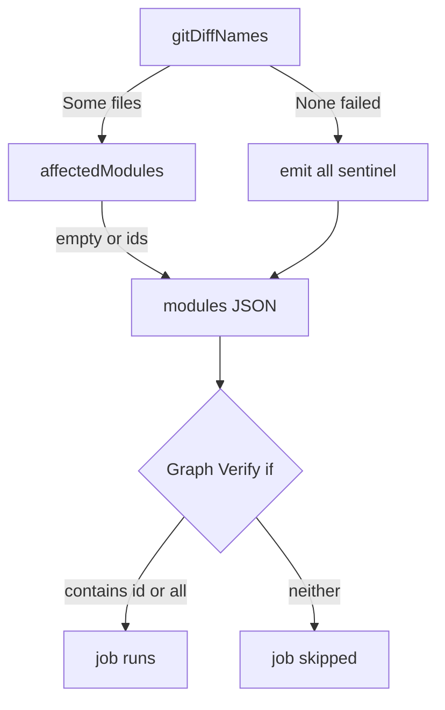
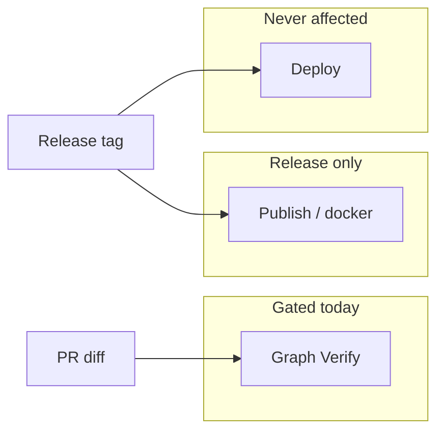
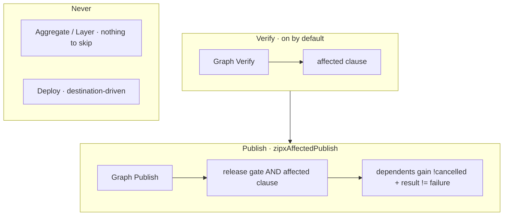

# zipx Roadmap

A self-describing CI plugin for Scala monorepos: a set of Scala 3 libraries plus an **sbt 2.x AutoPlugin** that lets a Scala monorepo *describe its own* fast, concurrent, dependency-ordered GitHub Actions pipeline (test, library publish, and docker-image publish) with pluggable Bazel-style caching.

**Status legend:** ✅ done · 🚧 in progress · ⬜ not started

| Milestone | Status |
|---|---|
| M0: Skeleton & trust | ✅ |
| M1: Vertical slice (test workflow) | ✅ |
| M2: Dependency-ordered library publish | ✅ |
| M3: Affected-only execution | ✅ |
| M4: Docker paved path + POC | ✅ |
| M5: Remote caches | ✅ |
| M6: Environments, approval & multi-target deploys | ✅ |
| M7: Typed secrets & capability env | ✅ |
| M8: `zipx-central` + dogfood Central publish | ✅ |
| M9a: Aggregate-first + Layer + deploy-by-target | ✅ |
| M9: Dynver-ci + publishSigned auto-detect | ⬜ |
| M10: `zipx-aws` | ✅ |
| M11: "Extend with Scala" docs & org rollout | ⬜ |

## Context

A common way to drive CI for a Scala monorepo is a hand-maintained external config (a YAML file, often plus a resolver script) that re-declares the module list, their inter-dependencies, and per-module test/build/publish/deploy recipes as free-text command strings. That approach has four recurring failure modes zipx exists to eliminate:

1. **Two sources of truth that drift**: the module set + edges live in *both* the external config and `build.sbt`'s `dependsOn`. Add, rename, or re-wire a module and the two silently desync.
2. **Publish order not modeled in CI**: the real dependency graph exists only in sbt, so the release step publishes every library **in parallel with no `needs`**, relying on upstream artifacts already existing in the registry (or recompiling them from source).
3. **No affected detection**: every PR builds/tests *all* modules; caching is the only mitigation.
4. **Stringly-typed module ids** copy-pasted across test/build/publish steps; a typo yields a green no-op instead of an error.

**zipx thesis:** the sbt build is the single source of truth. An sbt task introspects the real build graph and **generates** (and **check-verifies** in CI) a GHA workflow that fans out per-module jobs wired by `needs` derived from `dependsOn`, publishes in true dependency order, runs affected-only on PRs, and wires caching, all configured through sbt settings, **no external YAML config**.

## Decisions locked

- **Scope:** model the *whole* pipeline (test → build → library publish → **docker-image publish**), with images on the **paved sbt path** (sbt-native-packager `Docker / publish`): the build describes its own image, rather than a separate `sbt assembly` + external `docker build` jar-copy. A POC example repo demonstrates this.
- **Workflow generation:** **build our own** GHA AST + deterministic YAML renderer + check task. Do **not** depend on sbt-github-actions' `GenerativePlugin`; its single-matrixed-job model can't express per-job `needs`.
- **Caching:** an **abstraction** (`CacheBackend`): local-dir or remote selectable by config/availability.
- **Publishing:** a **registry-agnostic abstraction**: any publish mechanism plugs in; zipx owns ordering/gating, not the command.
- **Commit-stable cache keys:** the `actions/cache` primary key tracks a **commit-stable "cache epoch"** (`zipxCacheEpoch`, defaults to `version`) so mid-PR commits reuse the sbt action cache; integrates with the sibling `sbt-dynver-ci` plugin.
- **Action pins:** generated `uses:` values are **commit-SHA pins** (with `# vX.Y.Z` comments). Editable source of truth is `.github/zipx/action-pins.yml` (embedded into the jar as `ActionPins.Defaults`). Consumers bump via the pin file + Dependabot / `zipxActionsPull` / `zipxDependabotSync`, or one-off `zipxActions` in `build.sbt`. Actions zipx emits get a typed `ActionPins.Field`, checked against the action the key names; an action a consumer's own steps or a pack emit goes in the pin file's `extra:` block under a caller-chosen key, so pinning a new action never waits on a zipx release.
- **Secrets:** zipx renders secret *references* into job `env:` / steps; it never stores secret *values*. Named GitHub secrets (org- or repo-scoped) are selected in Scala; convenience packs (e.g. `zipx-central`) name the early-effect org secrets and supply GPG-import steps. Semantics stay out of core.
- **Extension language:** people extend zipx with **actual Scala**: `Capability` values, typed `zipxTasks` / `cmd"…"`, `project/*.scala` typed config, and published meta-build libraries, not external YAML or stringly `${{ secrets.X }}` soup. That extends all the way down: a `run:` body is a `Script` built from an open `Command` trait (so a construct zipx does not model is implemented in the consumer's own build, not waited on), a `${{ … }}` value is an `Expr`, a step comes from `Step.run` / `Step.uses`, and a reusable group of steps is a named `Steps` bundle that composes with `++` and can be published. Raw escape hatches (`Script.raw`, `Expr.Raw`, `JobCondition.Raw`) stay available on purpose, because a consumer who cannot express something must not be blocked, but they are typed so they cannot break the YAML, they return `Either` where the text could, and `zipxWorkflowGenerate` warns and names the bundle that used one. Reaching for the same hatch twice is the signal to implement `Command` instead.

## Central design principle

**zipx owns *topology*; the build owns *what to run*.** Topology = the graph, topological layers, `needs` edges, matrix axes, gating, environment binding, env injection, target fan-out, and cache wiring, all derived. "What to run" is delegated to sbt tasks the build already defines, modeled as a pluggable **Capability**. Test, library-publish, and docker-publish are all `Capability` instances; a user can define custom ones. Cloud, registry, and Central-signing semantics live in **Scala packs on the meta-build classpath**, not in the planner.

## Module layout

- **`modules/shell`**: `zipx.shell`. A general shell AST (`Script`, `Command`, `Word`, `ShTest`) over neotype-validated primitives (`ShText`, `ScriptLine`, `VarName`, `ExitCode`, …). No zipx concepts, no GitHub concepts, no zio-blocks: usable standalone, and the seam higher layers inject through is `Word.Opaque`.
- **`modules/workflow`**: `zipx.workflow`. GHA AST (`Workflow`, `Job`, `Step`, `Triggers`, `Strategy`, `Concurrency`) + deterministic YAML printer. Uses zio-blocks' schema-derived codecs to build the `Yaml` AST; **our own `YamlPrinter`** serializes it (adds literal block scalars zio-blocks' writer can't emit).
- **`modules/core`**: `zipx.core`. Graph model (`ModuleId`, `ModuleNode`, `ModuleGraph`), own deterministic toposort + layers + affected-closure, the `Capability` model, `CacheBackend`, `PlanConfig`, and the `Planner` (`ModuleGraph => Workflow`). Pure, sbt-free, unit-tested against a fixture mirroring the real graph. (M7 adds typed `EnvValue` / secret refs here.)
- **`modules/sbt-plugin`**: `zipx.sbt.ZipxPlugin`. The only module touching `sbt.*`: adapts build `State`/`structure`/`buildDependencies` into a `ModuleGraph`, defines `autoImport`, wires tasks.
- **`modules/central`**: the shipped convenience packs (see below).
- **`modules/aws`**: `zipx.aws`. The AWS paved path: `EcrRegistry` / `EcrImage` / `ImageTag`, the OIDC login `Steps` bundle, and `ZipxAws.dockerPublish`. Depends on `core` only; holds no credentials and no account numbers.
- **`modules/it`**: Testcontainers integration tests proving the remote cache against a real `buchgr/bazel-remote`. Deliberately **not** aggregated, so plain `sbt test` needs no Docker; CI runs `it/test` as a separate job. Does not publish.
- **`docs`**: the Specular docs-as-tests site (`docs/src/test/scala/zipx/docs/`). Every example compiles and every rendered YAML snippet is asserted, so docs cannot drift from the generator. Test-scope only; does not publish.
- **Convenience packs** (meta-build Scala libraries, not more plugin magic):
  - **`zipx-central`** (M8, shipped): early-effect / Maven Central org secrets, GPG import steps, `publishSigned` capability.
  - **`ZipxGitHubPackages`** (shipped, in `modules/central`): GitHub Packages publishing with the built-in `GITHUB_TOKEN`.
  - **`zipx-aws`** (M10, shipped, in `modules/aws`): OIDC role assumption, `EcrRegistry` / `EcrImage` / `ImageTag`, and `dockerPublish` / `dockerPublishAll` capabilities.

## Milestones

### M0: Skeleton & trust ✅
Three modules; `zipxGraph` prints the resolved graph + topological layers. Introspection validated against a representative multi-module graph shape.

### M1: Vertical slice (shippable) ✅
PerModule parallel **test** workflow, correct `needs` from `classpathRefs`, `LocalDir` cache with the **commit-stable `zipxCacheEpoch` key + `restore-keys` fallback**, deterministic generate+check round-trip.

### M2: Dependency-ordered library publish ✅
Publish capability, publish-edge contraction (nearest same-capability ancestors), release-tag gating, per-module cross-scala matrix (including a 2.13-only publisher). Publishes in true dependency order instead of a flat parallel matrix, the **headline feature**. Verified against the sample graph: `schema → {api, legacyClient} → {clientA, clientB}`.

### M3: Affected-only ✅
A leading `affected` setup job (checkout `fetch-depth: 0`, run `zipxAffectedModules <base>`, output a JSON module array); Verify jobs gated with `if: contains(fromJson(needs.affected.outputs.modules), '<id>') || contains(..., 'all')`. On push/tag the job emits the `"all"` sentinel ⇒ full build. A `.sbt` change or anything under a `project` dir ⇒ full build; unowned files ignored. **The skipped-`needs` hazard** handled with `!cancelled()` + `needs.X.result != 'failure'` so an affected module still runs when an unaffected upstream is skipped. Pure file→module mapping (`Affected`, longest base-dir prefix) is unit-tested including pathological prefix/superstring/diamond cases; the git-diff path (`zipxAffectedModules`) verified against a scratch git repo. Controlled by `zipxAffectedOnPR` (default true); `zipxAffectedPublish` (default false) extends the same gating to Graph Publish, see M6.

**Hardening (post-M3):** a failed git diff must **fail open**. Distinguishing `None` (diff did not run) from `Some(Nil)` (diff ran, nothing changed) prevents a bad base ref from emitting `[]` and skipping every Graph Verify job while the PR reports green. The same `"all"` sentinel used for tags/first-push covers that case. Workflow `concurrency` cancels superseded PR runs but **never** cancels `refs/tags/*` (publish is not idempotent). `Gate.AffectedOnly` is rejected at generate time because affected-gating is derived from phase plus `zipxAffectedOnPR` / `zipxAffectedPublish` rather than from `Gate` (Deploy stays never-affected; see M6).





### M4: Docker paved path + POC ✅
`Capability.docker` runs `<module>/Docker/publish` (sbt-native-packager), release-gated, dependency-ordered, never matrixed. A module opts in simply by enabling `DockerPlugin`; zipx auto-detects it (`thisProject.autoPlugins`) and adds the docker stage only when some module uses it. Demonstrated in [examples/monorepo](examples/monorepo): the `service` module describes its image in the build (`dockerBaseImage`, `Compile / mainClass`, `dockerExposedPorts`): no Dockerfile, no external `docker build` string. Verified end-to-end: `service/Docker/publishLocal` built `example-service:1.4.2-ci`, and `docker run` printed the greeting through the full `models → coreLib → service` chain.

### M5: Remote caches ✅
Selectable via `zipxCache`:
- **`LocalDir`** (default): `actions/cache` over sbt's local action-cache dir, commit-stable epoch key.
- **`BazelRemoteSidecar(image, port)`**: emits a `services:` block running `buchgr/bazel-remote` (gRPC) plus `env ZIPX_REMOTE_CACHE=grpc://localhost:<port>`. Verified rendering the nested `services:` mapping end-to-end.
- **`ManagedRemote(uri, headerSecret)`**: no sidecar; sets `ZIPX_REMOTE_CACHE` + `ZIPX_REMOTE_CACHE_HEADER` (from a repo secret) for a managed gRPC backend (BuildBuddy/EngFlow/NativeLink).

The plugin reads those env vars at load and wires `Global / remoteCache` + `remoteCacheHeaders` + `Global / cacheVersion` (inert when unset). The transport is bundled (sbt-zipx depends on `sbt-remote-cache`), and `cacheVersion` folds JDK+OS to keep heterogeneous remote pools sound. See the follow-ups section above.

### M6: Environments, approval gates & multi-target deploys ✅

**Why.** Real monorepos need three more capabilities beyond test/publish/docker, plus a first-class extension seam:

1. **GitHub Environments + human-in-the-loop approval.** A deploy/publish job binds `environment: <name>`; production approval is a GitHub Environment protection rule (required reviewers) configured on the prod environment; the workflow binds the environment and GitHub pauses that job for approval. Each target is a separate job (`fail-fast:false`), so a prod target can hold for approval while staging targets proceed.
2. **Environment-specific config (staging vs production).** Each deploy target carries its own data: account/project id, region, credentials/role, a tier label (prod vs staging). This is exactly the join that external-config CI does with several YAML files + a resolver script; in zipx it becomes a typed function in the build.
3. **Multi-target publishing.** Build once → publish/deploy to N targets, each with its own credentials and environment; plus optional additional publish kinds (e.g. a second registry or delivery system) as downstream jobs.

**Decisions locked:** config lives in the **sbt build as typed Scala** (the resolver-script join becomes a typed function, no external YAML); approval = **GitHub Environment name on the job** (GitHub enforces; zipx emits no manual-approval steps); image **tags/aliases/registries delegate to sbt-native-packager** (`dockerAliases`/`Docker/publish` already do multi-tag/multi-repo); **extensibility for unforeseen cases is first-class**.

**Design principle (sharpened).** zipx owns **topology** (jobs, `needs`, matrix, gating, **environment binding**, **env injection**, **target fan-out**) and stays **semantics-agnostic** (knows nothing about specific registries, tier meanings, or tag schemes). Because config is resolved at **generate time**, zipx emits **explicit per-target jobs** (not a runtime JSON matrix): simpler, byte-stable for the check round-trip, and each target gets its own `environment:` for independent approval. Cloud/credential/tier resolution is **user Scala producing `List[Target]`**, not zipx code.

**New/changed types:**
```scala
// zipx-workflow: Job gains
environment: Option[String] = None    // renders `environment: <name>`

// zipx-core:
final case class Target(                 // a deploy/publish destination, resolved at generate time
  name: String,                          // job-id suffix, e.g. "us-prd"
  environment: Option[String] = None,    // GitHub Environment → approval gate
  env: Map[String, String] = Map.empty,  // injected into the job's env: (account, region, role, tier…)
  condition: Option[String] = None,      // extra `if` clause (e.g. main-only)
)
final case class StepContext(node: ModuleNode, target: Option[Target], matrixed: Boolean)
final case class Capability(             // gains (all defaulting to current behavior):
  /* …existing… */
  targets: ModuleNode => List[Target] = _ => Nil,    // Nil = single job, no fan-out
  needsCapabilities: List[String] = Nil,             // also `needs` same-module jobs of these capabilities
  extraSteps: StepContext => List[Step] = _ => Nil,  // steps before the command (e.g. configure-aws), the extension seam
  permissions: Map[String, String] = Map.empty,      // job permissions, e.g. "id-token" -> "write" for OIDC
  runsOn: Option[List[String]] = None,               // per-capability runner override; >1 element ⇒ list form
)
// Phase gains `case Deploy` (after Publish); add Capability.deploy(...) and Capability.custom(...).
```

**Two capabilities added for full coverage (see mapping below):** `Capability.permissions` (OIDC/cloud deploys need `id-token: write`; `Job.permissions` already exists, the planner now sets it) and `Capability.runsOn` supporting **list-valued** runners (e.g. `[self-hosted, linux]`); `Job.runsOn` renders a scalar for one label, a sequence for many; falls back to build-level `zipxRunnerOs`.

**Planner changes:** target fan-out (job id `<cap>-<mod>-<target>`, each carrying `environment`, merged `target.env`, ANDed `target.condition`); cross-capability `needs` (deploy needs the module's docker job) with a cycle guard; `extraSteps` inserted between setup/cache and the command.

**Plugin surface:** `zipxCapabilities: SettingKey[Seq[Capability]]` (default `[test, publish, docker?]`, users **append** custom capabilities, the extension entry point); re-export `Target`/`Capability`/`Phase`/`Gate`/`Ordering`/`StepContext`. No cloud/registry types in core; the example shows the typed target resolution (a user `case class` + a validating `=> List[Target]` function, the typed replacement for a YAML+script config join). A cloud-provider convenience module (e.g. `zipx-aws`) is deferred until a second consumer needs it.

**Sub-milestones (all ✅):**
- **M6a+M6b: Environment binding + target fan-out + env injection:** `Job.environment`, `Target`, `Capability.targets`; explicit per-target jobs (`<cap>-<mod>-<target>`), `target.env`→job `env:`, `target.condition` ANDed into `if`. ✅
- **M6c: Cross-capability needs + `Phase.Deploy` + `Capability.deploy` + `Capability.permissions`:** deploy `needs` the module's docker job; capability-graph cycle guard; `id-token: write`. ✅
- **M6d: Extension seam:** `extraSteps`/`StepContext` + `Capability.custom` + `Capability.runsOn` (list runners, scalar/sequence rendering); append-able `zipxCapabilities`; staging/prod deploy demo in `examples/monorepo` (targets defined in `project/Deploy.scala`, the typed config-join). ✅
- **M6e: End-to-end capability proof:** `PipelineSpec` plans all capabilities together on the sample graph + staging/prod targets, asserting the complete pipeline (test → ordered publish → docker → gated multi-target deploy), phase ordering, cross-capability needs, approval env, OIDC, and deterministic rendering. ✅

**Setting-scope fix (sbt 2.0 common settings).** During M6d we corrected how zipx reads build-level settings. sbt 2.0 makes a bare `foo := x` in `build.sbt` a *common setting* injected into every subproject's own scope (overridable per module), NOT `ThisBuild`, and scope delegation only flows specific→general. So zipx's build-level tasks now read config from the **root project's scope** (`extracted.getOpt(rootRef / key)`, which delegates project→ThisBuild→Global), honoring bare/common, `ThisBuild /`, and the Global default alike. Result: **no `ThisBuild /` prefix is needed anywhere** in a consumer build; a bare `zipxTestTask := "testFull"` applies to every module and any module can override it (verified by a propagate-down/override scripted test).

**Testing plan: one test per capability.** Each capability gets a dedicated pure-planner assertion in `PlannerSpec`/`CapabilitySpec`, driven by the `sampleGraph` fixture plus a representative staging/production deploy target set:
- **Environments/approval:** a target with `environment = Some("prod")` → the job renders `environment: prod`; a staging target renders none. Assert the prod job carries the environment and staging doesn't (approval is GitHub-side; we test the binding).
- **Target fan-out:** N targets → exactly N jobs `deploy-<mod>-<target>`, sorted deterministically; each carries its own `env:` (account/region/role/tier) and `condition` in `if`.
- **Env injection:** assert `target.env` keys land in the job `env:` block verbatim (including a `${{ secrets.X }}` value) and that steps can reference `${{ env.DEPLOY_ROLE }}`.
- **Cross-capability needs:** `deploy-<svc>` `needs` `docker-<svc>`; cycle guard test (a capability set with a needs-cycle throws).
- **OIDC permissions:** deploy job renders `permissions: { id-token: write, contents: read }`.
- **List runners:** `runsOn = Some(List("self-hosted", "linux"))` renders a YAML sequence; a single label renders a scalar (golden).
- **Custom command:** a deploy capability whose `command` is a user sbt task renders that exact `run:`; a `tier` value from `target.env` is referenceable.
- **2nd publish kind:** a `Capability.custom` in the Publish/Deploy phase with `needsCapabilities=["docker"]` → a downstream job depending on the docker job.
- **Determinism:** the full sample-graph pipeline → generate twice → byte-identical; `zipxWorkflowCheck` clean.
- **Scripted (`generate-check`):** extend with a 2-target deploy capability; assert the prod job's `environment:` + `needs` + `permissions`, and the round-trip.
- **M6e:** in `examples/`, wire the sample graph + staging/prod targets and confirm `zipxWorkflowGenerate` produces the full job set with correct needs edges, environments, and gates.

**Resolved design choices:** (1) **`Phase.Deploy` is added**: Verify → Publish → Deploy; deploy is never affected-gated, sorts after publish, and uses `needsCapabilities` for its docker/publish dependency. (2) **Env injection uses the job `env:` block**: each explicit per-target job merges `target.env` into its `env:`, referenced in steps as `${{ env.KEY }}` (secret-valued entries like `${{ secrets.X }}` work as env values); no runtime matrix, so no GHA uniform-object constraint. (3) `zipx-aws` convenience module deferred until a second consumer needs it.

**Closed seam: affected Publish (still never Deploy), `zipxAffectedPublish`.** M6 closed Deploy as never affected-gated and left Publish open, wanting "composable gates (`OnReleaseTag ∩ Affected`)". Composition turned out to need no `Gate` change at all: the release gate and the affected clause are separate clauses of one conjunction already, so the whole feature is which *phases* the existing narrowing reaches. `Planner.affectedGatedPhase` is that decision in one place: Verify always, Publish under `PlanConfig.affectedPublish`, Deploy never.

It is a **separate setting** rather than a widening of `zipxAffectedOnPR`, and the asymmetry is the reason: **under-verifying is silently unsafe** (a green PR whose code was never tested) while **under-publishing is loudly broken** (the deploy that wants the missing artifact fails immediately). One switch for both would price Publish's narrowing at Verify's risk, so Verify's default stays on and Publish's has to be asked for. Off by default also means no consumer's committed `ci.yml` moves a byte on upgrade.

The three things that made it safe rather than merely cheap:

- **A release tag publishes everything, for free.** There is no base ref to diff a tag against, and `affectedScript` already emits the `all` sentinel for a tag push without taking a diff. So the "affected relative to what, after a series of merges?" question never arises. The one wiring change is that the `affected` setup job must now *run* on a tag push when a Publish capability reads it (`affectedOnTags`), where a Verify-only setup excludes tags.
- **Fail-open carries over untouched**: a diff that could not run still emits `["all"]`, which now means "publish everything" as well as "verify everything".
- **The skipped-`needs` hazard, reopened by this and closed again.** M3 handled it for Verify; narrowing Publish reopens it one level out, because `Capability.deploy` needs `docker` by default and GitHub's implicit `success()` skips a job whose need was *skipped*. So one affected-skipped `docker-<module>` would have silently skipped the deploy that wanted the other modules' images: exactly the class of failure this feature exists to prevent. `Planner.skipTolerantClauses` emits `!cancelled()` plus a per-need `!= 'failure'` at all four job-construction sites, and `tolerateSkips` returns `None` when nothing a job needs can skip, which is what keeps every existing `if:` byte-identical. `!= 'failure'` and not `== 'success'`, since `skipped` is the answer being tolerated; `affected` and `verify-gate` are excluded from the guard because each already has a clause of its own.

`AffectedPublishSpec` is a suite of its own rather than more cases in `PlannerSpec`, because the properties worth pinning are about the *interaction*: off-by-default byte-identity, the release gate surviving the narrowing, the Aggregate/Layer/Deploy exclusions, and a failed need still blocking a skip-tolerant job. `Gate.AffectedOnly` stays rejected: affected-gating is derived from phase plus the two settings, so honoring it there would be a silent Always.



**Refinement (post-M10): `TargetFanOut`, because targets multiply jobs.** M6 gave `targets` exactly one meaning, one job each, and that is right for the thing it was designed for (a deploy environment really is a separate job with its own approval) and wrong for the thing consumers reach for it with next: registries. `Docker / publish` builds one image and pushes every `dockerAliases` entry, so 6 registries across 8 images is **48** jobs under per-target fan-out and 8 under one job, and the 48 each rebuild the same image, so nothing guarantees the registries hold identical bytes. `Capability.targetFanOut` names the two shapes, `JobPerTarget` stays the default so no existing build moves a byte, and `withSharedTargets` / `withTargets` set the mode and the list together, since setting either alone is the mistake.

Two decisions inside it, both of the "a silent wrong answer is worse than an error" kind:

- **A shared job's `env:` is prefixed, not merged.** Two registries both wanting `AWS_ROLE_TO_ASSUME` would otherwise keep whichever the merge saw last, and the job would push twice to one account while silently skipping the other. `Target.envKey` is `ZIPX_<TARGET>_<KEY>` and `Target.envName` reads it back, so no step spells a prefix out. The fixed `ZIPX_` anchor is what makes `envName` total: a target legitimately named `github` would otherwise derive a reserved `GITHUB_…` name that `EnvName` refuses.
- **A per-destination `condition` or `environment` under `SharedJob` is a generate-time error.** Dropping it would push to a registry the author said to skip; applying it job-wide would skip the five that were fine. The error names the field and points at `JobPerTarget`, which is the shape that has a job each to put them on.

The shared job keeps the **same job ids** a no-target capability would produce, so a `needs:` edge onto `docker-<module>` keeps working and no dependent capability has to know which fan-out mode its dependency chose. `SharedTargetsSpec` is a suite of its own because the property under test is arithmetic rather than shape: only a counting assertion catches a change that quietly reintroduces the multiplication.

**Capability coverage: what a full CI pipeline needs, and how zipx provides it.** M6 is "done" when a `build.sbt` can generate a complete multi-environment pipeline with no external YAML config. Capability-by-capability:

| CI capability | zipx mechanism | milestone |
|---|---|---|
| test each module (custom task, e.g. `testFull`) | `zipxTestTask` (+ Aggregate Once / Graph/Layer); `zipxVerifyClean` for a static `clean`/`cleanFull` prefix, or `zipxVerifyCleanLabel` (default `clean`) for a per-PR clean rebuild by label | ✅ M1 / Verify knobs / post-M9a |
| ordered library publish | `Capability.publish`, dependency-ordered | ✅ M2 |
| publish gated on release | release-tag gate | ✅ M2 |
| docker image build | `Capability.docker` (native-packager) | ✅ M4 |
| one image → N tags / moving `latest` alias | native-packager `dockerAliases` | ✅ delegated |
| one image → **N registries/accounts**, each with own credentials | `Capability.withSharedTargets` (`TargetFanOut.SharedJob`): one job, one build, one login per destination, `dockerAliases` doing the N pushes; `ZipxAws.dockerPublishAll` is that wired up | ✅ M6+ / post-M10 |
| N registries that need N **approvals** | `Capability.withTargets` (`TargetFanOut.JobPerTarget`, the default) with `targets` = registries; a job each, so a per-registry `environment:` has somewhere to live | ✅ M6+ |
| deploy to staging/production targets | `Capability.deploy` + `targets` | ✅ M6 |
| production human-in-the-loop approval | GitHub Environment name on the job | ✅ M6 |
| per-target account/region/tier/credential config | typed `List[Target]` in the build (a typed config join) | ✅ M6 |
| deploy-time retag/promote using tier | user sbt task as the deploy `command`, reading `TIER` from the target `env:` (proven: a fresh JVM reads process env; sbt's persistent *server* is a local-dev caveat) | ✅ M6+ |
| a second publish kind, downstream of the image push | `Capability.custom` + `needsCapabilities` | ✅ M6d |
| cloud credential setup step (e.g. OIDC role assumption) | `extraSteps` seam, values from `target.env` | ✅ M6d |
| `permissions: id-token: write` (OIDC) | `Capability.permissions` → `Job.permissions` | ✅ M6c |
| custom / list-valued runner (`[self-hosted, linux]`) | `Capability.runsOn: Option[List[String]]` | ✅ M6d |
| run-once build-wide gate (e.g. `scalafmtCheckAll`) | `Capability.once` (`CapabilityScope.Once`), single job; others `needsCapabilities` it | ✅ M6+ |
| independent targets (one holds for approval, others proceed) | explicit per-target jobs are already independent | ✅ inherent |

Deliberately **not** modeled (equivalent-or-better by design): a container-based sbt runner: zipx uses `actions/setup-java` + `sbt/setup-sbt` for the same toolchain pinning without a container; `Job.container` remains available if a user wants it. Ad-hoc cache-warmup hacks and time-bucketed cache keys are obviated by M5's content-addressed caching + commit-stable epoch. `examples/monorepo` demonstrates the full pipeline end-to-end (fmt gate → test → ordered publish → multi-registry docker → gated multi-target deploy) generated entirely from `build.sbt` + typed lists in `project/`, no external YAML.

**Every acceptance-mapping capability is now implemented and proven** (unit + scripted + running example). A monorepo on the external-YAML-config pattern can migrate its whole pipeline to zipx.

### M7: Typed secrets & capability env ✅

**Why.** Secrets were stringly typed: consumers hand-wrote `"${{ secrets.X }}"` into `Target.env`. That worked for demos but was error-prone, un-completable, and insufficient for early-effect Central publishing (publish jobs ran bare `publish` with **no** PGP/Sonatype env injection).

**Goal.** Make secret *references* first-class Scala while keeping zipx semantics-agnostic (names and values stay out of the planner; only rendering is owned).

**Shipped types:**
```scala
enum EnvValue:
  case Plain(value: String)
  case FromSecret(name: String)   // → ${{ secrets.NAME }}
  case FromEnv(name: String)      // → ${{ env.NAME }}
  case Expr(expr: String)         // escape hatch

// Target.env and Capability.env are Map[String, EnvValue]
// autoImport: secret"PGP_PASSPHRASE", Secret.ref("…"), EnvValue.plain / .env / .expr
```

**Planner / plugin:**
- Capability gains `env: Map[String, EnvValue]` so publish/signing secrets attach once to all jobs of that capability.
- Merge precedence (later wins): cache contribution → `Capability.env` → `Target.env`.
- `ManagedRemote.headerSecret` validated via `EnvValue.secret` at plan time.
- Re-exported via `autoImport`; `examples/monorepo` uses `secret"…"` / `EnvValue.plain`.

**Acceptance (met):**
- Unit: `EnvValueSpec` (render + adversarial name validation); planner injects capability/target/cache layers; golden expressions.
- Scripted: publish jobs carry typed secret env; `zipxWorkflowCheck` clean.
- Example: no raw `"$${{ secrets.… }}"` strings in `examples/monorepo/build.sbt`.
- Gap coverage added for publish-edge contraction, cross-capability target fan-out needs, `ciRelevant=false`, unknown `needsCapabilities`, trailing-slash base dirs, ModuleGraph edge cases.

**Design guardrails:** generate-time resolution only (no runtime secret matrix); zipx never stores secret values; org vs repo secret *scope* is a GitHub concern, not a zipx type. Empty / spaced / expression-like secret names are rejected at construction.

### M8: `zipx-central` + dogfood Central publish ✅

**Why.** early-effect libraries publish CI-only to the Sonatype Central Portal, signing with the shared org secrets (`PGP_KEY_HEX`, `PGP_SECRET`, `PGP_PASSPHRASE`, `SONATYPE_USERNAME`, `SONATYPE_PASSWORD`). Before M8, zipx's own `publish-*` jobs could not release; consumers had to invent GPG-import steps and env wiring by hand.

**Shipped.** `zipx-central` composes M7 primitives into the paved Central path. Dogfood:

```scala
zipxCapabilities += ZipxCentral.release   // Aggregate: one job
// or Graph: ZipxCentral.publishSigned + ZipxCentral.releaseOnce
```

Generated CI owns GPG import + `publishSigned; sonaRelease` (Aggregate) or Graph staging artifacts + Specular Pages (`ZipxDocs.pages`); hand-rolled `release.yml` / `docs.yml` deleted. `ZipxCentral` / `ZipxDocs` are re-exported from the plugin's `autoImport` (nested objects so meta-build only needs the plugin jar).

**Also:** hash-pinned GitHub Actions via `.github/zipx/action-pins.yml` / `zipxActions` / Dependabot sync (`zipxDependabotSync`, `zipxActionsPull`). Reusable-workflow once-jobs via `Capability.workflowCall` / `Job.uses`.

**Acceptance:** unit coverage for `publishSigned` / `releaseOnce` / `needsCapabilities` fan-out; dogfood `ci.yml` regenerated with SHA pins + Central jobs. First Central tag publish is the live proof (same org secrets as peers).

**Out of scope for M8:** replacing every hand-written `release.yml` across the org (that's M11 rollout); local manual publishing.

### M9a: Aggregate-first + Layer + deploy-by-target ✅

**Why.** Graph (one job per module) proves topology but burns GHA minutes (~11 sbt starts on dogfood). sbt's root `.aggregate` already batches work in one JVM; zipx defaults should match that cost profile while keeping Graph as an escape hatch.

**Shipped:**
- `CapabilityScope`: `Aggregate` | `Layer` | `Graph` | `Once`
- Defaults: `Capability.test` / `.publish` / `.docker` / `.deploy` are Aggregate (deploy = one job per Target, modules joined)
- Escape hatches: `testGraph` / `publishGraph` / `dockerGraph` / `deployGraph`; Layer: `testLayers` / `publishLayers` / `dockerLayers`
- Planner emits joined `;` commands for Aggregate/Layer; Layer uses `subsetLayers` with previous-wave `needs`
- Affected setup only when a Graph Verify capability is present
- `ZipxCentral.release` (Aggregate single-job) preferred; Graph staging path retained
- Dogfood on Aggregate; `examples/monorepo` on Layer test/publish + Aggregate deploy; README execution-modes guide

**Acceptance:** unit coverage for Aggregate/Layer/Graph across test, publish, docker, deploy; dogfood workflow regenerates to Aggregate shape.

### Post-M9a hardening ✅

Work that shipped after M9a while M9/M10/M11 stayed open. Each item has code and tests on `main`.

- **Runtime cache epochs from git tags** (#32, `b7a7030`). `CacheEpoch` gained `GitTags` (now the default) and `Script` alongside `Fixed`, so the LocalDir `actions/cache` key resolves its epoch **on the runner** from `git describe` / `git tag -l` instead of a generate-time `version`. On `refs/tags/v*` the epoch is the tag; otherwise `<last-tag>-ci`. Actions annotations warn when local tags lag `origin` (a shallow checkout) or when no tag matches (falls back to `0.0.0`). This is the pressure valve for M9's cache-epoch half: `sbt-dynver-ci` is still worth recommending, but zipx no longer depends on it for a PR-stable key.
- **Cache-rehydrate job** (#39, `296fba5`; #43, `fb71d28`). When a merged-PR Verify is skipped, LocalDir would otherwise leave the next run cold, so a small job warms the cache. Controlled by `zipxCacheRehydrateOnMerge` (default true), `zipxCacheRehydrateTask` (default `compile`), and the opt-in `zipxCacheRehydrateExtraSteps` / `zipxCacheRehydrateEnv` (`ZipxPlugin.scala:192-208`).
- **Build-wide `zipxEnv`** (#43, `9e1a643`; #45, `b52b78a`). A `Map[String, EnvValue]` merged into every generated job's `env:`, so a shared runner variable is declared once. Deliberately omitted from reusable-workflow caller jobs: GitHub rejects `env` on a `jobs.<id>.uses` job.
- **`VerifyClean` + PR-label trigger** (#41, `d29557f`). `zipxVerifyClean` (`None` | `Clean` | `CleanFull`) prefixes the Verify command statically; when it is `None`, `zipxVerifyCleanLabel` (default `Some("clean")`) prepends `cleanFull` at workflow runtime only for PRs carrying that label. A clean rebuild becomes a label, not a workflow edit.
- **`publish / skip` honored** (#40, `7a225ea`). The publish graph is derived from each module's `publish / skip` task, so a module that does not publish cannot appear as a publish job. Same "the build describes itself" family as docker auto-detect.
- **`JobCondition` + a second pack** (#19, #23, #24). `JobCondition` is a typed `if:` expression with `&&` / `||` / `unary_!`, correct precedence parenthesization, and validated identifiers and literals, replacing hand-written `${{ }}` condition strings. `ZipxGitHubPackages` ([modules/central/src/main/scala/zipx/github/ZipxGitHubPackages.scala](modules/central/src/main/scala/zipx/github/ZipxGitHubPackages.scala)) is the second convenience pack, publishing to GitHub Packages with the built-in `GITHUB_TOKEN`.
- **Remote-cache live proof (`modules/it`)** (#25; #52, `deae398`). A Testcontainers integration module runs a real `buchgr/bazel-remote` and proves a Put/Get round-trip through sbt's remote cache. It is deliberately **not** aggregated, so plain `sbt test` needs no Docker; the dogfood `remote-cache-it` job runs `it/test` in parallel with the main test job.
- **Docs site as tests** (#6, #20-#22, #26, #28, #30). 18 Specular pages under [docs/src/test/scala/zipx/docs/](docs/src/test/scala/zipx/docs/) where every example is compiled and every rendered YAML snippet asserted, so a doc cannot drift from the generator. The `docs` project is a test-scope module and does not publish.
- **Dogfood via `unmanagedSources`** (#31, `ac9725a`). The meta-build mirrors each `modules/<m>/src/main/scala` into a `meta<M>` project (`project/dogfood.sbt`) instead of the previous meta-meta symlinks, so zipx builds its own CI from working-tree sources. A new module needs a matching mirror project or `reload` breaks.
- **Repo hygiene** (#37, `52fb8af`; #51; #53; #55). A scalafmt pre-commit hook in `.githooks`, property-based and edge-case coverage for the core graph and planner, an action-pin refresh, and a scaladoc-link cleanup.

### Typed step & shell DSL ✅

**Why.** The third instance of the M7 pattern, so a subsection rather than a new milestone. Four layers were still stringly typed: shell `run:` bodies (s-interpolated bash with doubled `$$`, and a warning comment in `ZipxCentral` where a type should be), expressions outside `env:` and `if:` (`with:` / `outputs:` / step `env:` still take raw `${{ … }}`), `Step` validity (all-optional, so `Step()` and `Step(uses =, run =)` both compile and both render YAML GitHub rejects), and reusable step bundles (bare `StepContext => List[Step]` lambdas with no name and no composition operator). This closes issue #46, which asked to move long `run:` strings into YAML resource files: that route would have relocated the splicing rather than removed it, and zio-blocks cannot round-trip a block scalar inside a step sequence anyway.

**Layers:**
1. ✅ **`zipx-shell`**: the shell AST. `Script` / `Command` / `Word` / `ShTest` over neotype newtypes.
2. ✅ **`Expr`** in `zipx-workflow`: the GHA expression AST, with `EnvValue` and `JobCondition` delegating to it. Includes `Expr.Call` over a `FunctionName` newtype (GitHub's function list is fixed, so an unknown name does not compile), which is what lets the planner's gates be built rather than interpolated.
3. ✅ **`StepBuilder`** + render-time `Step.validate`, closing step validity from both ends.
4. ✅ **`Steps`** in `zipx-core`: a named, composable, `StepContext`-aware bundle that *is* a `StepContext => List[Step]`, so every existing field keeps its declared type.

**Validation is structural.** Every important DSL type is a [neotype](https://github.com/kitlangton/neotype) newtype, so an invalid value is unconstructible and a literal fails at *compile* time: `VarName("has-dash")` does not compile, and the error carries the validator's own message. Smart constructors are `inline def` so they forward a literal into the check rather than laundering it, with `make`-style siblings returning `Either[String, A]` for genuinely runtime input. `CompileTimeSpec` asserts the compile-time half with zio-test's `typeCheck`. Rules cover what the shell actually does, not just the convenient cases: no `'` inside `'…'` (it cannot be escaped), no `}` inside `${…}` (it closes the expansion early), no leading tab on a script line (YAML block-scalar indentation must be spaces), `ExitCode` 0 to 255 (the shell truncates modulo 256), single-digit file descriptors only.

**Extensibility is load-bearing.** `Command` is an open `trait` with rendering as a method, deliberately **not** an `enum`: a consumer needing a construct zipx does not model (a `case` statement, a function definition) implements `Command` in their own build instead of waiting on a zipx release. The cost, accepted knowingly, is that a match over `Command` cannot be exhaustive. `Word` and `ShTest` stay closed, since the shell's grammar fixes them.

**`sh"…"` splices are typed.** The interpolator takes `Word*`, so a bare `String` splice does not compile: string interpolation is how the hole would otherwise come back, and there is deliberately no implicit `String => Word`. Wrap explicitly with `Word.lit` (checked) or `Word.litMake` (`Either`).

**Raw escape hatch: allowed, typed, and loud.** `Raw` holds `List[ScriptLine]`, so the *type* guarantees raw content cannot emit YAML GitHub fails to parse; there is no separate lint pass to forget. `Script.raw(text)` returns `Either` and names the offending line. What raw can still produce is broken *shell*, so its content is reported by `Command.rawFragments` and `zipxWorkflowGenerate` warns, naming the step.

**Actions syntax is typed too, every rule and not just the convenient ones.** `Expr` is closed rather than open (GitHub fixes the context list, and `Expr.Raw` covers what is not yet modelled), and each of its fields is a newtype carrying one of GitHub's documented rules: ids start with a letter or `_`, secret names reject the reserved `GITHUB_` prefix *case-insensitively* (GitHub stores them uppercase and matches case-insensitively, so checking one spelling would be bypassable) while still admitting `GITHUB_TOKEN` itself, output names reject the disabled `set-output` / `save-state` commands, matrix axes reject the `include` / `exclude` directives, context paths allow `[n]` and `*` segments but not an empty one, and `uses:` refuses an unpinned `owner/repo`. `EnvName` delegates to `zipx-shell`'s `VarName` pattern, which is the mechanical check that the two layers agree on what a name is: an `env:` key becomes a shell variable in every `run:` step.

**Step validity is closed from both ends.** `Step` keeps its flat all-optional shape, which is fixed by `derives Schema` and the on-disk mapping, so nothing about the rendered bytes moves. The good end is `StepBuilder`: `Step.run(script)` and `Step.uses(ref)` decide the mutually exclusive `run`/`uses` pair *before* any other field is set, so a builder cannot express a step with both or neither, and its fields are typed (`Script` for a body, `Expr` for `if:` and `with:` values, `StepId` / `EnvName` for names). The closing half is `Step.validate`, called from `Render`'s step encode path and from `encodeJob`, since the derived job codec encodes nested steps itself and would otherwise bypass it: a hand-built step with both keys, neither key, or a `with:` on a `run:` step fails at generate time with the step's name or id in the message. Validation lives in `Render` rather than in the constructor because a `Step` is also a decode target, and validating on construction would reject a value a codec is still filling in.

**Step bundles compose, and can be published.** `Steps` extends `(StepContext => List[Step])`, which is the whole trick: `Capability.extraSteps` / `postSteps`, `PlanConfig.cacheRehydrateExtraSteps` and the `zipxCacheRehydrateExtraSteps` setting all accept one with no signature change, and `Planner.stepsFor` needed no edit. What the type adds over a lambda is what a lambda cannot have: a name that reaches diagnostics, `++` to concatenate, `when(JobCondition)` to gate every step in the bundle at once (ANDed onto any `if:` already there, and rendered *bare*, since an `if:` is already an expression context and `${{ a }} && ${{ b }}` is a template string that evaluates to neither operand), and a stable identity to publish. `zipx-core` is on Central, so a shared org bundle is an ordinary published Scala value: `zipxCacheRehydrateExtraSteps := OrgSteps.playwright ++ OrgSteps.aptMirror`. That is what #46 was reaching for, without the splicing a YAML resource file would have relocated rather than removed. `ZipxCentral`'s three lambdas are the first consumers, and `releaseOnce` now composes two of them with `++` where it previously threaded one by hand. The raw warning also lands here: `Steps.built` collects its builders' `rawFragments`, composition and `when` / `named` / `mapSteps` preserve them, and `zipxWorkflowGenerate` logs one line per fragment naming the bundle. A bare lambda reports nothing, because it has nowhere to carry the information, which is the honest incentive to use the type.

**One definition per rule, and no thrown exceptions left in it.** `EnvValue.requireName` and `JobCondition`'s `requireIdent` / `requireLiteral` / `requireRaw` are gone rather than delegating: the rules live in the newtypes, so there is one definition of "valid GHA identifier" and nothing left to restate. The runtime-validation helpers went with them. A failure is now removed in the strongest way available at each site, in this order: make it unrepresentable with a type (`JobCondition.All` takes a head and a tail, so there is no empty conjunction to reject; `PlanConfig.verifyCleanLabel` is an `ExprLiteral`, so a quote that would break out of `'…'` cannot reach a plan; `InlineCommand` is the subtype whose `inlineRender` is total); failing that, check a literal at compile time with an `inline` constructor; failing that, return `Either[String, A]` naming the offending value (`Script.raw`, `Step.validate`, `Cron`, `ActionPinsSyncWorkflow.plan`, every `*Make` sibling). Throwing is confined to the sbt boundary, where sbt's own contract is to throw: `ZipxPlugin.orFail` is the single place a zipx failure value becomes a build error, and the untyped `Option[String]` settings are converted to typed fields there. The cross-layer coupling is two one-liners: `JobCondition.expr` lifts a validated condition into a step field, and `Expr.asWord` embeds an expression in a script as `Word.Opaque`, the one word kind the shell renderer never escapes.

**The hierarchy is enforced, not merely stated.** A first pass left seven throw sites that the four tiers above should have caught, so a follow-up closed each one at the tier it belonged in rather than one tier down. `ActionPins.Field` is an enum, so there is no unknown field name to reject and `FieldPrefixes` can no longer drift from the seven case-class fields. `ActionPinFile.loadResource` returns an `Option`, deleting a throw that `ActionPins.Defaults` immediately caught as control flow. `ModuleGraph.make` rejects a cyclic node list at construction, which makes `layers` / `subsetLayers` total and deletes `CyclicGraphError` (nothing had caught it, so a cycle produced an sbt stack trace). `SbtCommand` is an enum whose text is validated once where a command enters the planner, so `Planner.sbt` cannot fail on a user's single quote, with `Unchecked` as the documented, generate-time-warned escape for the sbt syntax zipx does not model. `ShLines` carries validated lines through rendering, so a structural command never revalidates text it built from validated pieces. `ModuleId`, `CapabilityName` and `TargetName` are newtypes over `Names.ActionsId`, and because `-` is in that pattern's trailing set, joining them *yields* a valid job id: `Planner.orThrow` is gone, since the planner builds ids rather than validating ones it assembled. `sh"…"` is a macro, so an invalid literal part is a compile error naming the text. `ModuleGraph.make` is the *only* constructor a graph has: the throwing `apply` beside it existed for tests writing a literal node list, so it moved to a test-scope `GraphFixture` in `zipx.core` and `zipx.docs`, and `RemoteCacheSmoke` (a planner fixture, its only main-source caller) moved to test scope with it. **The acceptance is a grep**: `grep -rn "throw \|makeOrThrow\|orThrow" modules/*/src/main` returns nothing. No `src/main` in this build can raise, below the sbt boundary or anywhere else; every failure is an `Either` that `ZipxPlugin.orFail` reports as an sbt error.

**The last raw string across a layer: `uses:`.** The tiers above validate a value where it is *written*, which leaves the case where a validated-looking value crosses a layer as a plain `String` and arrives somewhere that never rechecks it. `uses:` was the one instance left. `ActionPins` held seven `String` fields, `Planner` built `Step(uses = Some(config.actions.checkout))` by direct case-class construction, and `Render.checked` runs only the uses-vs-run shape check, so an unpinned ref in a consumer's pin file rendered into `ci.yml` as `uses: actions/checkout`: no `@sha`, and `annotateUses` still stamped the version comment beside it, which is worse than an unpinned ref alone because the comment claims the pin happened. Both halves are now closed at the tier that owns them. `Step.uses`, `Job.uses`, `WorkflowCall.uses` and all seven `ActionPins` fields are `ActionRef`, so the unvalidated ref is unrepresentable rather than rejected, and the literal pins keep their compile-time check for free (zio-blocks derives a neotype as its underlying primitive, so not one rendered byte moves). `ActionPinFile.parse` is the boundary and returns `Either`, refusing four ways: a line that is not `key: ref # version` at all, a key that is not an `ActionPins.Field`, a ref `ActionRef` rejects, and a ref that is valid but names a *different* action than its key does (`checkout: evil/malware@<sha>`, which only `Field.prefix` can catch). `ZipxPlugin.orFail` reports it, so a present-but-unreadable file is a build error naming the line rather than a per-field silent revert to the jar pin. Writing the properties found two further defects the examples had not: a pin line with no `# vX.Y.Z` inherited the *base* label, letting `annotateUses` stamp `# v7.0.1` onto a SHA that was not v7.0.1, and the field-matching predicate accepted a bare `startsWith`, which filed `actions/cache/restore@v4` under the `actions/cache` pin. A third class was found by grepping the tests for the shape that hid the first bug: `String.contains` and `indexOf` widen their argument to `Any` through `StringOps`, so three assertions comparing an `ActionRef` against rendered YAML compiled and passed vacuously.

**One cleanup left open.** `ExitCode` (0 to 255) and `FileDescriptor` (0 to 9) hand-write their lower bound, which `neotype.common.NonNegativeInt` already expresses; both could be built on it. Cosmetic, so it is recorded rather than done: neither validator can be wrong in a way a test would not catch.

**Acceptance: the generated YAML did not move a single byte, proven three ways.** `sbt zipxWorkflowGenerate` on this repo leaves `git diff` empty across `ci.yml`, `zipx-action-pins-sync.yml` and `zipx-scala-steward.yml`; `plugin/scripted zipx/generate-check` passes, which is an independent check because its `assertGraph` asserts the literal gate strings (`contains(fromJson(needs.affected.outputs.modules), 'api')`, `!cancelled()`, `startsWith(github.ref, 'refs/tags/v')`) that `Expr.Call` now builds; and `PlannerSpec` / `RenderSpec` / the docs pages pass unmodified, since an edit needed there would have meant output moved. Zero-diff only says *nothing* moved, not *which* script is which, so `ScriptRenderSpec` supplies the other half: it pins each migrated script against the exact string its pre-migration source produced. `examples/monorepo` was compiled against a `publishLocal` build to prove the consumer-facing types work outside this repo; its `project/Deploy.scala` now holds validated `EnvValue`s rather than secret-name `String`s, which is what keeps the compile-time check available to a typed target list.

**The DSL documents itself as tests.** The `Shell and steps` page walks all four layers, and every example on it is compiled and its rendered output asserted like the rest of the site, including the ones that demonstrate a *failure*: that a hand-built invalid `Step` is `Left`, and that a raw fragment produces a warning naming its bundle while a bare lambda produces none. `autoImport` re-exports the types a `build.sbt` writes, so none of it needs an import. `zipx.shell.Command` is deliberately **not** re-exported: `Command` is sbt's own name in a build file (`commands += Command.command(…)`), and shadowing it would break an unrelated line.

### M9: Dynver-ci + publishSigned auto-detect ⬜

**Why.** Docker auto-detect from `DockerPlugin` is the right pattern for "the build describes itself"; pgp presence should similarly nudge the default publish command.

**Scope shrunk by post-M9a work.** The cache-epoch half is already solved: `CacheEpoch.GitTags` (#32) resolves a PR-stable `<last-tag>-ci` epoch on the runner, so zipx no longer needs `sbt-dynver-ci` for a stable key. What remains here:
- Recommend `sbt-dynver-ci` alongside zipx in the README / docs (it still gives the *build* a PR-stable version, which `GitTags` only gives the cache key).
- When `sbt-pgp` is on the classpath, default `zipxPublishTask` (or the built-in publish capability command) toward `publishSigned`, with an explicit override. Consumers using `zipx-central` already get this via capability replace; auto-detect helps bare setups.
- Hygiene: refresh stale milestone comments in `Planner` / `CacheBackend`; keep the ROADMAP status table in sync. That last promise is the one that rotted: 20+ PRs landed undocumented before the `Post-M9a hardening` refresh above discharged it. The rule going forward is that a feature commit carries its own ROADMAP edit.

**Acceptance:** docs + scripted/unit proving pgp auto-detect and override; dynver-ci called out in README cache-epoch section.

### M10: `zipx-aws` ✅

Shipped ahead of the "second consumer" trigger, because the deferral turned out to have a cost the plan did not
anticipate. `examples/monorepo`'s own copy of the AWS block was the source of #65: its `Registry` case class carried a
hand-written `host` and no `region`, so the login step had no region to pass and `configure-aws-credentials` failed on
the runner reporting a *credentials* problem. A second consumer would have copied that bug, not merely duplicated code.

`modules/aws` (`zipx-aws`), depending on `core` only, on the meta-build library pattern `zipx-central` established:

- `EcrRegistry(accountId, region)` **derives** its host, so there is no constructor that omits the region and #65 is
  unrepresentable rather than fixed once. `AwsAccountId` / `AwsRegion` / `EcrRepository` / `ImageTag` are neotype
  `Subtype[String]`s on the repo's usual `inline apply` (literal, compile time) / `make` (runtime, `Either`) split.
- `ImageTag` follows the registry's own rule. A `/` is refused rather than mangled, because `example:main-feat/x` parses
  as a different *repository*: the image would publish where nothing deploys from and the build would stay green.
  `ImageTag.slug` is the opt-in mangle, and `forCommit` emits the moving tags only on the default branch.
- `ZipxAws.oidcLoginSteps` is a named `Steps` bundle passing **both** `role-to-assume` and `aws-region`, reading them
  from the job `env:` so one bundle serves every destination. `ecrLoginSteps` adds the docker login.
- `ZipxAws.dockerPublish` is `Capability.docker` plus `id-token: write` (and `contents: read`, since naming any
  permission drops the default set), the env block, and the login steps.
- The two AWS actions are **extra** pins (#69), not typed `ActionPins.Field` cases, because zipx's planner never emits
  them: they arrive through a pack, so pinning must not wait on a zipx release. The pack carries SHA-pinned fallbacks.
  Deliberately **not** added to the repo's own `.github/zipx/action-pins.yml`, which is embedded as the
  `ActionPins.Defaults` classpath resource and would otherwise ship an AWS pin to every consumer.
- `ZipxAws.dockerPublishAll` is the multi-registry shape: one job, one image, one login per destination via
  `sharedLoginSteps`, which reads each destination's role and region through `Target.envName` rather than spelling a
  prefix out. `registryTargets` with `withTargets` remains for separate accounts with separate approvals, and its
  scaladoc says why that is the shape to reach for last. See the `TargetFanOut` refinement under M6.

### M11: "Extend with Scala" docs & org rollout ⬜

**Docs:** a first-class guide that makes Scala the default extension story:
- `project/*.scala` typed config (the join that replaced YAML + resolver scripts)
- `zipxTasks` / `cmd"…"` over string commands
- `Expr` / `EnvValue` / `secret"…"` over raw `${{ }}` strings, with every Actions name a validated newtype
- `Steps` bundles over bare `StepContext => List[Step]` lambdas, composed with `++` and gated with `when`, including a bundle published in a shared pack and reused across repos
- composing `Capability.custom` / `.deploy` / `.once` and same-name replace
- published packs (`zipx-central`, `zipx-aws`)

**Org rollout:**
1. Publish zipx `0.1.0` to Central (via M8 dogfood).
2. Adopt zipx in 1–2 early-effect libraries (alongside `sbt-dynver-ci`).
3. Prefer generated publish/release topology over hand-maintained `release.yml` where the build graph already knows the modules.
4. Adopt `zipx-aws` (shipped, M10) in every AWS consumer rather than copying an OIDC + ECR block. The block that was
   waiting to be extracted was also the one carrying #65, so a copy of it is a copy of a bug.

**Design guardrails (carry forward):**
1. Topology in zipx; semantics in Scala packs.
2. Generate-time resolution; deterministic YAML for `zipxWorkflowCheck`.
3. Org secrets by **name**, never value, in the plugin or packs.
4. sbt 2.0 remains the unlock (action cache, remote cache, Scala 3 plugins, common settings); do not regress to sbt 1.x shapes.
5. No stringly-typed construction in the public API: every string that reaches YAML comes from a validated Scala value or a linted, warned raw escape hatch. Its teeth: no public API takes a `String` in a position a validated newtype exists for, and a failure is removed at the strongest tier available (unrepresentable > compile-time literal check > `Either` > throw at the sbt boundary) rather than the most convenient one. `grep -rn "throw \|makeOrThrow\|orThrow" modules/*/src/main` is the check, and it must return nothing: a helper that unwraps an `Either` by throwing belongs in test scope (`GraphFixture`, `DocsRender.yaml`), not beside the checked constructor. A new escape hatch must be typed (so it cannot emit unparseable YAML), report itself (`rawFragments`), and be warned at generate time naming its step or bundle.

## Verification

**Always `testFull`, never `test`.** On sbt 2.0 a plain `test` runs `testQuick`: it skips tests it deems unaffected and prints "No tests to run", which reads like success while proving nothing. Every command below uses `testFull` so a green result means the suite actually ran.

- **Pure units (fast, no sbt):** `zipx-core` planner + `zipx-workflow` printer tested with golden output against a fixture graph, plus the shell AST and the packs. `sbt "shell/testFull; workflow/testFull; core/testFull; central/testFull"`. `zipx-shell` carries both validation paths: `PrimitivesSpec` covers every newtype's accepting cases, rejecting cases, and boundaries (each control-character range end, tab mid-line versus leading, `ExitCode` at -1/0/255/256) with generators where the rule is a character class, and `CompileTimeSpec` asserts that an invalid *literal* does not compile.
- **Docs as tests:** `sbt docs/testFull` compiles every documented example and asserts every rendered YAML snippet, so a stale doc fails the build.
- **Integration (Docker, not aggregated):** `sbt it/test` runs the remote-cache Testcontainers proof against a real `buchgr/bazel-remote`. `modules/it` is excluded from the root aggregate so the fast suites need no Docker; CI runs it as a parallel job.
- **Plugin integration:** sbt `scripted` test (`modules/sbt-plugin/src/sbt-test/zipx/generate-check`) where `zipxWorkflowGenerate` then `zipxWorkflowCheck` is a clean no-op round-trip (idempotence = determinism proof).
- **Dogfood:** zipx generates its own `.github/workflows/ci.yml` (`workflow → core → plugin` test + publish chains) from working-tree sources via the meta-build mirror projects in `project/dogfood.sbt`. `sbt reload` proves the mirror is wired; regenerating and getting an empty `git diff` proves determinism end to end.

## Post-milestone follow-ups (all done)

- **Remote-cache correctness (`cacheVersion`).** For remote backends, `Global / cacheVersion` = a stable FNV-1a hash of `(jdkMajor, os)`, the axes sbt does NOT auto-hash, so a heterogeneous runner pool can't poison the shared cache. The commit epoch is excluded (cross-epoch reuse is the point of a persistent remote cache); the epoch still keys the local `actions/cache`.
- **Remote-cache transport is bundled.** `sbt-zipx` depends on `org.scala-sbt:sbt-remote-cache`, whose `RemoteCachePlugin` triggers on AllRequirements, so consumers need no extra `addSbtPlugin` line. It's a no-op until `Global / remoteCache` is set (only when the CI job exports `ZIPX_REMOTE_CACHE`), so local builds are unaffected. Host `org.scala-sbt` transitives are excluded so the POM's compile-scoped `sbt` dependency cannot pull `compiler-interface` into consumer meta-builds.
- **`zipxPublishOrder` task** prints the contracted publish layers (`ModuleGraph.subsetLayers(_.publishes)`), e.g. `L0: models / L1: coreLib / L2: client`.
- **Opt-in push-time affected (`zipxAffectedOnPush`, default false).** When on, pushes also restrict to affected modules by diffing the push `before` sha, guarded against force-push / branch-create (all-zero sha → build everything). Default remains: PRs are affected-scoped, pushes/tags build all.
- **Affected fail-open + concurrency.** Diff failure emits `["all"]` (not `[]`); workflow concurrency cancels superseded PR runs but never release tags (`zipxCancelSupersededRuns`, default true).
- **`Gate.AffectedOnly` rejected.** Affected-gating is derived from phase plus `zipxAffectedOnPR` / `zipxAffectedPublish`, never from `Gate`, so generate fails instead of silently running Always.
- **Opt-in affected Publish (`zipxAffectedPublish`, default false, #70).** Narrows Graph Publish jobs to the affected closure so one changed module does not rebuild and push every image. A separate switch from `zipxAffectedOnPR` because **under-verifying is silently unsafe** while **under-publishing is loudly broken**; a release tag still publishes everything (the `all` sentinel needs no diff), fail-open is unchanged, and dependents of a narrowable job gain `!cancelled()` plus a per-need `!= 'failure'` so a skipped image never silently skips its deploy. See M6.
- **An `if:` that can never be true is rejected (#66).** `Gate`, `Capability.condition` and `Target.condition` are ANDed across three files nobody reads together, so `OnReleaseTag` plus `refIs("refs/heads/main")` produced a job that looked deliberate and could never run (this repo's own example shipped it). `Satisfiable` decides a deliberately narrow subset: single-valued `github` contexts (`ref`, `event_name`, `repository`) inside a conjunction, flattening `All` and De Morgan on `Not(Any)`. `Any`, `Raw`, `vars.*`, PR labels and two negations are left alone, because an unsound rejection is worse than a missed one: a missed contradiction is the status quo, a wrong rejection is a build that cannot generate its own CI.

## Deviations from the original plan

- **Own `YamlPrinter` instead of zio-blocks' `YamlWriter`.** zio-blocks' writer escapes newlines to `\n` and can't emit block scalars, which breaks multi-line values like `actions/cache` `path:`. `YamlPrinter` replicates its quoting exactly (single-line output byte-identical) and adds literal block scalars.
- **Docker opt-in is auto-detected**, not a `zipxDocker := true` flag: enabling sbt-native-packager's `DockerPlugin` on a module is the signal (`zipxDocker` defaults from `thisProject.autoPlugins`). Users can still override the setting.
- **`zipx-shell` is a general shell AST, not a GHA one.** The plan asked for typed `run:` bodies, which would have fitted inside `zipx-workflow`. It became its own module with no zipx, GitHub, or zio-blocks dependency, so it is usable standalone and testable without a plan. The cost is a seam between the layers, and that seam is exactly one word kind: `Word.Opaque`, the only one the renderer never quotes or escapes, which is how `Expr.asWord` embeds a `${{ … }}` in a script without the shell layer knowing what an expression is.
- **The JDK version newtype is `JdkVersion`, not `JavaVersion`.** sbt 2.0 exports a `sbt.JavaVersion`, and `ZipxPlugin.autoImport` re-exports zipx's validated settings types into a `build.sbt`'s scope, so both names would be in scope at once: writing `zipxJavaVersion := JavaVersion("21")` is an ambiguous reference, not a shadow, and the build fails to load. The setting key keeps its name (`zipxJavaVersion`), since only the type collides.
- **Dogfooding needs meta-build mirror projects.** The original plan had no such concept: zipx would just use its own published plugin. To generate this repo's CI from working-tree sources, `project/dogfood.sbt` defines a `meta<M>` project per module whose `Compile / unmanagedSourceDirectories` points at `modules/<m>/src/main/scala` (#31 replaced an earlier meta-meta symlink scheme). The cost is real: adding a module means adding its mirror, or `reload` breaks.
