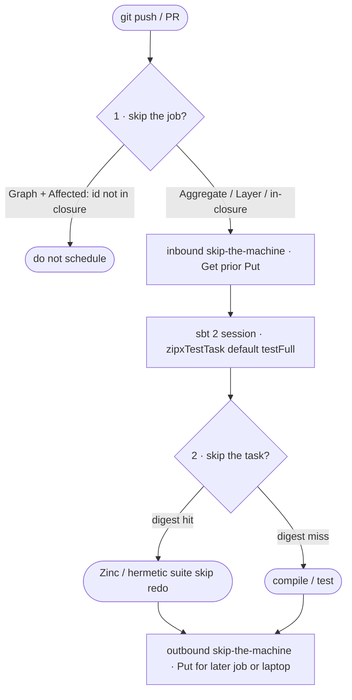
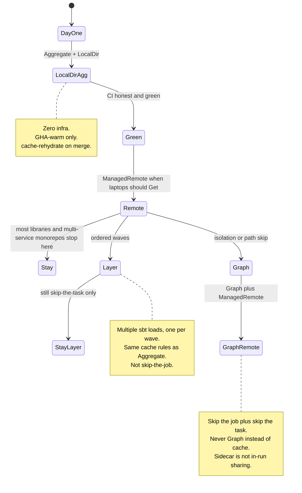
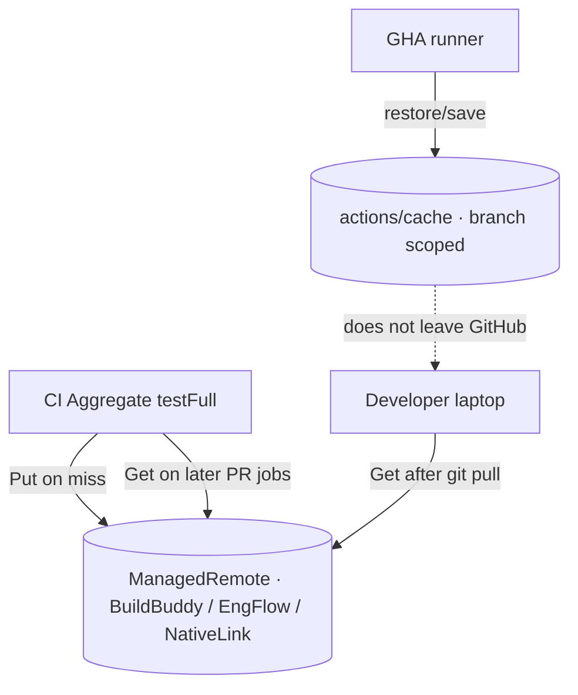

# Cache northstar: large monorepos stay fast if they use cache

| Field | Value |
|---|---|
| Status | Draft |
| Date | 2026-08-28 |
| Author | TBD |
| Kind | Product northstar (focusing artifact for later product and docs work; not an implementation spec to land now) |
| Workspace | `/Users/russ/projects/fun/zipx` |
| Sibling (do not fold in) | [`independent-module-versioning.md`](independent-module-versioning.md) (Ship / ShipGroup) |

This document stands if Ship never ships. It does not specify `CacheEpoch.ShipCatalog`, `zipxModver*`, Graph publish-on-main, or any PR that implements independent module versioning.

---

## Overview

zipx's product northstar for speed is not "make sbt faster." It is: **even large monorepos stay fast to build if they effectively use cache.** zipx does not replace the compiler, rewrite the build as Bazel packages, or sell a second YAML product. sbt 2 is the cache. zipx is how CI and laptops share that cache, and how the graph skips work that does not need a runner at all, without a second source of truth.

The locked claim: zipx makes the **graph skippable** and the **work reusable**. Three *kinds* of skip: skip the job (`Affected` + Graph), skip the task (sbt 2 content-addressed compile/test), skip the machine (inbound Get of a prior Put in `zipx-sbt-setup`, then outbound Put for the next job or laptop). LocalDir keeps GHA warm; ManagedRemote hydrates laptops. Most libraries and multi-service monorepos should stay on **Aggregate plus remote cache** (day-one generate is LocalDir; graduate to ManagedRemote once CI is green). Escalate to Layer for ordered waves (still skip-the-task only). Escalate to Graph for more runners or isolation. Never Graph *instead of* cache.

This file is the checklist for later Caching / Why zipx / Remote cache for teams / Execution modes / `examples/monorepo` edits. Implementation PRs are deferred. The northstar can ship as this markdown alone.

---

## Background & Motivation

### Why this change is needed

Scala monorepos do not get slow because sbt is uniquely incapable. They get slow because every SHA pays a full graph, a full JVM start, and a full compile of code someone else already built. Teams respond with three familiar moves: hand-shrunk GitHub Actions YAML, a second BUILD graph, or a cache appliance next to the workflow. All three can make *some* minutes disappear. None of them make the sbt graph honest *and* the work reusable.

ROADMAP already locks the topology thesis: zipx owns graph, layers, `needs`, matrix, gating, environments, env injection, target fan-out, **and cache wiring**. Semantics live in Scala packs. Live behavior is in Specular (`docs/`), not in this file. What is missing is one place that states the **monorepo pitch**: large repos stay fast because the three skips work *together*, and because `version` is stable enough that digests actually hit.

### Current state (what already exists)

Cache is not a greenfield. The planner, composites, plugin, live IT, and docs already encode the machinery this northstar is about. Sharpen the claims; do not rewrite them.

| Piece | Where | What it already does |
|---|---|---|
| `CacheBackend` | `modules/core/src/main/scala/zipx/core/CacheBackend.scala` | `LocalDir` / `BazelRemoteSidecar` / `ManagedRemote`. Default `zipxCache := CacheBackend.LocalDir`. Sidecar is a **per-job** `JobService`, not a workflow-wide store. |
| `CacheEpoch` | `modules/core/src/main/scala/zipx/core/CacheEpoch.scala` | `Fixed` / `GitTags` / `Script`. Default `zipxCacheEpoch := CacheEpoch.GitTags()`. Mid-PR pushes share a namespace; a release tag rolls it **without regenerating** `ci.yml`. |
| `zipx-sbt-setup` | `modules/core/src/main/scala/zipx/core/ZipxComposites.scala` | JDK, sbt, optional Node, optional LocalDir `actions/cache`. `local-cache: true` only for LocalDir. Checkout is a **prior** workflow step (local composites need the workspace on disk). |
| `cacheVersionFor` | `modules/sbt-plugin/src/main/scala/zipx/plugin/ZipxPlugin.scala` | FNV-1a of `(JDK, OS)` only, assigned to `Global / cacheVersion` when `ZIPX_REMOTE_CACHE` is set. Commit epoch is deliberately **not** an axis. |
| Remote env wiring | same file, `remoteCacheWiring` | Inert unless `ZIPX_REMOTE_CACHE` is set. Bundled `sbt.plugins.RemoteCachePlugin` no-ops until `Global / remoteCache` is `Some`. Local laptops are unaffected until they opt in. |
| `Affected` | `modules/core/src/main/scala/zipx/core/Affected.scala` | Path to owning module(s) to reverse-dep closure. A changed `.sbt` file, or any path under a `project/` directory (root or nested), forces **all** modules. Fail open to `["all"]` when the diff cannot run. |
| `cache-rehydrate` | `Planner.cacheRehydrateJob`, `PlanConfig.cacheRehydrateOnMerge` | LocalDir only. Runs when `zipxSkipMergedPrPush` skips Verify, so `main` still gets an `actions/cache` save later PRs can restore from. |
| Proof pins | `modules/core/src/main/scala/zipx/core/RemoteCacheProof.scala` | Image, port, `ZIPX_REMOTE_CACHE` / `ZIPX_REMOTE_CACHE_HEADER`, sidecar YAML substrings. Shared by docs, planner tests, and IT. |
| Live Put/Get | `modules/core/src/test/scala/zipx/it/RemoteCacheItSpec.scala` | Testcontainers bazel-remote + sbt fixture. Put then Get across wiped local caches; `cacheVersion` 111 vs 222 must not false-hit. |
| Dynver pairing | ROADMAP M9, Caching page, [`sbt-dynver-ci`](https://github.com/early-effect/sbt-dynver-ci) | Between tags, `version` is `<tag>-ci` (or `0.0.0-ci`). Jar names stay stable so sbt 2 digests match across CI pushes. |

Specular pages that already teach pieces of this (and that later PRs must treat as the edit surface):

- `docs/src/test/scala/zipx/docs/Caching.scala`
- `docs/src/test/scala/zipx/docs/RemoteCacheForTeams.scala`
- `docs/src/test/scala/zipx/docs/WhyZipx.scala`
- `docs/src/test/scala/zipx/docs/ExecutionModes.scala`
- `docs/src/test/scala/zipx/docs/AffectedDoc.scala`
- `docs/src/test/scala/zipx/docs/FromBazel.scala`
- `docs/src/test/scala/zipx/docs/Verify.scala` (skip-merged-PR + `cache-rehydrate`)
- `docs/src/test/scala/zipx/docs/Overview.scala` (sbt 2 as the reason zipx exists)

`examples/monorepo` already generates LocalDir + `cache-rehydrate` + Layer test waves (`test-L0` / `L1` / `L2`) and docker/deploy topology. It does **not** yet tell the three-skips story. That is a later docs/example gap, not a missing backend.

### Pain points

1. **Cache as a logo.** Restoring `~/.ivy2` or running `coursier/cache-action` is not skip-the-task. sbt 2's win is content-addressed *task results* (Zinc class/API, hermetic suite digests), restored across JVM runs.
2. **Graph as a substitute for cache.** N module jobs without a remote store is N cold JVMs. Isolation without hydration multiplies the miss path.
3. **LocalDir mistaken for a team cache.** GitHub scopes `actions/cache` to the branch that saved it. Other PRs restore from the default branch. Laptops never see it. `cache-rehydrate` exists because merge-push skip would otherwise starve `main`.
4. **Version as theater.** If `version` changes every SHA, jar names and `CompileInputs2` change every SHA, and the remote store is a write-only log.
5. **sbt load and the meta-build.** Cache does not eat `project/` / plugin changes. `Affected` treats a changed `.sbt` file, or any path under `project/` (root or nested), as the whole module set. That is correct, and it is a cost this northstar must say out loud. Jobs that still run also pay JVM start and sbt load even when every compile/test digest hits.
6. **Cross matrix as four worlds.** `2.13` + `3` times JVM + JS is four digest partitions, not one. Cache reuses within a world; it does not collapse the matrix.

### The foil: zio-blocks (contrast, not a takedown)

[zio/zio-blocks](https://github.com/zio/zio-blocks) is the useful contrast. It is a serious, large, lockstep Scala family: 2.13 and 3.x, JVM and JS, one version on every artifact, a huge Aggregate, CI generated by `zio-sbt-ci` and then kept smaller by hand. Their `AGENTS.md` tells agents the operational truth they live with: sbt is slow (minutes per compile/test); batch edits; do not loop compile. That is not incompetence. It is what a kitchen-sink aggregate plus dependency-cache CI feels like when skip-the-task and skip-the-machine are not the product.

Notes that keep the foil honest:

- **ZIO the org did not merge the whole org into one repo.** Blocks is a second gravity well. The problem shows up *inside* one large sbt graph, not only at "we should have been a monorepo" scale.
- Their CI caches Coursier / setup-sbt disk state. That is not sbt 2 remote action cache. Hits on jars are not hits on Zinc outputs or hermetic test digests.
- They split `testJVM` / `testJS` / `testGolem` / `buildDocs` by hand and keep shrinking that matrix. zipx's answer is not "one infinite Aggregate job with no cache," and it is not "explode into Bazel." It is the three skips, with Aggregate + remote as the default path.
- Do not trash the project in docs. Cite the shape (lockstep, cross, hand-shrunk CI, minutes-per-compile agent advice). Offer zipx's path as the alternative strategy. Land that paragraph on **Why zipx** or **Caching** (kitchen-sink sbt Aggregate). Keep **From Bazel** as the BUILD / RBE contrast. Same honest tone, two different foils.

Cache is not a logo. If the store does not receive sbt 2 task digests, and if `version` is not stable, the logo does not matter.

---

## Goals & Non-Goals

### Goals

- One focusing artifact that states the monorepo pitch: large repos stay fast because of the three skips together.
- Lock the product claim for later Specular edits: zipx does not make sbt fast; zipx makes the graph skippable and the work reusable.
- Lock the default path: **Aggregate + remote cache first** (day-one generate is LocalDir; ManagedRemote once CI is green and laptops should Get). Layer for ordered waves, still skip-the-task only. Graph when wall-clock needs more runners or isolation. Never Graph *instead of* cache.
- Preserve and sharpen existing claims (epoch, LocalDir vs sidecar vs ManagedRemote, `cacheVersion` JDK+OS only, cache is not remote execution, `cache-rehydrate`, dynver-ci pairing).
- Make `examples/monorepo` a later teaching surface for the three skips, not only docker/deploy topology.
- Say the costs cache does not eat, so speed claims stay reviewable.
- Keep this document independent of Ship. The northstar is true on today's dynver-ci / `v*` / `CacheEpoch.GitTags()` path.

### Non-goals

- Remote execution (RBE). Graph is more runners. True remote execute is sbt work, not a zipx toggle.
- Replacing sbt, or exploding the repo into Bazel `BUILD` files per package.
- An org-wide early-effect monorepo as a product goal.
- Implementing Ship / ShipGroup / `CacheEpoch.ShipCatalog` / `zipxModver*`. That is [`independent-module-versioning.md`](independent-module-versioning.md).
- Building a new `CacheBackend`. LocalDir, BazelRemoteSidecar, and ManagedRemote are the set.
- A standalone cache product beside hand-rolled YAML (Develocity-class appliance as the *CI*). zipx already rejects that in **Why zipx**.
- Changing Verify's fail-open Affected policy, or making Aggregate/Layer path-skip jobs (there is nothing in one sbt session to skip at job granularity).
- Landing the PR Plan in this change. Those PRs are later, independently reviewable, and marked deferred below.

---

## Product claim (locked)

**zipx does not make sbt fast. zipx makes the graph skippable and the work reusable. sbt 2 is the cache. zipx is how CI and laptops share it without a second YAML product.**

Three *kinds* of skip (not one wall-clock sequence named 1-2-3 after the work):

1. **Skip the job.** `Affected` + Graph: do not schedule `test-sql` because someone edited HTML docs. Topology zipx already owns. Aggregate and Layer never skip this way; one sbt session has nothing in it to drop.
2. **Skip the task.** sbt 2 content-addressed compile/test (Zinc class/API; hermetic suite digests). You do not need Bazel `BUILD` files per package; the cache unit is already inside the module.
3. **Skip the machine.** Two directions. **Inbound:** after the job is scheduled, `zipx-sbt-setup` Gets a prior Put (LocalDir `actions/cache` restore, or `ZIPX_REMOTE_CACHE`) *before* the sbt session, so skip-the-task can hit. **Outbound:** after work, Put hydrates a later job or a laptop. LocalDir keeps GHA warm. ManagedRemote (BuildBuddy / EngFlow / NativeLink, or a self-hosted store at a URI that outlives the job) is how CI hydrates laptops. `BazelRemoteSidecar` is not that store.

In one run the order is: skip-the-job, then inbound restore, then skip-the-task, then outbound Put. Caching mermaid and copy must not restore after `testFull`.

Default path, also locked: **Aggregate + remote cache first.** Day-one generate is LocalDir (zero infra). Graduate to ManagedRemote once CI is green and laptops should Get. **Layer** is ordered waves with fewer sbt starts than Graph, still skip-the-task only (one JVM load per wave). Escalate to Layer for those waves, not to make caching work. Same LocalDir / ManagedRemote rules as Aggregate. Graph when the *workflow* needs more runners or isolation (path skip, per-module status). Never Graph *instead of* cache.

Not all three skips are on by default. Day-one zipx (`zipxCache := LocalDir`, `Capability.test`) gets skip-the-task on a restored runner and skip-the-next-GHA-job via epoch-keyed `actions/cache`. Skip-the-laptop requires ManagedRemote (a URI that outlives the job; a self-hosted bazel-remote is that backend with `grpc://…` / `grpcs://…`, not a fourth `CacheBackend`). Skip-the-job requires Graph + `zipxAffectedOnPR` (already the Graph Verify default). The northstar is that a large repo is fast when it **uses** all three it needs, not that every repo turns Graph on on day one.

---

## Proposed Design

This is a product and docs design. The code cited below already exists. Later work is thesis, example story, default-path wording, and maybe hit-rate observability, not a new backend.

### Architecture: three skips on one graph



Inbound restore (`zipx-sbt-setup`: epoch LocalDir or `ZIPX_REMOTE_CACHE`) is skip-the-machine *before* skip-the-task. Outbound Put hydrates the next machine. Do not draw restore after `testFull`.

zipx owns the left and the edges (who runs, in what order, with which env and which store). sbt 2 owns the middle (whether a task is a hit). A cache product that only owns the store leaves hand YAML as a second graph. A Graph-only fan-out that does not hydrate a store that **outlives the job** pays N cold starts. `BazelRemoteSidecar` is not that store (per-job service, empty on each Graph job).

### Default path (Aggregate + remote, then Graph)



**Locked:** Layer is still skip-the-task only (multiple sbt loads, one per wave). Escalate to Layer for ordered waves, not to make caching work. Same LocalDir / ManagedRemote rules as Aggregate. Leave Graph for isolation and path skip.

This matches **Execution modes** today ("stay on Aggregate unless you have a reason not to") and **Remote cache for teams** ("Aggregate CI plus a remote cache is enough for most libraries and multi-service monorepos"). The northstar's addition is to treat that ladder as the *speed* story, not only the *job-count* story. `examples/monorepo` already sits on Layer + LocalDir; later teaching must not recast those waves as "Graph instead of cache."

`FromBazel.scala` already writes a ladder for Bazel refugees: Aggregate first, `zipxWorkflowCheck`, opt into ManagedRemote (or sidecar **as single-job proof**), Graph only when wall clock or isolation needs per-module jobs. Keep that order. Sidecar on Graph is still N empty bazel-remote containers, not sibling Get.

### Skip the job (Affected + Graph)

Owner: `Affected.scala`, `Planner` (`usesAffected`, `affectedGatedPhase`), docs **Affected**.

- Graph Verify is path-gated by default (`zipxAffectedOnPR := true`).
- Seeds: longest owned-path prefix over `ModuleNode.ownedPaths` (base dir **and** unmanaged source dirs, so `projectMatrix` rows work). Cross-built shared sources belong to **every** platform row.
- Closure: reverse-deps. A docs-only HTML change that no module owns seeds nothing; Graph Verify skips. A `models` change runs `models` plus every dependent.
- Build files force everything: a path ending in `.sbt`, or anything under a `project/` directory (root or nested, the rule in `Affected`). Plugin and graph changes are not safe to skip.
- Fail **open**: `outputModules(graph, None)` emits `["all"]`. A broken base ref costs minutes, not a green untested PR. `Some(Nil)` is a successful empty diff and stays empty.
- Publish/Deploy narrowing is opt-in (`zipxAffectedPublish` / `zipxAffectedDeploy`) because under-verifying is silently unsafe and under-publishing is loudly broken. Unchanged by this northstar.
- Aggregate / Layer: never job-gated. The skip inside those jobs is skip-the-task. Layer still starts one sbt session per wave, so it pays that many JVM starts and sbt loads even at 100% digest hits.

`examples/monorepo` currently uses `Capability.testLayers` / `publishLayers`, so it demonstrates ordered waves and docker/deploy, **not** skip-the-job. That is a valid Layer teaching surface (skip-the-task per wave, LocalDir restore). A later example PR should *also* show Graph Verify + Affected on at least one path (for example a docs-only or leaf-only diff that does not schedule `test-service`), without recasting the existing Layer waves as a cache substitute. LocalDir in that YAML remains fine.

### Skip the task (sbt 2 is the cache)

Owner: sbt 2 action cache; zipx restores it and points `Global / remoteCache` when env is set.

From **Remote cache for teams** / **Execution modes**, keep these sentences sharp:

- Compile invalidates on Zinc's class/API graph **inside** a subproject.
- Test uses hermetic suite digests over transitive bytecode (not timestamps). A successful suite can be skipped across machines when inputs match.
- You do **not** need Bazel-style package targets for the cache unit to be small enough. In Bazel the target *is* the boundary. In sbt 2 the boundary is already class/suite digests inside the module.
- Plugin default is `zipxTestTask := zipxTasks.of(testFull)`. CI still *schedules* every suite; Zinc and the task cache are what skip redo. Plain `sbt test` on sbt 2 is `testQuick` and can silently skip. That is a verification rule (`AGENTS.md`, ROADMAP) and a cache-honesty rule: advertising "tests were skipped because cache" must mean hermetic digest hits, not `testQuick`.

Aggregate is not "rebuild the world in one job." A root `.aggregate` session parallelizes independent subprojects. After LocalDir restore or a remote Get, a cold runner can still compile almost nothing. That is why one Aggregate job stays the default even for multi-service monorepos.

### Skip the machine (LocalDir vs remote)



**LocalDir** (`CacheBackend.LocalDir`): persist `~/.sbt`, `~/.cache/sbt`, `~/.cache/coursier`, and `target/` with `actions/cache` inside `zipx-sbt-setup`. Primary key is OS + JDK + epoch + run id + job id (`cache-key-suffix`). **GitTags / Script** restore-keys (the paved path, empty `cache-epoch` input): same run (`$prefix$epoch-$runId-`), then epoch, then `steps.*.outputs.release` (the tag build), then the OS+JDK prefix. **Fixed** (non-empty `cache-epoch`): same run, then the baked epoch, then the OS+JDK prefix only. Fixed does **not** emit a generate-time prior-release restore-key today. `Planner.priorReleaseEpochKey` (strip `-ci` / `-SNAPSHOT`) is used in tests, not wired into the composite. Do not document strip-`-ci` as live YAML unless a later PR actually uses that helper. No infrastructure. Remote backends pass `local-cache: false` and turn this off (the gRPC store is the persistence). setup-sbt `disk-cache` and setup-java `cache: sbt` stay off on the LocalDir path so they cannot race the epoch key.

LocalDir can warm a *later* job in the **same run** via restore-keys `$prefix$epoch-$runId-` once an earlier job has saved. The first wave is still cold unless `main` (or another default-branch save) was hydrated. That is not the same as a sibling Get from a live gRPC store.

**GitHub's scoping is the LocalDir trap.** Entries belong to the branch that saved them. Other PRs restore from the **default branch**. You cannot copy a PR cache onto `main` via the API. With `zipxSkipMergedPrPush := true` (default), Verify does not run on the merge push, so by default `cache-rehydrate` recreates a main-scoped save (`Planner.usesCacheRehydrate`: verify-gate + `cacheRehydrateOnMerge` + `cache == LocalDir`). Fail-closed on the gate: rehydrate runs only when verify-gate *succeeded* with `run=false`. Default task is `compile`, not `testFull`. Remote backends never emit the job.

**BazelRemoteSidecar**: pinned `buchgr/bazel-remote-cache:v2.6.1` (`RemoteCacheProof.image`) as a **per-job** GitHub service (`Planner.cacheContribution` attaches `JobService` `RemoteCacheProof.serviceName`, `grpc://localhost:9092`, `--max_size=1`). GitHub job services are per-job containers, not a workflow-wide store. Graph `test-core` and `test-api` each start an **empty** bazel-remote. IT (`RemoteCacheItSpec`) proves Put/Get inside one fixture, not across jobs. Sidecar is in-job **proof** for one Aggregate (or one Graph) job, not a team store and not a Graph fan-out store. Caching.scala today says "shared across the run"; later Caching edits must not elevate that into locked Graph mitigation.

**ManagedRemote**: `CacheBackend.managedRemote("grpcs://cache.buildbuddy.io", "BUILDBUDDY_KEY")`. Planner emits `ZIPX_REMOTE_CACHE` and `ZIPX_REMOTE_CACHE_HEADER` from a named repository secret (`SecretName`). Plugin `remoteCacheWiring` sets `Global / remoteCache` and headers from that env. This is the path for **CI-hydrated caches that developers reuse**, and for **in-run Get of a sibling's Put** (the URI outlives the job). A self-hosted bazel-remote that laptops or sibling jobs Get is this backend with that URI (`grpc://…` or `grpcs://…`), not `BazelRemoteSidecar` and not a fourth `CacheBackend`.

Remote is **not** LocalDir with extra steps. LocalDir does not share to laptops. Sidecar does not outlive the **job**. ManagedRemote is the team default **once CI is green**, not the day-one default (zero-infra LocalDir stays the generated default).

### Epoch (commit-stable namespace, regenerate-free roll)

`CacheEpoch` is the LocalDir `actions/cache` namespace. Cases differ in *when* the string is known:

| Strategy | When known | Typical use |
|---|---|---|
| `GitTags()` (default) | Runner, after checkout `fetch-depth: 0` / `fetch-tags: true` | On `refs/tags/v*`, epoch = release = tag without `v`. Else latest matching tag is release and epoch is `${release}-ci`. Warning `::warning title=zipx cache epoch::` if local tags lag origin, or if none match (`0.0.0`). |
| `Fixed(value)` | Generate time, baked into `cache-epoch` input | Scripted tests, unusual versioning. Old behaviour. Prefer GitTags so post-tag PRs warm from the release cache without a regenerate commit. |
| `Script(run, stepId)` | Runner, user shell | Must write `epoch=` and `release=` to `$GITHUB_OUTPUT`. |

`ZipxComposites.sbtSetup` empty `cache-epoch` runs the resolve script (GitTags / Script); non-empty uses `Fixed`. Teach GitTags restore-keys as the paved path: epoch, then `outputs.release`, then prefix (plus same-run). Fixed has no generate-time prior-release restore-key today; do not document strip-`-ci` as live YAML unless a later PR actually uses `Planner.priorReleaseEpochKey`. Caching.scala already claims Fixed strips those suffixes; copying that as northstar policy would lock a behavior generate does not emit. Later Caching edits should match generate.

**Do not roll the epoch on every tag in a way that starves PRs.** GitTags already uses `${release}-ci` between tags; GitTags restore-keys fall back to `outputs.release` (the bare tag). The failure mode is `Fixed(version.value)` combined with stock sbt-dynver (unique version every commit): every generate bakes a new key, every SHA is a compulsory miss, and cache is theater. Pair GitTags with sbt-dynver-ci (below). Cutting a release tag *should* start a new LocalDir generation; that is the point of a tag.

Remote backends do **not** fold the epoch into `cacheVersion`. Cross-epoch reuse is the point of a persistent store. A tag changes `version` (`1.4.2` vs `1.4.2-ci`), which is already a digest input, so only tasks that actually saw the new version miss.

### `cacheVersion`: JDK + OS only

```scala
// ZipxPlugin.scala: load-bearing comment
/** Partitions the remote cache by the two axes sbt's own content-addressed key omits. sbt hashes sources, classpath
  * and scalacOptions but not the JDK or the OS, so without this a JDK-21 runner and a JDK-17 runner would read each
  * other's blobs. The commit epoch is deliberately not an axis: cross-epoch reuse is the point of a persistent cache.
  */
private def cacheVersionFor(jdk: String, os: String): Long
```

FNV-1a over UTF-8 `jdk=$jdk;os=$os`, masked to `Long.MaxValue`. Heterogeneous runners cannot poison the shared cache. IT asserts a different `cacheVersion` does not false-hit (`RemoteCacheItSpec`). Do not add git SHA, epoch, or workflow name to this hash.

### Cache is not remote execution

Keep the table from **Remote cache for teams**:

| | Remote **cache** | Remote **execution** |
|---|---|---|
| Question | Has this digest been done? | Run this action on a worker pool |
| sbt 2 / zipx | Yes (Bazel-compat gRPC) | Not pursued; use Graph for job fan-out |
| Team win | CI hydrates; everyone skips redo | Wall-clock via many workers |

If wall clock is still bound by *many independent misses* on a huge PR, prefer **Graph** (more runners, path-based affected jobs) **plus ManagedRemote** (a URI that outlives the job, so siblings Get). Sidecar on Graph is N empty stores. True task-level remote execution needs hermetic action workers inside sbt. That is build-tool work, not `zipxCache :=`.

### Dynver-ci: stable `version` so every SHA does not bust digests

sbt hashes inputs that include the project's `version` (jar names, `CompileInputs2`). Stock sbt-dynver produces a unique version per commit. Then:

- every SHA is a new digest,
- LocalDir still *restores* directories but task hits inside them miss,
- ManagedRemote fills with never-reused blobs,
- cache is theater.

[`sbt-dynver-ci`](https://github.com/early-effect/sbt-dynver-ci) is the pairing ROADMAP M9 already recommends:

| Git state | Version |
|---|---|
| Clean on tag `v0.2.0` | `0.2.0` |
| Any commit after that tag | `0.2.0-ci` |
| No tags | `0.0.0-ci` |

Between tags, jar names stay stable. Cutting the next tag starts a new cache generation on purpose. `version` itself is uncached and re-reads git, so a restored previous-tag action cache cannot republish that tag.

`examples/monorepo/build.sbt` already stands this in: `version := "1.4.2-ci" // stands in for sbt-dynver-ci output`. That comment is about **digest** stability. Epoch on that example is still `GitTags()` (the default); do not confuse baked `Fixed(version.value)` with "we set version."

This northstar treats dynver-ci (or an equivalent stable `version` policy) as a **prerequisite for claiming cache**, not as an optional polish.

### Verify: skip-merged-PR, rehydrate, `testFull`, `clean` label

Owner: `docs/src/test/scala/zipx/docs/Verify.scala`, `PlanConfig.verifyClean` / `verifyCleanLabel`, `zipxSkipMergedPrPush`, `zipxCacheRehydrateOnMerge`. Do not invent a generate-time cache bust.

- Default Verify test task is `zipxTestTask := zipxTasks.of(testFull)`. Plain `sbt test` is `testQuick` on sbt 2.
- `zipxSkipMergedPrPush := true` (default): a push to `main` that lands a merged PR does not re-run Verify. Direct pushes still Verify. Tag pushes never run Verify.
- LocalDir + that skip would starve `main` of an `actions/cache` save, so `zipxCacheRehydrateOnMerge := true` (default, LocalDir only) emits `cache-rehydrate`: checkout / JDK / LocalDir restore, then `compile` (not `testFull`). Remote backends never emit it.
- **One-off LocalDir / action-cache bust:** leave `zipxVerifyClean := VerifyClean.None` (default) and add the GitHub PR label **`clean`**. Verify then prefixes `cleanFull` at workflow runtime (`ZIPX_VERIFY_CLEAN_FULL`, `PlanConfig.verifyCleanLabel`, default `Some("clean")`). The version-updates and pin-updates companions always add that label. `zipxVerifyClean := VerifyClean.CleanFull` is the *permanent* bust. There is no generate-time "bust the epoch" knob besides changing `CacheEpoch` / cutting a tag.

Later Caching / Verify edits must quote this policy, not invent a new one.

### Honest costs cache does not eat

Speed copy that omits these will get senior engineers to distrust the rest.

| Cost | Why cache does not eat it | What to do instead |
|---|---|---|
| **sbt load on a `project/` / `.sbt` PR** | Meta-build is not a Zinc compilation unit in the same way. `Affected` treats a changed `.sbt` file, or any path under `project/` (root or nested), as **all** modules. | Keep the meta-build small. Expect full Verify on plugin PRs. Do not advertise "docs-only speed" for a `project/` PR. |
| **sbt load on a hit** | Jobs that still run pay JVM start and sbt load even at 100% compile/test digest hits. That is the remaining wall-clock of "one Aggregate job stays the default," and it is why skip-the-job exists. The `testFull` row is scheduled suites, not load time. | Do not promise "comment-only PR is a few seconds" under Aggregate or Layer. Graph skip-the-job is how you avoid the load; shrinking `project/` is how you shorten it. |
| **Cross matrix** (2.13+3 × JVM+JS = four worlds) | Each Scala × platform is a different digest. Hits do not cross the world. | Cache still wins *within* a world. Graph + matrix isolation is for wall-clock of independent worlds, not to make one cache key cover four. |
| **First miss** | Someone has to Put. Cold store, new JDK, new epoch after a tag, new `version`. | CI is the hydrator. Measure Put vs Get (`RemoteCacheItSpec` already times phases). |
| **Non-hermetic tests** | Suite digests cover bytecode and declared inputs, not the universe. Tests that hit the clock, the network, or untracked files will miss or worse, false-hit if they are not actually hermetic. | Keep those suites honest. `testFull` still runs; a digest skip must mean the suite's inputs matched. |
| **Graph without ManagedRemote** | Each job is a cold JVM. N jobs × miss path. `BazelRemoteSidecar` is a fresh empty store per job, so Graph plus sidecar is not in-run sharing. LocalDir can warm a *later* job in the same run via restore-keys `$prefix$epoch-$runId-` once the earlier job has saved; first wave is still cold unless `main` was hydrated. | Never escalate to Graph *instead of* cache. In-run Get of a sibling's Put requires ManagedRemote (a URI that outlives the job). |
| **GitHub LocalDir quota** | `actions/cache` is size- and eviction-bounded (repo cap, short retention). Epoch + per-job keys multiply entries. | Treat LocalDir as GHA-warm, not as a durable team store. Graduate to ManagedRemote before the quota is the architecture. |
| **`testFull` wall clock on a hit** | Default Verify still *starts* the test task. A whole-task cache hit can skip redo; a compile hit with a test miss still runs suites. | Do not promise "CI is empty on a comment-only change" under Aggregate. Promise "compile is empty; suites still scheduled unless the hermetic digest hits." Graph can skip the job entirely when the module is out of the closure. |

### `examples/monorepo` later: three skips, not only docker/deploy

Today the example's teaching payload is Layer waves plus ZipxAws docker/deploy (`examples/monorepo/build.sbt`, generated `.github/workflows/ci.yml` with `cache-rehydrate`, `local-cache: "true"`, `test-L0` …). That is a real monorepo, and it is the wrong *northstar* screenshot if we only show registries and `TIER`. Layer here is skip-the-task per wave (and LocalDir GHA-warm), not skip-the-job. Keep teaching Layer as ordered waves, not as a cache substitute.

Later (PR Plan): keep LocalDir in committed example YAML (zipx CI generate-check must not require a BuildBuddy secret). Point the docs page at ManagedRemote as the team default once CI is green. Show:

1. Layer waves as skip-the-task (already true: `test-L0` / `L1` / `L2`).
2. A leaf-only or unowned-path diff that **skips a job** (requires at least one Graph Verify capability in the story, even if the checked-in example stays Layer for docker teaching; a Specular fixture can Graph while the example stays Layer, or the example gains a Graph test capability).
3. Epoch-keyed LocalDir restore on the jobs that *do* run (already true).
4. A paragraph that CI hydration of ManagedRemote is how a laptop skip-the-machine works, with a copy-paste setting, not necessarily live env in the example. Sidecar is not that paragraph.

Open Question 1 records the YAML-vs-docs-only choice.

### What this northstar is for (later product and docs)

Use this file as the checklist when editing:

| Page / surface | What to align |
|---|---|
| **Why zipx** | Keep the one-graph recovery story. Add the three skips as the *speed* story. Faster tasks are not kinder CI; cache that travels with topology is. Do not replace honesty with speed. Short zio-blocks foil here or on Caching (kitchen-sink sbt Aggregate), not on From Bazel. |
| **Overview** | "Why stay on sbt 2" already names machine-wide cache and remote cache as plumbing. Tie it to the locked claim. Inbound restore before skip-the-task. |
| **Caching** | Epoch, backends, LocalDir trap, `cacheVersion`. Sidecar is **per-job proof**, not shared across the run. GitTags restore-keys are the paved path; do not claim Fixed strips `-ci` unless generate does. Add honest costs (including sbt load on a hit) and the default-path ladder (Layer named). |
| **Remote cache for teams** | CI hydrates; developers Get. Graduate from LocalDir when the team wants laptop reuse. A self-hosted store is ManagedRemote with that URI. Cache ≠ execute. Sidecar is not laptop hydration and not Graph sibling Get. |
| **Execution modes** | Stay on Aggregate; one job is not slow *because of cache*. Layer for ordered waves, still skip-the-task. Graph for workflow boundaries, not to make caching work. |
| **Affected** | Skip-the-job only. Fail open. `.sbt` / `project/` = all. |
| **From Bazel** | Different strategy, kinder boundaries. BUILD / RBE contrast only. Same Aggregate → ManagedRemote → Graph ladder. No zio-blocks paragraph here. |
| **Verify** | `cache-rehydrate`, skip-merged-PR, `testFull`, `clean` label as one-off *runtime* `cleanFull` (`zipxVerifyClean := None`, default label `clean`). Folded into PR 2; do not invent a generate-time bust. |
| **Quick start** | Day one remains Aggregate + LocalDir. Do not make ManagedRemote a install step. |
| **BuildSite summary** | Large monorepos stay fast if they use the three skips. Day one is Aggregate + LocalDir. Graduate to ManagedRemote when laptops should Get. Do not print "default remote" without "once CI is green." |
| **`examples/monorepo`** | Eventually the three skips, not only docker/deploy. Layer waves stay skip-the-task teaching. |

> **Aside (not this thesis, not a Key Decision of this document).** A module `version` string is a digest input. Independent outbound versions (`Ship` / `ShipGroup` in [`independent-module-versioning.md`](independent-module-versioning.md)) are a later interaction with that input: a bump changes that module's `version`, so that module's remote entries miss, while lockstep OSS keeps dynver-ci. This northstar is true if Ship never ships. Do not specify `CacheEpoch.ShipCatalog`, `zipxModver*`, or Graph publish-on-main here. Do not write PRs that implement Ship. Do not live in `independent-module-versioning.md`.

---

## API / Interface Changes

**None required for this northstar to ship.** The public knobs already are the product:

```scala
zipxCache        := CacheBackend.LocalDir
// zipxCache     := CacheBackend.BazelRemoteSidecar(RemoteCacheProof.image, RemoteCacheProof.port)
// zipxCache     := CacheBackend.managedRemote("grpcs://cache.buildbuddy.io", "BUILDBUDDY_KEY")

zipxCacheEpoch   := CacheEpoch.GitTags()          // default
// zipxCacheEpoch := CacheEpoch.GitTags(tagMatch = "v*")
// zipxCacheEpoch := CacheEpoch.Fixed(version.value)   // avoid with per-SHA dynver
// zipxCacheEpoch := CacheEpoch.Script(myEpochShell)

zipxSkipMergedPrPush      := true   // default
zipxCacheRehydrateOnMerge := true   // default; LocalDir only
zipxCacheRehydrateTask    := zipxTasks.of(compile)

zipxVerifyClean      := VerifyClean.None  // default; not a permanent bust
zipxVerifyCleanLabel := Some("clean")     // PR label: runtime cleanFull this PR only

zipxAffectedOnPR := true            // default; Graph Verify only
```

Plugin remote wiring (already):

- Env `ZIPX_REMOTE_CACHE` / `ZIPX_REMOTE_CACHE_HEADER` (`RemoteCacheProof.envUri` / `envHeader`).
- `Global / remoteCache`, `Global / remoteCacheHeaders`, `Global / cacheVersion := cacheVersionFor(jdk, os)`.
- Inert when env is unset.

Later optional API (only if Open Question 2 chooses a code slice): a documented way to see hit/miss in CI logs. Prefer teaching sbt's existing cache % and `actions/cache`'s restore logs over a new setting. A single composite log line after LocalDir restore (key, hit/miss) is the largest code change this northstar will ever justify, and it is still deferred.

No new `CacheBackend` case. No change to `cacheVersionFor`'s axes. No new generate-time epoch strategy in *this* document.

---

## Data Model Changes

None. There is no zipx database. The "model" is already:

- `CacheBackend` ADT (LocalDir / BazelRemoteSidecar / ManagedRemote).
- `CacheEpoch` ADT (Fixed / GitTags / Script).
- `PlanConfig` fields: `cache`, `cacheEpoch`, `skipMergedPrPush`, `cacheRehydrateOnMerge`, `cacheRehydrateTask`, `cacheRehydrateExtraSteps`, `cacheRehydrateEnv`.
- Generated YAML + `.github/actions/zipx-sbt-setup/action.yml` (outputs of `zipxWorkflowGenerate`, inputs to `zipxWorkflowCheck`).
- Runner env `ZIPX_REMOTE_CACHE` as the bridge into sbt 2's `Global / remoteCache`.

No migration. Consumers on LocalDir stay on LocalDir until they set `zipxCache := CacheBackend.managedRemote(...)` and regenerate. Remote backends already disable LocalDir in the composite (`local-cache: false`).

---

## Alternatives Considered

### 1. Explode into Bazel (second graph + RBE)

**Shape:** `BUILD` files per package, remote cache and maybe remote execution, CI glue on the side.

**Attracts:** hermeticity talk, fine-grained hits, a worker pool.

**Costs:** a second graph while Scala engineers still think in modules and `dependsOn` (**From Bazel**, **Why zipx**). Adding a library means updating more than one world. zipx is not Bazel-parity and should not pretend to be.

**Trade-off:** Bazel wins if the team already lives in that graph. For an sbt monorepo, the cache unit is already inside the module. Rejected as the zipx path. Keep the vocabulary mapping (action/task, target/module, remote cache as gRPC, remote execution out of scope).

### 2. Graph-only fan-out without cache

**Shape:** `Capability.testGraph` on day one, one job per module, path Affected, no ManagedRemote, maybe even LocalDir off.

**Attracts:** per-module status, skip-the-job on narrow PRs, familiar "more CI parallelism."

**Costs:** N cold JVMs. GitHub bills per job and per minute. First wave of a run cannot Get a sibling's Put unless a store **outlives the job** (ManagedRemote). `BazelRemoteSidecar` is a fresh container per job, so Graph plus sidecar is still N empty stores. LocalDir can warm a later job in the same run only after an earlier job has saved. **Execution modes** already warns: escalate when the *workflow* needs isolation, not to avoid compile work Aggregate + remote already skip.

**Trade-off:** Graph is the right escalate. Graph *instead of* cache is how a monorepo gets slower. Rejected as the default.

### 3. Copy the zio-blocks kitchen-sink aggregate

**Shape:** one enormous Aggregate, lockstep version on every artifact, cross 2.13×3 × JVM×JS, CI split and shrunk by hand, Coursier/setup-sbt disk cache, agent advice to batch compiles because each one is minutes.

**Attracts:** one command, no job graph to maintain, familiar sbt.

**Costs:** skip-the-job never happens. Skip-the-task is weak if `version` moves every SHA and the store is dependency-cache rather than action-cache. Skip-the-machine never leaves CI. Humans (and agents) internalize "sbt is slow" as a law of nature.

**Trade-off:** zipx's own dogfood *is* Aggregate, on purpose, but paired with epoch LocalDir (and, for a team, ManagedRemote) and dynver-ci. The foil is useful. Copying the kitchen-sink *without* the three skips is rejected.

### 4. Remote execution as a zipx toggle

**Shape:** Bazel Remote Execution API's execute half: schedule compile on a worker pool.

**Attracts:** wall-clock on huge misses.

**Costs:** hermetic action workers inside sbt. Not a YAML `services:` stanza. Not `zipxCache`. ROADMAP and **Remote cache for teams** already say out of scope.

**Trade-off:** use Graph for more GHA runners; leave execute to sbt. Rejected.

### 5. Treat cache as a standalone product beside hand-rolled YAML

**Shape:** Develocity-class remote build cache, scans, predictive test selection; keep the hand `ci.yml`.

**Attracts:** task speed and a UI, without changing how jobs are listed.

**Costs:** two sources of truth. Mornings still start with "did we update the workflow?" **Why zipx** already names this: faster tasks are not kinder CI. zipx retires disconnected CI, then leans on sbt 2's cache so Aggregate stays light.

**Trade-off:** acceleration layers can sit *on* a zipx graph. They must not *be* the CI. Rejected as the product.

---

## Security & Privacy Considerations

| Topic | Handling |
|---|---|
| **Secrets** | ManagedRemote takes a *name* (`SecretName`), rendered as `${{ secrets.BUILDBUDDY_KEY }}`. Values never enter the plugin. Same as ROADMAP: zipx renders secret references; packs name org secrets. |
| **Auth to the store** | `ZIPX_REMOTE_CACHE_HEADER` from that secret. Laptops that Get need the same credential. Treat the remote cache as **read/write of build artifacts**, not as public. A poisoned store is a supply-chain issue; `cacheVersion` only partitions JDK/OS, it does not authenticate writers. |
| **Poisoning / heterogeneous runners** | `cacheVersionFor` is the partition so JDK 21 cannot read JDK 17 blobs. It is not a trust boundary. Restrict who can Put (CI OIDC / team API keys). |
| **LocalDir** | GitHub's cache service, branch-scoped. No extra secret. Quota and eviction are GitHub's. Do not put credentials in `target/` expecting LocalDir to keep them off the remote store; `target/` is in the LocalDir path list. |
| **Sidecar** | Ephemeral **per job**, `--max_size=1`. Not a persistence story and not a workflow-wide store. Proof image is pinned (`RemoteCacheProof.image`), never `:latest`. |
| **Checkout before composites** | `uses: ./.github/actions/zipx-*` resolves from the workspace. Planner emits `actions/checkout` first (`Planner.checkoutThenSbtSetup`). Full history + tags (`fetch-depth: 0`, `fetch-tags: true`) so GitTags and Affected can see refs. |
| **Skip-merged-PR / rehydrate** | `verify-gate` uses `gh api` with `GH_TOKEN: ${{ github.token }}` and `pull-requests: read`. Rehydrate is fail-closed on the gate so a broken lookup does not skip Verify *and* skip hydration. |
| **Threat model (cache)** | Attacker with Put access to ManagedRemote can serve bad classfiles to laptops that Get. Mitigation: store auth, branch protection, and "CI is the hydrator" (developers Get what CI already tested). Do not point laptops at an unauthenticated HTTP cache. |

---

## Observability

What exists today:

- **GitTags warnings** on stdout: `::warning title=zipx cache epoch::` when local tags lag origin or none match (`CacheEpoch.gitTagsResolveTypedScript`). Visible in the Actions run summary.
- **`actions/cache` restore logs** on LocalDir (hit/miss, key, restore-keys). That is GitHub's UI, not zipx.
- **sbt cache %** on the session (sbt 2 prints cache statistics). Not scraped.
- **`RemoteCacheItSpec`** times Put vs Get phases (`itStamp`) and requires a remote-hit hint or non-regressing time. Contract pins match `RemoteCacheProof`. Different `cacheVersion` must not false-hit. This is the in-repo proof, not a customer dashboard.
- **`zipxWorkflowCheck`** is honesty of topology, not of hit rate.

What this northstar does **not** add now: a metrics backend, a BuildBuddy UI requirement, or a new GHA job that fails the PR on low hit rate (that would punish first misses and `project/` PRs).

Later (Open Question 2): the first implementation slice, if any, is **make hit/miss obvious in CI logs** so a reviewer can see skip-the-task happening. Recommended default: document how to read sbt's cache % and LocalDir restore logs on **Caching** / **Remote cache for teams**. Optional small composite line after cache restore. Do not fail CI on hit rate.

Alerting: none at the zipx layer. A team on ManagedRemote uses the vendor's dashboard. zipx should not pretend to own it.

---

## Risks

| Risk | Severity | Mitigation |
|---|---|---|
| LocalDir mistaken for a team cache; docs or sales pitch say "shared cache" while laptops stay cold | **High** | Locked language: LocalDir is GHA-warm. GitHub branch-scopes. `cache-rehydrate` exists because of that. ManagedRemote is how the win leaves the datacenter. Quick start stays LocalDir. |
| Epoch roll on every tag (or `Fixed(version.value)` with per-SHA dynver) starves PRs | **High** | Default `GitTags()`; `${release}-ci` between tags; GitTags restore-keys include `outputs.release`. Fixed has no prior-release restore-key in generated YAML today. Pair sbt-dynver-ci. Docs: `Fixed(version.value)` is the old behaviour. |
| Non-hermetic tests skip or false-hit | **High** | `testFull` default. Honest-costs section. Do not claim hermetic skips for I/O suites. |
| `project/` / `.sbt` PRs still full Verify, while copy promised "affected" | **Medium** | Affected docs already say this. Northstar repeats it as a cost cache does not eat. |
| Advertising speed without remote (laptop reuse, "CI hydrates you") while default is LocalDir | **High** | Default-path ladder. Remote cache for teams: skip until CI is green *and* you want local reuse. |
| Graph without ManagedRemote multiplying cold starts | **High** | Never Graph instead of cache. Sidecar is per-job proof, not in-run sharing. In-run sibling Get requires ManagedRemote. LocalDir can warm a later job in the same run after an earlier save; first wave is still cold unless `main` was hydrated. |
| Caching copy treating sidecar as "shared across the run" | **High** | Locked language in this file. Later Caching PR must not repeat the false Graph+sidecar speed story. |
| `cacheVersion` grows extra axes (SHA, epoch, module) and kills reuse | **High** | Key Decision: JDK+OS only. IT covers false-hit across versions. Ship (if it ever ships) must not fold a catalog hash into `cacheVersionFor`. |
| GitHub LocalDir quota / eviction makes "the cache" vanish | **Medium** | Treat LocalDir as warm, not durable. Graduate to ManagedRemote. |
| Treating this northstar as a license to implement Ship | **Medium** | Boxed aside. Key Decisions exclude Ship. PR Plan is docs-and-defaults. |

---

## Rollout Plan

This northstar **rolls out as markdown**. No feature flag, no generate change, no new default for `zipxCache`.

| Stage | What ships | Rollback |
|---|---|---|
| **Now** | This file (`cache-northstar.md`). Product and docs work later use it as the checklist. | Delete or revise the file. No runtime effect. |
| **Later, independent PRs** | Specular thesis wording, example story, maybe log-line observability (PR Plan). Each PR is reviewable alone. `docs/testFull` is the gate (examples lock job YAML). | Revert that PR. Generated `ci.yml` only changes if an example/docs fixture PR changes planner inputs. |
| **Consumer default path** | Unchanged: LocalDir + GitTags + skip-merged-PR + cache-rehydrate. Teams opt into ManagedRemote in `build.sbt` and regenerate. | `zipxCache := CacheBackend.LocalDir` and `zipxWorkflowGenerate`. |

Do not flip zipx dogfood or `examples/monorepo` to ManagedRemote as part of "adopting the northstar." That needs a secret, a vendor, and a separate decision (Open Question 1 / 3).

Staged rollout of *behavior* (when a later PR exists):

1. Docs thesis (Why zipx, Overview, Caching) so the claim is sayable.
2. Execution modes / Affected / From Bazel default-path wording so Graph is not sold as the cache. Layer named as skip-the-task waves. Blocks foil on Why zipx / Caching, not From Bazel.
3. Example story (LocalDir YAML, ManagedRemote as the page's team default).
4. Optional observability.

Rollback of a docs PR is a docs revert. There is no dual-write period.

---

## Open Questions

Only later choices. Each has a recommended default so work can proceed without blocking this file.

### 1. Does `examples/monorepo` emit ManagedRemote YAML, or stay LocalDir with a docs-only pointer?

**Choice:** (a) committed example `ci.yml` stays LocalDir; Caching / Remote cache for teams / a monorepo section copy-paste ManagedRemote; (b) example `build.sbt` sets `managedRemote` and CI of zipx must supply a secret or the generate-check mocks it; (c) commented snippet in example `build.sbt` that is *not* assigned, so generate stays LocalDir.

**Recommended default: (a), with (c) allowed as extra.** zipx's Aggregate `test` generate-checks the example after `publishLocal`. A real `grpcs://` URI plus `${{ secrets.BUILDBUDDY_KEY }}` either leaks a fake into the committed YAML or requires credentials zipx CI should not need. LocalDir in example YAML is already the honest zero-infra path. The *page* says ManagedRemote is the team default once CI is green.

### 2. Cache-hit observability in CI logs as a first implementation slice?

**Choice:** (a) docs only (how to read sbt cache % and `actions/cache` restore); (b) one log line in `zipx-sbt-setup` after LocalDir restore (key, hit/miss if GitHub exposes it); (c) fail a job on low hit rate.

**Recommended default: (a) first, (b) only if (a) is not enough in review, never (c).** First misses, tag rolls, and `project/` PRs would fail (c) for correct reasons. This is not a new cache backend. Defer until after the docs thesis PRs.

### 3. Should zipx-the-product dogfood ManagedRemote?

**Choice:** (a) no, keep LocalDir (current); (b) sidecar on dogfood (per-job proof, not laptop hydration and not Graph sibling Get); (c) ManagedRemote with an org secret.

**Recommended default: (a) for this northstar.** Dogfood LocalDir is honest OSS (no vendor required to clone and generate). Sidecar is already proven in `RemoteCacheItSpec` as one-fixture Put/Get, not in dogfood `ci.yml`. (c) is a later org choice (cost, auth, public-repo leakage of cache metadata), not a thesis blocker.

### 4. Should **Why zipx** lead with three skips, or keep one-graph as the lead?

**Choice:** (a) keep one-graph as the recovery story, add a "Cache that travels" / three-skips section (mostly today's shape, sharpened); (b) rewrite the page so speed is the headline.

**Recommended default: (a).** Teams arrive at Why zipx because YAML drifted, not because they want BuildBuddy. Overview + Caching + Remote cache for teams carry the monorepo speed pitch. Do not replace honesty-of-CI with speed-of-CI.

---

## References

- Specular: `docs/src/test/scala/zipx/docs/Caching.scala`, `RemoteCacheForTeams.scala`, `WhyZipx.scala`, `ExecutionModes.scala`, `AffectedDoc.scala`, `FromBazel.scala`, `Verify.scala`, `Overview.scala`, `BuildSite.scala`
- Core: `modules/core/src/main/scala/zipx/core/CacheBackend.scala`, `CacheEpoch.scala`, `ZipxComposites.scala`, `Affected.scala`, `Planner.scala` (`cacheRehydrateJob`, `cacheContribution`, `checkoutThenSbtSetup`), `RemoteCacheProof.scala`, `PlanConfig.scala`, `ZipxSettings.scala`
- Plugin: `modules/sbt-plugin/src/main/scala/zipx/plugin/ZipxPlugin.scala` (`remoteCacheWiring`, `cacheVersionFor`)
- Proof: `modules/core/src/test/scala/zipx/it/RemoteCacheItSpec.scala`, `modules/core/src/test/scala/zipx/core/RemoteCacheSmoke.scala`
- Example: `examples/monorepo/build.sbt`, `examples/monorepo/.github/workflows/ci.yml`
- ROADMAP.md (topology includes cache wiring; M9 dynver-ci)
- AGENTS.md (blast radius: planner / composites / docs examples)
- [sbt 2 caching](https://www.scala-sbt.org/2.x/docs/en/concepts/caching.html)
- [sbt-dynver-ci](https://github.com/early-effect/sbt-dynver-ci)
- Foil (shape, not a dependency): [zio/zio-blocks](https://github.com/zio/zio-blocks) `AGENTS.md`, generated `.github/workflows/ci.yml`
- Sibling, do not fold in: [`independent-module-versioning.md`](independent-module-versioning.md)

---

## Key Decisions

1. **Product claim (locked).** zipx does not make sbt fast. zipx makes the graph skippable and the work reusable. sbt 2 is the cache. zipx is how CI and laptops share it without a second YAML product.

2. **Three kinds of skip, inbound restore before skip-the-task.** (1) Skip the job: `Affected` + Graph. (2) Skip the task: sbt 2 content-addressed compile/test inside the module. (3) Skip the machine: inbound Get in `zipx-sbt-setup` before sbt; outbound Put hydrates a later job or laptop. LocalDir for GHA; ManagedRemote for CI-hydrated laptops and for in-run sibling Get. Do not call this "wall-clock order" without that inbound/outbound split, and do not draw restore after `testFull`. Not all three are default-on. The northstar is using the ones the repo needs, together.

3. **Default path.** Aggregate + remote cache first. Day-one generated default remains `CacheBackend.LocalDir` (zero infra). ManagedRemote is the **team** default once CI is green and laptops should Get. Layer is ordered waves, still skip-the-task only (one sbt load per wave); escalate to Layer for those waves, not to make caching work; same cache rules as Aggregate. Graph when wall-clock needs more runners or isolation. Never Graph *instead of* cache.

4. **Cache is topology zipx already owns, not a second product.** Same planner emits jobs, services, and env. YAML is generate output. `zipxWorkflowCheck` stays the honesty gate.

5. **Epoch.** `CacheEpoch.GitTags()` default. Mid-PR pushes share a namespace (`${release}-ci`). A release tag rolls LocalDir without regenerating `ci.yml`. GitTags restore-keys: same run, epoch, `outputs.release`, then OS+JDK prefix. `Fixed` is generate-time (tests, unusual versioning), not the paved path, and has **no** generate-time prior-release restore-key in YAML today (`Planner.priorReleaseEpochKey` is test-only).

6. **LocalDir is not a team cache.** GitHub scopes `actions/cache` to the branch that saved it; other PRs restore from the default branch. `zipxSkipMergedPrPush` plus `cache-rehydrate` exist so skip-on-merge does not starve `main`. Remote backends never emit rehydrate. Laptops never see LocalDir.

7. **Remote is not LocalDir with extra steps.** `BazelRemoteSidecar` is a **per-job** GitHub service: in-job proof (IT Put/Get in one fixture), not a team store and not a Graph fan-out store. Graph jobs each start an empty bazel-remote. In-run Get of a sibling's Put requires ManagedRemote (a URI that outlives the job). A self-hosted bazel-remote is ManagedRemote with that URI, not a long-lived sidecar case. LocalDir can warm a later job in the same run via `$prefix$epoch-$runId-` after an earlier save; first wave is still cold unless `main` was hydrated. Remote backends set `local-cache: false` on `zipx-sbt-setup`.

8. **`cacheVersion` is JDK+OS only.** FNV-1a in `ZipxPlugin.cacheVersionFor`. Epoch and git SHA are not axes. Heterogeneous runners must not poison the store. Cross-epoch reuse is the point of a persistent cache.

9. **Cache is not remote execution.** Graph is more runners. True execute is sbt work, not a zipx toggle.

10. **Aggregate + remote is enough for most libraries and multi-service monorepos.** Escalate to Layer for ordered waves (still skip-the-task). Escalate to Graph for fan-out / isolation, not merely to "make caching work." You do not need Bazel `BUILD` files per package; the cache unit is already inside the module. Graph plus sidecar is not in-run sharing.

11. **Dynver-ci (or equivalent stable `version`) is a prerequisite for claiming cache.** If `version` changes every commit, digests miss every commit, and cache is theater. ROADMAP M9 pairing stays. `examples/monorepo`'s `1.4.2-ci` stands in for that policy.

12. **Honest costs are part of the pitch.** sbt load on `project/` PRs, sbt load even at 100% digest hits, four cross worlds, first miss, non-hermetic tests, Graph without ManagedRemote, LocalDir quota. Speed copy that skips these is out of spec. Do not promise a comment-only Aggregate PR is a few seconds.

13. **zio-blocks is a foil, not a takedown.** Cite lockstep, 2.13×3 × JVM×JS, hand-shrunk CI, minutes-per-compile agent advice. ZIO did not merge the whole org; Blocks is a second gravity well. Offer the three skips as the alternative strategy. Land that paragraph on Why zipx or Caching. From Bazel stays BUILD / RBE.

14. **This northstar stands without Ship.** Independent module versioning is a separate design. `version`-as-digest-input is the only allowed mention, in a boxed aside. No `CacheEpoch.ShipCatalog` here. No Ship PRs in the PR Plan.

15. **The northstar ships as this markdown.** Later work is docs thesis, example story, default-path wording, maybe log-level observability. Not a new backend.

---

## PR Plan

Deferred implementation. Each PR is independently reviewable. The northstar can ship as this markdown file alone. Do **not** implement Ship in any of these. Do **not** add a cache backend.

Proof for any docs PR that locks example YAML: `docs/testFull` (Specular examples), plus `zipxWorkflowCheck` / `plugin/scripted` / example check if generated `.github/**` or `examples/monorepo` change. sbt 2: `testFull`, not `test`.

### PR 1. Docs thesis: lock the three skips on Why zipx and Overview

| | |
|---|---|
| **Title** | `docs: lock the three-skips cache northstar on Why zipx and Overview` |
| **Files / components** | `docs/src/test/scala/zipx/docs/WhyZipx.scala`, `Overview.scala`, `BuildSite.scala` (site summary sentence) |
| **Depends on** | None |
| **Description** | Product claim in **Why zipx** (keep one-graph as the recovery lead; add three skips as the speed story; inbound restore before skip-the-task; sharpen "cache that travels with the topology"). Short zio-blocks foil here (kitchen-sink sbt Aggregate; not a takedown), not on From Bazel. Overview "Why stay on sbt 2" names skip-the-task and skip-the-machine without making ManagedRemote an install step. BuildSite summary: large monorepos stay fast if they use the three skips; day one is Aggregate + LocalDir; graduate to ManagedRemote when laptops should Get. Do not print "default remote" without "once CI is green." No planner changes. |

### PR 2. Caching page as the northstar checklist

| | |
|---|---|
| **Title** | `docs: Caching page as three-skips checklist (honest costs, default path)` |
| **Files / components** | `docs/src/test/scala/zipx/docs/Caching.scala`, `Verify.scala` |
| **Depends on** | PR 1 optional (can land first; claim language should match) |
| **Description** | Preserve epoch / backends / LocalDir trap / `cacheVersion` / rehydrate pointers. **Correct sidecar:** per-job `JobService`, not "shared across the run"; Graph plus sidecar is not sibling Get. GitTags restore-keys as the paved path; stop claiming Fixed strips `-ci` unless generate does. Add the default-path ladder (Aggregate + LocalDir day one, ManagedRemote once green, Layer as skip-the-task waves). Add honest costs (sbt load on `project/` PRs, sbt load even at 100% hits, cross matrix, first miss, non-hermetic tests, Graph without ManagedRemote). Dynver-ci as prerequisite, not a footnote. **Verify page:** skip-merged-PR, `cache-rehydrate`, `testFull`, `clean` label as one-off runtime `cleanFull` (`zipxVerifyClean := None`). Existing YAML examples (`local-cache: "true"` vs `"false"`) stay the assertions. |

### PR 3. Remote cache for teams: team default after green CI

| | |
|---|---|
| **Title** | `docs: Remote cache for teams as the laptop path, not LocalDir-plus` |
| **Files / components** | `docs/src/test/scala/zipx/docs/RemoteCacheForTeams.scala` |
| **Depends on** | PR 2 optional |
| **Description** | Sharpen: remote is not LocalDir with extra steps; LocalDir does not share to laptops; graduate when the team wants Get-after-pull. A self-hosted store is ManagedRemote with that URI, not a long-lived sidecar. Sidecar is per-job proof, not laptop hydration and not Graph sibling Get. Keep the claim table (cache yes, execute no). Keep `RemoteCacheProof` example assertions. Point at Caching for knobs. |

### PR 4. Execution modes and Affected: never Graph instead of cache

| | |
|---|---|
| **Title** | `docs: default path is Aggregate plus cache; Graph is isolation` |
| **Files / components** | `docs/src/test/scala/zipx/docs/ExecutionModes.scala`, `AffectedDoc.scala` |
| **Depends on** | PR 1 optional |
| **Description** | Execution modes already says one job is not slow because of Zinc + epoch/remote. Make the northstar ladder explicit: skip-the-task lives on Aggregate and Layer; skip-the-job is Graph-only; do not escalate to make caching work. **Layer:** ordered waves, still skip-the-task (multiple sbt loads, one per wave); same LocalDir / ManagedRemote rules as Aggregate; `examples/monorepo` already sits here. Affected stays fail-open and `.sbt`/`project/` = all (honest cost). Cost intuition table: Graph without ManagedRemote as the anti-pattern; sidecar is not in-run sharing. |

### PR 5. From Bazel ladder only (BUILD / RBE)

| | |
|---|---|
| **Title** | `docs: From Bazel ladder stays BUILD/RBE, Aggregate then ManagedRemote then Graph` |
| **Files / components** | `docs/src/test/scala/zipx/docs/FromBazel.scala` |
| **Depends on** | PR 1 optional |
| **Description** | Keep From Bazel's kinder-boundaries table and migration ladder (Aggregate first, `zipxWorkflowCheck`, ManagedRemote when the team is ready, Graph only when isolation needs it). Name sidecar as **single-job proof**, not Graph in-run sharing. **Do not** land the zio-blocks kitchen-sink paragraph here; that foil is sbt Aggregate and belongs on Why zipx / Caching (PR 1 / PR 2). No YAML assertion changes required unless a new example render is added. |

### PR 6. Quick start and Settings: default-path wording only

| | |
|---|---|
| **Title** | `docs: Quick start stays LocalDir; Settings point at the cache ladder` |
| **Files / components** | `docs/src/test/scala/zipx/docs/QuickStart.scala`, `Settings.scala` (prose around generated tables, not the catalog of keys) |
| **Depends on** | PR 2 optional |
| **Description** | Day one remains add plugin, generate, commit. Do not add ManagedRemote to install. One sentence: when CI is green and laptops should reuse it, **Remote cache for teams**. Settings purpose strings already name LocalDir / sidecar / ManagedRemote; only the surrounding prose if needed. Independently reviewable from example YAML. |

### PR 7. `examples/monorepo` teaches three skips (LocalDir YAML)

| | |
|---|---|
| **Title** | `docs+example: monorepo story includes three skips, YAML stays LocalDir` |
| **Files / components** | `docs/src/test/scala/zipx/docs/` (new section on Caching or Execution modes, or a short monorepo-oriented paragraph), optionally `examples/monorepo/build.sbt` comments; **committed example `ci.yml` stays LocalDir** unless Open Question 1 is re-decided |
| **Depends on** | PR 2, Open Question 1 (recommended: docs-only pointer) |
| **Description** | Today the example is docker/deploy + Layer waves + `cache-rehydrate`. Keep Layer as skip-the-task waves (not "Graph instead of cache"). Add teaching: (1) epoch LocalDir is skip-the-machine *on GHA*; (2) `1.4.2-ci` is digest stability; (3) ManagedRemote is the team default, copy-paste, not live in this YAML; sidecar is not that copy-paste; (4) skip-the-job via a Graph fixture in Specular if the example stays Layer. If the example gains `Capability.testGraph` for a leaf-skip demo, that is this PR's blast radius (`examples/monorepo` `zipxWorkflowCheck`, companion regenerate). Default recommendation: Specular fixture for Graph skip, example stays Layer + LocalDir so docker teaching does not grow a secret. |

### PR 8. Observability: document hit/miss (optional first code slice)

| | |
|---|---|
| **Title** | `docs: how to read cache hits in CI` (optional follow-up: `zipx-sbt-setup` restore log line) |
| **Files / components** | `Caching.scala` / `RemoteCacheForTeams.scala`; only if Open Question 2 picks (b): `ZipxComposites.sbtSetup` |
| **Depends on** | PR 2, Open Question 2 (recommended: docs-only) |
| **Description** | Teach sbt cache % and `actions/cache` restore logs. Point at `RemoteCacheItSpec` as the live Put/Get proof. **Do not** fail CI on hit rate. If a composite log line is added, it is a generate output change: `zipxWorkflowCheck`, dogfood composites, `docs/testFull`, scripted generate-check. Still not a new backend. |

**Out of plan:** new `CacheBackend`, remote execution, org-wide monorepo, Ship / `CacheEpoch.ShipCatalog`, flipping dogfood to ManagedRemote, fail-closed Affected, changing `cacheVersionFor` axes.
