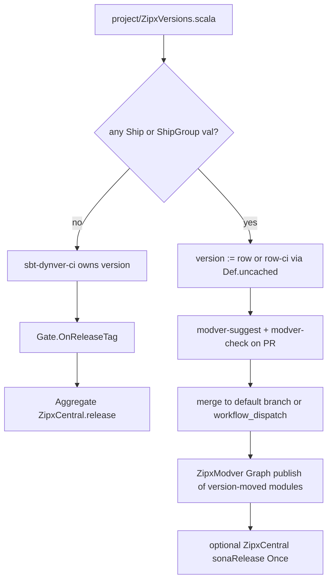
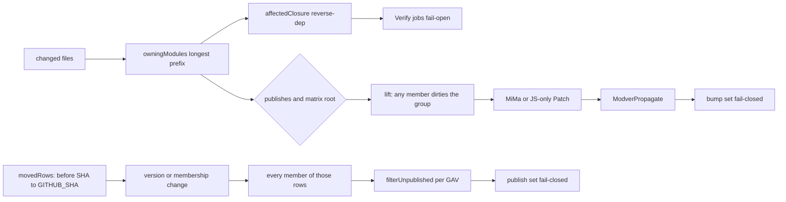

# Independent module versioning (Ship / ShipGroup)

| Field | Value |
|---|---|
| Status | Draft |
| Date | 2026-08-27 |
| Author | TBD |
| Product source | `versions-plan.md` (Locked section is final) |
| Workspace | `/Users/russ/projects/fun/zipx` |

## Overview

zipx today owns topology and the *inbound* versions catalog (`Lib` / `Plugin` / `Pin` / `Action` in `project/ZipxVersions.scala`). Artifact versions are still repo-wide: `sbt-dynver-ci` plus `Gate.OnReleaseTag` plus Aggregate `ZipxCentral.release` treat a `v*` tag as one number for every module. That is the right paved path for lockstep OSS (zipx, specular, chekhov). It is the wrong path for a monorepo that publishes several artifacts on different cadences.

This design adds a fourth catalog collection for *outbound* versions: `Ship` (one sbt project, including all of its `projectMatrix` platform rows) and `ShipGroup` (several sbt projects that always share one number and one release). Presence of any such row is the feature flag. The human writes the number in the PR. CI suggests a MiMa-informed edit as a sticky comment and **fails closed** on a missing or undersized bump. Merge to the default branch is the release signal. Graph publish uploads only modules whose row moved, and skips a GAV already on the registry.

No sibling plugin. No per-module `version.sbt`. No auto-commit of the suggested bump. Verify's `Affected` stays fail-open. zipx-the-product stays on dynver-ci. `examples/monorepo` is the dogfood.

## Background & Motivation

ROADMAP thesis: zipx owns topology; the build owns what to run. The versions catalog already owns inbound coordinates (typed rows, constructor rewrite, `zipxCheckDeps`, CLI `catalog update` above the target sbt). It does not own what this repo *ships*.

Current version assumptions, all repo-wide:

| Piece | Path | Version assumption |
|---|---|---|
| `sbt-dynver-ci` | `project/plugins.sbt`, `project/ZipxVersions.scala` (`dynverCi`) | One `v*` tag, every module is that version or `…-ci` |
| `Gate.OnReleaseTag` | `modules/core/src/main/scala/zipx/core/Capability.scala` | `JobCondition.onReleaseTag` (`startsWith(github.ref, 'refs/tags/v')`) |
| `Capability.publish` | same file, `publishBody` | Aggregate, `OnReleaseTag`, `participates = _.publishes` |
| `ZipxCentral.release` | `modules/central/.../ZipxCentral.scala` and plugin rebuild in `ZipxPlugin.scala` | Aggregate `publishSigned; sonaRelease` on a tag |
| `zipxAffectedPublish` | `PlanConfig.affectedPublish`, default false | Graph Publish may skip per module; **a release tag still publishes everything** and a broken diff fail-opens to `["all"]` |
| `CacheEpoch.GitTags()` | `modules/core/src/main/scala/zipx/core/CacheEpoch.scala` | One cache generation from `v*` tags |
| `ZipxVersions` `Lib` | `modules/core/src/main/scala/zipx/core/ZipxDep.scala` | What this repo depends on |

Pain for a multi-artifact repo: a bugfix in `core` cannot ship without versioning `client`. `zipxAffectedPublish` on a tag is a no-op (tags emit `Affected.AllSentinel`). Two `Ship` rows with the same literal can drift; a group makes lockstep unrepresentable as two numbers.

`zipx.core.Affected` answers "which Verify jobs can we skip." A version manager answers "which coordinates move, to what, and when is upload legal." Reusing `affectedModules` for that second question is how you fail-open a publish.

## Goals & Non-Goals

### Goals

- Typed `Ship` / `ShipGroup` rows in the existing catalog object, collected like `Lib` / `Pin` / `Action`.
- Feature flag: any such row. No rows: today's dynver-ci / `v*` path is unchanged.
- Human-written bump in the PR; CI suggests (MiMa-informed) and refuses undersized or missing.
- Publish only version-moved modules, Graph scope, fail closed, skip GAV already on the registry.
- `catalog update` / `zipxDepUpdate` never rewrite `Ship` / `ShipGroup`.
- `examples/monorepo` dogfoods a `ShipGroup` plus an independent `Ship`.
- Failures stay unrepresentable > compile-time check > `Either` > throw only at the sbt boundary (`ZipxPlugin.orFail`). Core bump/publish-set functions are pure `Either`. `grep -rn "throw \|makeOrThrow\|orThrow" modules/*/src/main` stays empty.

### Non-goals (v1 will not)

- Infer bump size from conventional commits.
- Per-module `version.sbt`.
- Auto-apply a MiMa-suggested version (CI never commits `ZipxVersions.scala` on the PR branch).
- Change Verify Affected to fail closed.
- Docker image tags (sha / moving tags stay a different axis; `Capability.docker*` is unchanged).
- Dogfood independent versioning on zipx-the-product. ROADMAP M9 still recommends `sbt-dynver-ci` + `ZipxCentral.release` + `v*`.
- A sibling plugin a repo could adopt without zipx.

### Explicitly off or locked (not Open Questions)

Optional per-module output tags (`core-v1.4.3`): **off in v1**. A later `v*` remains a human docker/docs tag in the monorepo example.

## Key Decisions

1. **Release signal is a catalog row change merged to the default branch, not a git tag.** Optional output tags after publish are off in v1. Idempotency is "GAV already on the configured registry."

2. **Lives in this repo, on the existing catalog.** Fourth collection (`AsShips`), not a reuse of `Lib`. `organization` / `name` stay in `build.sbt`.

3. **Feature flag is presence of any `Ship` / `ShipGroup` val.** Empty collection: dynver-ci may own `version`, Aggregate `ZipxCentral.release` on `v*` stays legal. Any row: generate refuses dynver-owned `version`, and refuses **library** publish (`Capability.PublishName`) that is Aggregate/Layer or `OnReleaseTag`. Docker and deploy stay on today's gates.

4. **`Ship` identity is the matrix root.** One `Ship("core")` covers `core` and `coreJS`. `ShipGroup` identity is the group name; members are project ids. Fill `ModuleNode.matrixRoot` from sbt `ProjectMatrix` / virtual-axis metadata. v1 suffix auto-detect is JVM+JS/Native with an empty JVM suffix (`shared` / `sharedJS` in scripted `crossproject`). Other axes set `zipxMatrixRoot` or generate fails with a hint. A row-per-platform split is not designed.

5. **Bump set and publish set are not `affectedModules`.** Sibling pure functions in zipx-core: ownership + `ModuleNode.publishes`, no reverse-dep, no "`.sbt` means all." Then lift through groups. Verify stays fail-open. Bump and publish fail closed.

6. **Human writes the number. Disregard means bump more, not skip and not bump less.** Two PR jobs: suggest (sticky comment, best-effort on forks) and gate (`zipxModverCheck`). CI never commits the catalog. **`modver-check` / `modver-suggest` self-compile; `needsCapabilities = Nil`.**

7. **Dependent propagation default is `Never`.** Built-ins: `PatchPublished`, `MatchBump`, `custom`. Intra-group `dependsOn` is not a propagate edge.

8. **Min-bump talks to MiMa via `mima-core` on the plugin classpath.** zipx owns previous-version resolution from the Ship row on the PR base. Not `sbt-mima-plugin`, not `sbt-version-policy`. Honor `versionScheme` / early-semver. JS-only roots skip MiMa and get a patch suggestion.

9. **Independent topology is `ZipxModver`, not `ZipxCentral`.** Graph, `Gate.OnDefaultPush` (plus `workflow_dispatch` in v1), version-moved filter, skip-tolerance, `MatrixCollapse.Off`. The publish `SbtCommand` is a parameter. ZipxCentral stays Maven Central *semantics* (signing, staging, `sonaRelease`, org secrets). GitHub Packages uses the same `ZipxModver` topology with `publish` (or `ZipxGitHubPackages` CI wiring). Registry skip HTTP GET is parameterized by registry root, not hardcoded to repo1.maven.org. `sonaRelease` Once is optional composition, not required by ZipxModver. Prefer `ZipxModver` in the plugin with core wire form in `zipx-core`; no fourth published jar. The monorepo example uses ZipxModver without Central secrets.

10. **`Gate.OnDefaultPush` is a new `Gate` case.** Render: push to `zipxPushBranches` **or** `workflow_dispatch`. Not `Gate.Always` plus an ad-hoc `JobCondition`.

11. **`workflow_dispatch` republish is in v1.** Dispatch runs the `modver` job in registry-only mode: every catalog GAV not on the configured registry, skip 200s, fail closed on HTTP errors. `gh run rerun` of the merge SHA remains the other recovery path.

12. **Between releases, `version` is `<row>-ci` when that row is not releasing on this commit.** Catalog stores the release number only. Local and PR checkouts are always `-ci`. Sibling POM coordinates use the catalog number without `-ci`.

13. **Cache epoch is a choosable `CacheEpoch` strategy.** Independent mode does not force `GitTags()`. Add `CacheEpoch.ShipCatalog`: SHA-256 of sorted Ship identity+version, used as the LocalDir `actions/cache` namespace (same role `GitTags` plays today). Recommended when ships are present. Lockstep OSS keeps `GitTags()`. **BuildBuddy / remote:** do not fold the Ship hash into `Global / cacheVersion` (`cacheVersionFor` stays JDK+OS only). Remote is content-addressed; a Ship bump changes that module's `version`, so only that module's digests miss. LocalDir: one row bump rolls the **repo-wide** LocalDir key (same as a `v*` tag today). `examples/monorepo` sets `zipxCacheEpoch := CacheEpoch.ShipCatalog`.

14. **Lockstep OSS is unchanged.** zipx / specular / chekhov stay on dynver-ci. Independent versioning is opt-in for multi-artifact consumer repos. Optional output tags are off in v1.

## Proposed Design

### Feature flag and two worlds



Detection: `zipxShips` (new setting, analog of `zipxVersions` / `zipxPins` / `zipxActionRows`) is non-empty after `MyVersions.settings`. Plugin `validateCatalog` and `Planner.plan` both see the flag (`PlanConfig.modverPublish`).

### Catalog types (core)

Add to `modules/core/src/main/scala/zipx/core/ZipxDep.scala` (or a sibling `ZipxShip.scala` in the same package; do not put types in a package named `sbt`). Import `scala.annotation.targetName` like `Action`.

`Lib` stays a `ZipxCoord` (group, artifact, version). `Ship` is **not** a `ZipxCoord`. Identity is an sbt project id.

```scala
import scala.annotation.targetName

/** How a catalog val becomes outbound version rows. `Ship` / `ShipGroup` have givens; a bundle can add its own. */
trait AsShips[A]:
  def ships(value: A): Seq[PublishedRow]

object AsShips:
  def apply[A](using ev: AsShips[A]): AsShips[A] = ev
  given ofRow[A <: PublishedRow]: AsShips[A] = a => Seq(a)

type ShipGroupName = ShipGroupName.Type
object ShipGroupName extends Subtype[String]:
  override inline def validate(input: String): Boolean | String =
    if input.nonEmpty then true else "a ship group name must be non-empty"

sealed trait PublishedRow:
  def version: DepVersion
  def label: String                 // "Ship" or "ShipGroup", for comments and apply
  def identity: String              // project id or group name
  def memberRoots: List[ModuleId]   // matrix roots this row owns

final case class Ship(id: ModuleId, version: DepVersion) extends PublishedRow:
  def label: String               = "Ship"
  def identity: String            = id
  def memberRoots: List[ModuleId] = List(id)

object Ship:
  /** Catalog literal. `@targetName` plus `new` because `ModuleId` / `DepVersion` erase to `String` and would clash
    * with the case-class apply. Same pattern as [[Action.apply]] in `ZipxDep.scala` (Lib/Plugin dodge it with extra
    * defaults; Ship has none). */
  @targetName("fromLiterals")
  inline def apply(inline id: String, inline version: String): Ship =
    new Ship(ModuleId(id), DepVersion(version))

final case class ShipGroup(
    name: ShipGroupName,
    version: DepVersion,
    members: List[ModuleId],
) extends PublishedRow:
  def label: String               = "ShipGroup"
  def identity: String            = name
  def memberRoots: List[ModuleId] = members

object ShipGroup:
  inline def apply(inline name: String, inline version: String)(inline members: String*): ShipGroup =
    ShipGroup(ShipGroupName(name), DepVersion(version), members.toList.map(ModuleId(_)))
```

Consumer file (locked shape):

```scala
object MyVersions extends ZipxVersions:
  val zio    = Lib("dev.zio", "zio", "2.1.26")
  val core   = Ship("core", "1.4.2")
  val cli    = Ship("cli", "0.3.0")
  val foo    = ShipGroup("foo", "1.4.2")("foo-api", "foo-cli", "foo-impl")
  def libraries = library(zio)
```

`ModuleId` already forbids GitHub-illegal project ids (`ModuleId.make("café")` is `Left`). A `Ship` literal is therefore checked while the catalog compiles, same as `Lib` / `Action`.

A group of one is representable but pointless; it is legal (it is just `Ship`). Empty `members` is representable at the type level (varargs) and **refused at generate** (see refusal table). Compile test in PR 1: `Ship("core", "1.4.2")` typechecks to `Ship` (the `@targetName("fromLiterals")` factory, not a recursive apply).

**Helper types** (constructors and equality for PRs 1/4/5; do not invent incompatible shapes):

```scala
/** Identity of a catalog row: a lone Ship's project id, or a ShipGroup's name. Not a platform row id. */
enum ShipRef:
  case One(id: ModuleId)
  case Group(name: ShipGroupName)

final case class ShipIndex(
    byIdentity: Map[ShipRef, PublishedRow],
    byRoot: Map[ModuleId, PublishedRow],
):
  def refOf(row: PublishedRow): ShipRef = row match
    case s: Ship      => ShipRef.One(s.id)
    case g: ShipGroup => ShipRef.Group(g.name)
  def liftGroups(dirtyRoots: Set[ModuleId]): Set[ShipRef] =
    dirtyRoots.flatMap(byRoot.get).map(refOf).toSet

/** Min-bump map after lift (and, later, after propagate). */
opaque type BumpSet = Map[ShipRef, BumpKind]
object BumpSet:
  def apply(m: Map[ShipRef, BumpKind]): BumpSet = m
  extension (b: BumpSet) def asMap: Map[ShipRef, BumpKind] = b

enum RegistryStatus:
  case Published, Missing
```

`ShipIndex.liftGroups`: any dirty member dirties the whole group (the group's `ShipRef`, not each member). `BumpKind` min-bump `Ordering` is explicit: `None < Patch < Minor < Major`. `PreRelease` is not in that ordering and is not a min-bump.

Catalog versions that already end in `-ci` are refused at generate (`Ship("core", "1.4.2-ci")` is a `zipx:` error). `zipxModverBump` must not write `-ci`.

### Collection (`Catalog` / `ZipxCatalog` / plugin settings)

Mirror `coordsOf` / `pinsOf` / `actionsOf` in `modules/core/src/main/scala/zipx/core/ZipxCatalog.scala`:

```scala
inline def shipsOf[A](inline catalog: A): Seq[PublishedRow] = ${ shipsOfImpl[A]('catalog) }
```

Walk the same `catalogValParts` (source declaration order, parent traits then object, skip `def`s and types without a given). `SbtVersion`, `ScalaVersion`, `List`, and named groups stay uncollected.

`modules/core/src/main/scala/zipx/ZipxVersions.scala` (`trait Catalog`):

```scala
inline def ships: Seq[PublishedRow] = zipx.core.ZipxCatalog.shipsOf[this.type](this)
```

Plugin `trait ZipxVersions` (`modules/sbt-plugin/src/main/scala/zipx/ZipxVersions.scala`):

```scala
inline def settings: Seq[Setting[?]] =
  ZipxVersions.applySettings(sbt, scala, coords, pins, actions, ships)
```

`applySettings` gains `shipRows: Seq[PublishedRow] = Nil` and:

```scala
zipxShips := shipRows,
```

When `shipRows.nonEmpty`, assign `version` only on projects that have a row (next section). When empty, do **not** set `version`; dynver-ci may own it.

`PlanConfig.modverPublish` is derived only from `zipxShips.nonEmpty` in `planConfig` (`ZipxPlugin.scala`). There is no `zipxModver := true` that could disagree with the catalog.

New **autoImport** keys (register in `ZipxSettings.buildLevel` / `projectLevel` / `tasks` so Settings docs stay generated). Follow `zipxVersions` / `zipxDepUpdate` / `zipxAffectedModules`: descriptions live on `SettingDef`, plugin key RHS is `ZipxSettings.*.description`. `ZipxSettingsSpec` name lists must include every row.

| Key | Kind | Scope | Default | Purpose |
|---|---|---|---|---|
| `zipxShips` | Setting `Seq[PublishedRow]` | Build | `Seq.empty` | Collected `Ship` / `ShipGroup` rows |
| `zipxModverPropagate` | Setting `ModverPropagate` | Build | `ModverPropagate.Never` | Reverse-dep bump policy |
| `zipxMatrixRoot` | Setting `Option[ModuleId]` | Project | `None` | Override inferred matrix root (Scala-version axes, weird layouts) |
| `zipxModverBump` | Input | | | Rewrite `Ship(` / `ShipGroup(`; default patch |
| `zipxModverCheck` | Task | | | Fail closed on missing / undersized (post-propagate) |
| `zipxModverCompat` | Task | | | Compile bump set, MiMa, write min-bump report |
| `zipxModverSuggest` | Task | | | Sticky PR comment (best-effort) |
| `zipxModverPublishModules` | Input | | | Write `target/zipx-modver-publish.json` (object) and `target/zipx-modver-modules.json` (id array); fail closed |
| `zipxModverPublishSigned` | Task | | | Publish this `scalaBinaryVersion` only if it is in that module's JSON `missing` list |

**Not autoImport:** `zipxModverReleaseFlags` (if it exists as a setting at all) is private plugin state. Users must not set it. Releasing vs `-ci` is computed from `GITHUB_ACTIONS` plus the same catalog-diff function publish uses.

### Identity vs `ModuleGraph` / `projectMatrix`

`ZipxPlugin.buildGraph` creates one `ModuleNode` per `ProjectRef`. Scripted `crossproject` proves the JVM row is `shared` and the JS row is `sharedJS`, with synthetic `baseDir` under `.sbt/matrix/` and real sources on `ModuleNode.sourcePaths`. There is **no** `matrixRoot` field today.

Smallest extension: add `matrixRoot: ModuleId` to `ModuleNode`, defaulting to `id` so every existing fixture keeps compiling.

```scala
final case class ModuleNode(
    id: ModuleId,
    // ...existing fields...
    matrixRoot: ModuleId, // default: id
)
```

Plugin fills it when building the graph, in this order:

1. Per-project `zipxMatrixRoot: Option[ModuleId]` (autoImport, default `None`). If `Some`, that is the root.
2. Else sbt `ProjectMatrix` / `VirtualAxis` metadata when the plugin can read it (the `projectMatrix` origin id, not the synthetic `.sbt/matrix/<id>` base). This is the default that implements the lock "one Ship covers every publishing matrix row of that id," including Scala-version suffixes such as `coreJS2_13`.
3. Else v1 suffix auto-detect: if `ref.project` is `X + "JS"` or `X + "Native"` **and** a project `X` exists **and** the two nodes share at least one `sourcePaths` entry that is not under `.sbt/` or `target/`, then `matrixRoot = X`. This is what scripted `crossproject` actually is (`shared` / `sharedJS`).
4. Else `matrixRoot = id`.

If step 2 is not reachable on the sbt 2 API the plugin sees, document that limit in generate: only JVM+JS/Native with an empty JVM suffix is auto-detected; `coreJS2_13` / `core3` without `zipxMatrixRoot` fails membership with a hint to set it. Shared-source matching is a fallback, not the primary rule (two unrelated projects sharing a source dir must not be grouped).

`Ship("shared", …)` owns every node with `matrixRoot == "shared"` (both `shared` and `sharedJS`). `Ship("sharedJS", …)` is refused at generate with a hint to use the matrix root.

A JS-only `projectMatrix` that only calls `.jsPlatform` typically produces id `fooJS` and no `foo` node: then `matrixRoot` stays `fooJS`, and the catalog writes `Ship("fooJS", …)`. That is still one Ship per matrix root. A later row-per-platform split is deferred.

Membership is computed on **matrix roots**, not platform rows:

```scala
def publishingRoots(graph: ModuleGraph): Set[ModuleId] =
  graph.nodes.filter(_.publishes).map(_.matrixRoot).toSet
```

Each such root is in exactly one `PublishedRow.memberRoots`. Platform rows inherit the row of their root. `publish / skip` on a platform row: if *any* platform of the root publishes, the root must be in a row; a fully skipped root must *not* be in a row.

`ShipGroup` members are roots, not `fooJS`. Intra-group `dependsOn` (including `fooJS` depending on `foo`) is not a propagate edge.

### Version assignment (`Def.uncached`)

sbt 2 caches per-module settings factories. `ZipxVersions.library` already uses `libraryDependencies ++= Def.uncached(...)`. Version assignment must too.

**Do not declare `version` on projects with no row.** A common `version := Def.uncached { row match case None => version.value }` is a self-dependency on the `version` key. `MyVersions.settings` is dropped at the top of `build.sbt` (common settings, every project), including root aggregators and unpublished apps (`service` with `publishArtifact := false`). Dynver is refused when ships are present, and the dogfood removes the bare `version := "1.4.2-ci"`. sbt still requires *some* `version` on those projects; it should be sbt's default (`0.1.0-SNAPSHOT`) or an explicit dummy that is never published, not a loop on `version.value`.

When `shipRows.isEmpty`, `applySettings` omits `version` entirely (dynver-ci may own it). When non-empty, assign `version` only on refs that `Modver.rowFor` hits: plugin `projectSettings` gated on the row, or a `ScopeFilter` over publishing refs. Sketch:

```scala
version := Def.uncached {
  val pub = Modver.rowFor(thisProject.value.id, zipxShips.value).get
  if Modver.thisCommitReleases(pub) then (pub.version: String) else s"${pub.version}-ci"
}
```

`thisCommitReleases` is not a user setting. It is computed in the plugin from the **same** `Modver.movedRows` value publish uses. It is true iff **any** of:

- `refOf(row)` is in `versionChanged` or `added`
- `row.memberRoots` intersects `newMembers`

A catalog-only `ShipGroup` member add must therefore assign the catalog number (not `-ci`) to that new root in the Graph publish job. POM rewrite of *dependencies* is not enough; the module's own `version` is what Central gets.

How CI reads the range (this is not an env var named `github.event.before`):

- Synthetic `modver` job: GHA expression `github.event.before` written to `$BEFORE` for `zipxModverPublishModules`.
- `version :=` and `zipxModverPublishSigned` in Graph publish jobs: parse `GITHUB_EVENT_PATH` (the push payload JSON, field `before`) plus `GITHUB_SHA`. Reject the all-zero SHA.

On `GITHUB_ACTIONS` plus `push` to a `zipxPushBranches` ref, a missing `GITHUB_EVENT_PATH`, unreadable file, malformed JSON, or absent `before` field is `Left`. The plugin `orFail`s the task that needs `version` (`zipxModverPublishSigned` / any `version.value` in that session). Do **not** assign `-ci` and continue: the job `if:` already selected the module, and a `-ci` GAV is the hole round 2 closed for `newMembers`.

Flags:

- No `GITHUB_ACTIONS`: every flag false (always `-ci`). A developer on `main` after merge must not `publishSigned` from a laptop racing CI. Local never consults the payload.
- `GITHUB_ACTIONS` plus `push` to a `zipxPushBranches` ref: `movedRows` as above, including `newMembers`. Parse failure is a failed task, not `-ci`.
- Anything else (PR, tag, dispatch in v1): `-ci`. Do not consult the payload.

`zipxModverBump` is the only local catalog writer. Scripted in PR 2: `sbt --no-server 'show models/version; show client/version; show root/version; show service/version'` after `MyVersions.settings`, including a skipped-publish module. Scripted in PR 5: catalog-only member add on a simulated `GITHUB_ACTIONS` default-branch push `show`s the catalog number for the new member, not `-ci`.

**In-repo POM coordinates.** `dependsOn` is a project ref at compile time. The published POM revision of a sibling comes from that sibling's `version` key. If `core` is `1.4.2-ci` in the same session while `client` publishes `0.3.1`, client's POM would depend on `core_3;1.4.2-ci`. That GAV is not on Central.

The tree has no `projectDependencies` / `pomPostProcess` usage today. PR 2 spikes the sbt 2 hook `makePom` actually reads (likely `projectDependencies` or `pomPostProcess` on publishing configs) and names it in the implementation. Behavior, independent of the key:

- Rewrite applies only when producing a POM (`makePom` / `publishSigned` / `publishLocal`). Compile `dependsOn` is unchanged.
- A dependency on matrix root `R` uses the catalog version **without** `-ci` (last released coordinate, or the version being uploaded if `R` is also releasing).
- Never emit `-ci` into a POM. `publishLocal` coordinates are therefore **release numbers**, not `-ci`. That is a footgun if another build consumes the ivy module expecting a CI coordinate; in-repo `dependsOn` stays a project ref so the zipx build itself is fine. Document it.
- Scripted mixed-release POM assert: `ShipGroup` + independent `Ship` writes the catalog revision into the independent module's POM.

`organization` / `moduleName` / `crossVersion` stay on the project. Registry lookup enumerates live GAVs from those keys (see "Registry skip is per GAV").

### The three sets



| Set | Function | Inputs | Rule | Failure |
|---|---|---|---|---|
| Test | `Affected.affectedModules` / `outputModules` | graph, files | reverse-dep of owners; `.sbt` / `project/` => all; diff fail => `["all"]` | fail **open** |
| Bump | `Modver.liftedBumpSet` then min-bump then `propagate.expand` | graph, ships, files | owners ∩ publishes, **no** reverse-dep, **no** build-file explosion, group lift, **then** MiMa kinds, **then** propagate | fail **closed** |
| Publish | `Modver.movedRows` then `filterUnpublished` | ships, before SHA, graph, registry | every platform row of a row whose version **or membership** changed on `before`…`GITHUB_SHA`; job skipped only when every binary is 200; job that runs uploads **only Missing** binaries | fail **closed** |

Do not call `Affected.affectedModules` from bump/publish. `Affected.owningModules` **is** reused: same longest-prefix rule, including cross-built shared sources mapping to every platform row (`AffectedSpec` matrix fixture). Then:

```scala
object Modver:
  /** Owning published matrix roots. Empty file list is empty set, not all. */
  def dirtyRoots(
      graph: ModuleGraph,
      changedFiles: List[String],
  ): Set[ModuleId] =
    changedFiles
      .flatMap(path => Affected.owningModules(graph, path))
      .flatMap(id => graph.get(id).toList)
      .filter(_.publishes)
      .map(_.matrixRoot)
      .toSet

  /** Fail closed: None files => Left. `.sbt` / `project/` do not expand.
    * Kinds are not Patch placeholders. Callers run MiMa (or JS-only Patch) on `lifted`, then `propagate.expand`.
    * PR 1 stubs `expand` as identity. */
  def liftedBumpSet(
      graph: ModuleGraph,
      ships: ShipIndex,
      changedFiles: Option[List[String]],
  ): Either[String, Set[ShipRef]] =
    changedFiles match
      case None        => Left("could not diff changed files for modver; refusing to guess the bump set")
      case Some(files) => Right(ships.liftGroups(dirtyRoots(graph, files)))

  /** Catalog diff on `before`…`head`. Missing file at `before` is `Right(empty)`, not Left (first adoption).
    * Failed `git show` / unreadable git is `Left`. Membership adds are moved; version-equal existing members are not. */
  def movedRows(
      current: ShipIndex,
      previous: Either[String, ShipIndex],
  ): Either[String, MovedRows]

  /** Module ids whose *job* must run, plus the Missing binaries each job may upload. */
  def filterUnpublished(
      moved: MovedRows,
      gavs: ModuleId => List[Gav],
      registry: Gav => Either[String, RegistryStatus],
  ): Either[String, Map[ModuleId, List[Gav]]]
```

Core `Either` strings are the **suffix** (no `zipx:` prefix). `ZipxPlugin.orFail` and Planner `sys.error` add `zipx:` once, matching `ModuleId.make` through `orFail`. Tests assert the refusal-table substrings after that single prefix.

`project/ZipxVersions.scala` sits under `project/`, so **Verify** still treats it as a build file and fail-opens. That is unchanged. For bump, a catalog-only edit is **not** "all modules": `owningModules` of `project/ZipxVersions.scala` is empty (root `baseDir` `""` never matches; `project/` is not a module source path). A Ship version edit without source changes is an over-bump: the gate passes. A source change without a Ship edit is a missing bump: the gate fails.

`build.sbt` also does not expand the bump set. POM-only edits that zipx cannot map to a module are a known gap (see Risks). Do not revive "`.sbt` means all" to close it.

**Bump pipeline (order is load-bearing for `MatchBump`):**

1. `liftedBumpSet`: dirty published roots, group lift. No reverse-dep. No kinds yet.
2. Min-bump: MiMa (or JS-only Patch) on that set. Binary break upgrades the kind. First publish / no previous artifact: `None` floor (any written version is legal).
3. `propagate.expand` with **those** kinds. Dependents added only by propagate inherit the triggering kind as the floor; v1 does not run extra MiMa on them.
4. Check and sticky comment consume the post-propagate `BumpSet`.

PR 1 ships step 1 with `expand` as identity. PR 3 adds step 2. PR 4 must not ship Patch-then-MiMa: `MatchBump` sees the MiMa kind of `core` (Major) and floors `client` at Major. `max` uses `Modver.minBumpOrd` (`None < Patch < Minor < Major`), not `BumpKind` enum ordinal (`PreRelease` sits after `Major` in `PinFeed.scala` and is not a min-bump).

### How "version moved vs last successful publish" is computed

Nothing in the tree today compares outbound versions to a registry. `MavenMetadata.latest` is inbound lookup (latest of a `Lib` / `Plugin`). `gitDiffNames` in `ZipxPlugin` is fail-open for Affected. We add a fail-closed pair.

**One function, one range, both flags and publish consume it.** There is no stored last-success SHA. "Last successful publish" means: the catalog identity appeared, its version string changed, or a new member joined the group on this git range, then drop GAVs whose POM GET is 200.

```scala
final case class MovedRows(
    versionChanged: Set[ShipRef],   // identity existed on both sides, version string differs
    added: Set[ShipRef],            // new Ship / ShipGroup identity (first adoption of that row)
    newMembers: Set[ModuleId],      // member added to an existing group, version may be unchanged
)

def thisCommitReleases(row: PublishedRow, moved: MovedRows, index: ShipIndex): Boolean =
  val ref = index.refOf(row)
  moved.versionChanged.contains(ref) || moved.added.contains(ref) ||
    row.memberRoots.exists(moved.newMembers.contains)

def parseCatalogAt(sha: String, file: String): Either[String, ShipIndex]
```

`parseCatalogAt`: missing file at that SHA is `Right(ShipIndex.empty)` (first adoption). Failed `git show`, missing git, or parse error is `Left`. Callers must not collapse those.

**Range on CI:** `github.event.before`…`GITHUB_SHA` on `push` (reject the all-zero SHA a branch-create reports). Direct push of several commits: `event.before` is the previous branch tip, so every catalog edit in that range is visible. `HEAD^` is **not** used; it would see only the last commit and disagree with the publish job.

**Range on PR (check / suggest):** `github.event.pull_request.base.sha`…`HEAD` (same env pattern as `Capability.pinCheck`'s `ZIPX_PIN_BASE_SHA`).

**Local:** `movedRows` is not consulted for `version :=`. Every Ship-backed `version` is `-ci` (no `GITHUB_ACTIONS`).

**Membership diffs.** Adding `foo-impl` to `ShipGroup("foo", "1.4.2")` without bumping `1.4.2` is a `newMembers` entry: `foo-impl` is in the publish set; siblings at `1.4.2` 200-skip if already on Central. Removing a member is generate-only: the leftover root must get its own `Ship` or stop publishing (`publishes = false`); it is not unpublished from Central. `zipxModverCheck` fails if a **new member is also in the lifted bump set** (own sources dirty) and the group version did not move. A catalog-only membership add (scaffold, no source change) is a first publish at the current number: the sticky comment names it; the check passes. `ModverSpec` law: new member of an existing group is in `publishSet`; version-unchanged siblings are not unless their GAV is missing.

**PR (check / suggest)** then:

1. `movedRows` on the PR range (fail closed on git/parse).
2. Min-bump on the **lifted dirty set**, then propagate (see bump pipeline). A version already written in the PR is compared with `VersionStrategy` numeric order against the MiMa floor. Undersized or missing (dirty but version equal to base) fails.

**Default-branch push (publish)** then:

1. `movedRows` on `before`…`GITHUB_SHA`. Git/parse failure: the `modver` job **fails** (does not write `["all"]`). Contrast `affectedScript`, which assigns `["all"]` on tag/dispatch/bad before.
2. `filterUnpublished`: enumerate live GAVs (next subsection). Skip a **module job** only when **every** GAV for that module is `Published`. If any GAV is `Missing`, the job runs and uploads **only those Missing binaries** (see registry skip). Any non-404/410 HTTP is `Left`.

Write both files under `baseDirectory.value / "target"` (not `(target).value`; sbt 2's `target.value` is `target/out/jvm/…`), same reason as `zipx-affected.json` in `affectedModulesTask`:

- `target/zipx-modver-publish.json`: object with `missing` (task input).
- `target/zipx-modver-modules.json`: compact id array, same shape as `zipx-affected.json` (GITHUB_OUTPUT / Graph `if:`).

Empty list is legal (docs-only main push): Graph Publish jobs skip. `sonaRelease` must not run against an empty staging tree: `central-release` is skip-tolerant (see skip-tolerance below) and the task no-ops when the JSON is `[]` or no `sona-staging-*` artifacts exist.

**Recovery.** A later main SHA does not republish a failed merge (`movedRows` on that later range is empty). Recovery is `gh run rerun` of the merge SHA, **or** `workflow_dispatch` in registry-only mode (every catalog GAV not on the configured registry). Registry skip still protects a successful rerun.

**First publish.** Previous catalog lacks the identity (`added`); registry 404s. Any catalog version is legal. Comment is "add a `Ship` row" when membership is missing, not a numeric bump. MiMa is skipped (no previous artifact).

#### Registry skip is per GAV, not per ModuleId

`MavenMetadata.mavenArtifact` is `private` and inbound (`Lib` / `Plugin`, including `_3` vs Java `%`). A publishing module with `crossScalaVersions` 2.13+3 (the monorepo: `MyVersions.cross`) uploads **two** Maven GAVs from one `ModuleId` via `runningEachCross` / `SbtCommand.crossModule` (`publishBody` has `matrixed = false`). GET of "the" POM cannot decide skip vs publish: skipping because `_3` is 200 while `_2.13` is 404 strands a binary; publishing because one binary is missing retries the 200 binary and fails the job on Central's reject.

Enumerate live `(organization, artifactId, scalaBinary, version)` from sbt keys **per platform row**, including Scala.js `sjs1` suffixes on JS rows. Export or twin `mavenArtifact` for outbound coordinates. Reuse `HttpLookup.get` (retries with jitter are real in `HttpLookup.scala`). The GET URL is **`ModverRegistry.pomUrl(gav)`**, not a hardcoded repo1.maven.org path. `ModverRegistry.MavenCentral` is `https://repo1.maven.org/maven2/…`. `ModverRegistry.GitHubPackages(owner, repo)` uses `https://maven.pkg.github.com/…` and the workflow token when present. `ModverRegistry.Url(base)` is the hatch. Default in `zipxModverPublishSigned` is Maven Central so ZipxCentral consumers need no extra setting; GitHub Packages consumers pass the registry into `ZipxModver.publish`.

```scala
final case class Gav(organization: String, artifact: String, version: String)
```

Skip the module's Graph job only when every `Gav` is `RegistryStatus.Published`. If any is `Missing`, the job still runs, but **must not** call `+id/publishSigned` / `runningEachCross(publishSigned)` over every `crossScalaVersions` binary. sbt's cross publish uploads all of them; Central **rejects** a 200 GAV (it does not no-op). That is the recovery path: first attempt publishes `_2.13` then dies; `gh run rerun` of the same SHA sees 200 + 404; a full `publishSigned` retries `_2.13`, Central 400, `_3` never ships.

Required command: `zipxModverPublishSigned` (plugin task, `Def.uncached`). Two files, two readers:

1. **`target/zipx-modver-publish.json`** (object). The task reads `missing`. Written by `zipxModverPublishModules` from `filterUnpublished`.
2. **`target/zipx-modver-modules.json`** (compact JSON **array** of module ids, same shape as `target/zipx-affected.json`). The synthetic job cats **this** file into `GITHUB_OUTPUT`. Graph `if:` is `contains(fromJson(needs.modver.outputs.modules), '<id>')` with no `'all'` sentinel. GitHub `contains` on an object tests keys (`modules`, `missing`), not id membership; do not cat the object. Do not `jq` (scripted runners may not have it).

```json
{"missing":{"client":["2.13","3"],"foo-impl":["3"]}}
```

```json
["client","foo-impl"]
```

**Cross is selected once.** `ZipxModver.publish` is `runningEachCross(command)` and nothing else. Default `command` is `zipxModverPublishSigned`. `runningEachCross` is `SbtCommand.crossModule`: it sets `cross = true` when `crossScalaVersions` has more than one entry, so the session already walks each binary (`+id/zipxModverPublishSigned`). `zipxModverPublishSigned` **must not** `++` internally. For the current `scalaBinaryVersion`, if that binary is in this module's `missing` list, run `publishSigned` for this module only; otherwise log skip and exit 0. Double-cross (`N` outer switches times an inner `++` loop) is refused. Mixed 200/404 is a **tested recovery case in PR 5**, not a Central reject. Fail closed on non-404/410 HTTP stays.

### Min-bump (MiMa) and `versionScheme`

Runs on the **lifted dirty set**, before `propagate.expand` (see bump pipeline). After compile of those modules (the Once job runs `sbt <id>/compile` for those roots, JVM row first). Graph test jobs already compiled *affected* modules, which is a superset, but those classfiles live on other runners. v1 does **not** change Graph test jobs (avoids `allJobIds` churn). The check job compiles itself; LocalDir cache makes the extra compile cheap.

Drive [MiMa](https://github.com/lightbend/mima) **core** (`com.typesafe:mima-core` on the plugin classpath), not `sbt-mima-plugin` (would fight `mimaPreviousArtifacts`) and not `sbt-version-policy` (resolves previous from tags / `versionPolicyPreviousVersions`).

Previous artifact: `organization.value %% moduleName % previousCatalogVersion` (or `%` when `crossVersion` is disabled), resolved from the PR base catalog + live sbt keys. Missing previous (first publish, or 404): no problems, min bump `None`.

Map problems:

| `versionScheme` | Binary break (MiMa problem) | No problems, sources dirty |
|---|---|---|
| `early-semver`, version `0.y.z` | minor (`0.y+1.0`) | patch |
| `early-semver` / `semver-spec` / unset, `>= 1.0.0` | major | patch |
| `pvp` | treat as early-semver unless a consumer asks otherwise (v1) | patch |

Read `versionScheme` per project (`ThisBuild / versionScheme` is already `Some("early-semver")` in zipx's own `build.sbt`; consumers should set it). Default if unset: `early-semver`.

JS-only roots: skip MiMa, suggested kind = patch unless the human writes more. ShipGroup: min-bump is the **max** of members that have a previous artifact, using `Modver.minBumpOrd` (`None < Patch < Minor < Major`; `PreRelease` is not a min-bump). One constructor in the comment. Dependents added only by propagate do not get a second MiMa run in v1; their floor is the inherited kind.

Report file: `target/zipx-modver-report.json` (module/group identity, from, suggested to, kind, whether MiMa ran). Check and suggest both read it. Tasks are `Def.uncached`.

### Suggest vs gate (two jobs)

Locked product: two jobs, not one auto-commit.

| | `modver-suggest` | `modver-check` |
|---|---|---|
| Capability | `Capability.once(ModverSuggestName, zipxModverSuggest, Phase.Verify, Always)` + `condition = eventIs("pull_request")` | same with `ModverCheckName` / `zipxModverCheck` |
| Missing bump | comment with suggested `Ship("core", "1.4.3")` or the `ShipGroup` constructor | fail |
| Undersized | comment with the legal constructor | fail until `written >= suggested` |
| Over-bump | optional note, not a fail | pass |
| Forks | `gh` comment may fail; step `|| true` | still the gate |
| Permissions | `pull-requests: write`, `contents: read` | `contents: read` |

Inject in `capabilitiesOf` **into the builtin list before** `combineCapabilities`, when `zipxShips` is non-empty, so same-name replace still works. Appending after combine would ignore a user replacement. Do **not** put them in `builtinCapabilities` for lockstep repos (ships empty).

Both jobs self-compile. **`needsCapabilities = Nil` is locked.** Independent of test topology; no `validateSkipConsumers` interaction; Graph `test-*` fan-out does not serialize the gate.

**Sticky comment.** Marker `<!-- zipx-modver -->`. One issue comment per PR: `gh api repos/{repo}/issues/{n}/comments`, find by marker, `PATCH` or `POST`. Body contains:

1. Human-readable table (identity, from, suggested, written, status).
2. A GitHub suggested-change fenced block **if** `git show HEAD:project/ZipxVersions.scala` still has the exact `from` constructor on one line:

````markdown
```suggestion
  val core = Ship("core", "1.4.3")
```
````

Issue comments cannot apply as a one-click GitHub "suggested change" (that requires a review comment on the diff). Attempt a PR review comment on the line (`pulls/{n}/comments` with `commit_id`, `path`, `line`) when the line still matches; on failure, the issue comment is the fallback. The sticky part is the issue comment, updated per push, not a new thread per SHA.

CI never `git commit`s. Local `zipxModverBump` is the apply path.

### Propagation

```scala
enum ModverPropagate:
  case Never
  case PatchPublished
  case MatchBump
  case Custom(f: (Map[ShipRef, BumpKind], ModuleGraph, ShipIndex) => Map[ShipRef, BumpKind])

object ModverPropagate:
  def default: ModverPropagate = Never
```

`zipxModverPropagate := ModverPropagate.Never` (default).

Walk **across** groups and lone Ships only. Contract the graph: each `PublishedRow` is one node; an edge exists if any member of A has a `dependsOn` whose `matrixRoot` belongs to B. Intra-group edges disappear.

- **Never:** post-propagate set = lifted+MiMa set only.
- **PatchPublished:** every published reverse-dep not already in the map gets `Patch`. Existing kind wins via `Modver.minBumpOrd.max`.
- **MatchBump:** those dependents get `max(existing, triggering kind)` on that same ordering, so a binary-breaking `core` floors `client` at Major, not Patch.
- **custom:** the lambda is the whole policy (allowlists, "core major => client major but util patch").

Comment and check run **after** propagate, so `MatchBump` cannot merge `core` minor with `client` still at the old number.

`BumpKind` already lives in `modules/core/src/main/scala/zipx/core/PinFeed.scala` (`None, Patch, Minor, Major, PreRelease`). Reuse it. Add `Modver.minBumpOrd: Ordering[BumpKind]` and `Modver.bumpVersion(from, kind, scheme): Either[String, String]` using the same parse as `VersionStrategy.npm` (`major.minor.patch` plus optional `-pre`).

### Topology pack and planner

Independent mode cannot use today's `ZipxCentral.release`:

- `gate = OnReleaseTag` is repo-wide `v*`.
- Aggregate joins every `publishes` module into one session.
- `zipxAffectedPublish` still publishes everything on a tag (`affectedScript` `elseDo = buildEverything`).

**`ZipxModver` is topology, not a registry.** Wire form in `zipx-core`; plugin `autoImport.ZipxModver` rebuilds from real keys. Do **not** put this on `ZipxCentral` (people release to GitHub Packages and elsewhere). Do **not** add a fourth published jar: the example must generate without Central secrets.

```scala
// core wire form
enum ModverRegistry:
  case MavenCentral
  case GitHubPackages(owner: String, repo: String)
  case Url(base: String) // maven-style POM / metadata root

object ZipxModver:
  /** Same-name replace of builtin Aggregate `publish`. Graph, OnDefaultPush, MatrixCollapse.Off. */
  def publish(
      command: SbtCommand,
      registry: ModverRegistry = ModverRegistry.MavenCentral,
  ): Capability =
    Capability.publishGraph
      .copy(gate = Gate.OnDefaultPush)
      .withMatrixCollapse(MatrixCollapse.Off)
      .runningEachCross(command)

// plugin
def publish(
    command: SbtCommand = CapabilityTasks.of(zipxModverPublishSigned),
    registry: ModverRegistry = ModverRegistry.MavenCentral,
): Capability =
  zipx.core.ZipxModver.publish(command, registry)
```

Consumers **compose** semantics packs:

```scala
// Maven Central
zipxCapabilities += ZipxModver.publish(CapabilityTasks.of(publishSignedKey))
zipxCapabilities += ZipxCentral.releaseOnce.copy(gate = Gate.OnDefaultPush) // optional Once

// GitHub Packages (same topology)
zipxCapabilities += ZipxModver.publish(
  CapabilityTasks.of(publish),
  registry = ModverRegistry.GitHubPackages("acme", "libs"),
)
```

`ZipxCentral.releaseOnce` (existing `central-release` + staging download + GPG) is **optional composition**. ZipxModver does not upload staging or call `sonaRelease`. The Graph command is whatever the consumer passed; `zipxModverPublishSigned` is only the default (skip Missing-only, then `publishSigned`). A Packages build passes `CapabilityTasks.of(publish)` (or a thin wrapper that still consults `ModverRegistry.pomUrl` before running `publish`). For GitHub Packages, GET may send `GITHUB_TOKEN` (`packages: read`).

`combineCapabilities` replaces builtin `Capability.publish` because the name is still `publish`.

**New `Gate` case** `OnDefaultPush`:

```scala
enum Gate:
  case Always, OnReleaseTag, AffectedOnly, OnDefaultPush
```

Render: (`github.event_name == 'push'` AND `github.ref` is one of `refs/heads/${zipxPushBranches}`) **or** `github.event_name == 'workflow_dispatch'`. Thread `PlanConfig` into `jobCondition` / `onceJob` / `validateSatisfiable`. `AffectedOnly` stays a rejected seam. `triggersFor` emits `workflow_dispatch` when `modverPublish` is on (or the build already set `zipxWorkflowDispatch := true`).

`PlanConfig.modverPublish` is filled in `planConfig` from `zipxShips.nonEmpty` only.

**MatrixCollapse.** Default plan collapse is `Auto`. `graphCollapseFeasible` is false when DependencyOrdered jobs have inter-module `needs` (`MatrixCollapse.scala`), so a dependsOn chain (the monorepo) expands. Two unrelated Ships with no `dependsOn` *are* feasible to collapse into one `publish` job with `strategy.matrix.module`. Job-level `if:` cannot use `matrix.*` (Planner already documents this; affected uses job-level non-empty plus step-level `affectedContainsMatrixModule`). **Lock `ZipxModver.publish` to `MatrixCollapse.Off`:** one Graph job per module, version-moved `contains(..., '<id>')` at job `if:`. Packs YAML and the `allJobIds` property lock Off. A later Coarse/Auto collapsed gating (job `if:` OnDefaultPush and JSON non-empty, step `if:` `contains(..., matrix.module)` with no `'all'`) is out of v1.

Graph **library** publish when `PlanConfig.modverPublish` (`Capability.PublishName` only):

- `needs` the synthetic `modver` job (like `affected`) **and** DependencyOrdered ancestor `publish-<id>` jobs (`nearestParticipatingAncestors` in `graphJobsFor`).
- `if:` is `OnDefaultPush` (push to default **or** `workflow_dispatch`) AND `contains(fromJson(needs.modver.outputs.modules), '<id>')` AND `skipTolerantClauses` on guarded needs (see skip-tolerance). On `workflow_dispatch`, `zipxModverPublishModules` uses **registry-only** mode (every catalog GAV, not `movedRows`).
- **No** `|| contains(..., 'all')`.
- Do **not** set `affectedPublish` to get version-moved library publish. That remains a different output.

**`zipxAffectedPublish` vs library Graph jobs.** `PlanConfig.affectedPublish` is one boolean. Today's `affectedGatedPhase(Phase.Publish)` applies it to **every** Graph Publish job, including `Capability.PublishName` (`Planner.scala`). You cannot refuse the flag for library publish and still set it for docker without changing that function. When `modverPublish` is on, **change** `affectedGatedPhase` (pass the capability, not only the phase):

```scala
private def affectedGated(capability: Capability, config: PlanConfig): Boolean =
  capability.phase match
    case Phase.Verify                                                => true
    case Phase.Publish if config.modverPublish &&
        capability.name == Capability.PublishName                    => false
    case Phase.Publish                                               => config.affectedPublish
    case Phase.Deploy                                                => config.affectedDeploy
```

Library Graph publish is version-moved, never fail-open affected. Docker Graph publish may still set `zipxAffectedPublish := true`. Do **not** generate-refuse the flag. Update every `affectedGatedPhase(c.phase, config)` call site that decides who is affected-gated (`usesAffected`, `affectedGatedNames`, `validateSkipConsumers`, `graphJobsFor`, `graphMatrixJobs`) to this predicate. `validateSkipConsumers` already ignores Verify; with this change it will not treat library `publish` as an affected-gated producer when ships are present (docker still can be).

**Skip-tolerance (partial skip is the mixed-cadence case).** Builtin `publishBody` is `Ordering.DependencyOrdered`. GitHub's default: a skipped needed job skips the dependent. Without skip-tolerance, `Ship("client")` cannot publish unless `coreLib` also version-moved.

`dependsOnSkippable` is `capability.needsCapabilities.exists(affectedGatedNames.contains)`. Builtin `publishBody` leaves `needsCapabilities` at default `Nil`. Same-capability ancestor jobs (`publish-client` needs `publish-coreLib` via `nearestParticipatingAncestors` in `graphJobsFor`) are **invisible** to it. Affected-gating today ORs `gatedOnAffected` into `jobCondition`, and **that** flag is what puts `skipTolerantClauses` on `guardedNeeds` (the ancestor list). Putting `PublishName` in `modverGatedNames` makes an optional Once consumer (`ZipxCentral.releaseOnce`) skip-tolerant (`needsCapabilities = List(PublishName)`). It does **not** make `publish-client` tolerate a skipped `publish-coreLib`.

Wire it the same path as affected, in `graphJobsFor` / `jobCondition` (and the Graph-collapse twin if any):

```scala
val gatedOnModver =
  config.modverPublish && capability.name == Capability.PublishName
val rawNeeds =
  (upstreamNeeds ++ crossNeeds ++
    (if gatedOnAffected then List(affectedJobId) else Nil) ++
    (if gatedOnModver then List(modverJobId) else Nil)).distinct.sorted
val guardedNeeds = rawNeeds.filterNot(id =>
  id == affectedJobId || id == verifyGateJobId || id == modverJobId
)
val skipTolerant =
  gatedOnAffected || gatedOnModver || dependsOnSkippable(capability, affectedGatedNames ++ modverGatedNames)
val baseCond = jobCondition(capability, node, guardedNeeds, gatedOnAffected, skipTolerant, gatedOnModver)
```

`jobCondition` when `gatedOnModver`: `OnDefaultPush` AND `contains(fromJson(needs.modver.outputs.modules), '<id>')` with **no** `'all'` sentinel, AND `skipTolerantClauses(guardedNeeds)` so a skipped `publish-coreLib` does not skip `publish-client`. `modver` is read through its output, like `affected`, so it is not in `guardedNeeds`. Failed `modver` (`result == 'failure'`) still blocks because Graph publish `needs: [modver, …]` and GitHub `success()` is false (do not put `modver` under skip-tolerance). A skipped `modver` on PR does not matter: publish's own `OnDefaultPush` is false on `pull_request`.

Keep `modverGatedNames` (library `PublishName` Graph jobs) for **optional Once consumers** such as `ZipxCentral.releaseOnce`: `tolerateSkips` / `dependsOnSkippable` on `needsCapabilities = List(PublishName)`. When **every** `publish-*` job skipped, a composed `sonaRelease` must no-op (empty staging). Download step `if-no-files-found: ignore`. ZipxModver itself has no Once job.

Unit tests in PR 5 (not a follow-up): only `client` in the JSON => `publish-client` runs, `publish-coreLib` skipped; `modver` step `exit 1` => no publish job runs and the workflow is red. Assert `publish-client`'s `if:` contains `needs.publish-coreLib.result != 'failure'` (or the rendered `skipTolerantClauses` form), not merely `dependsOnSkippable` on `PublishName`. A fixture that *also* composes `releaseOnce` asserts that Once still runs when some Graph publish jobs skipped.

Synthetic `modver` job (planner, not a `Capability`, same family as `affected` / `verify-gate`):

- Emit only when some **library** Publish capability has `OnDefaultPush` (or `config.modverPublish`).
- **`if:` is `OnDefaultPush`**, the same condition as Graph library publish (default-branch push **or** `workflow_dispatch`). Copy the PR vs push split from `affectedSetupJob`; do **not** copy `buildEverything`. On `pull_request` the job is **skipped**, not failed. On `workflow_dispatch`, run registry-only (`zipxModverPublishModules` with no `before`; every catalog GAV). Check/suggest stay separate Once jobs with `eventIs("pull_request")`.
- Checkout with `fetch-depth: 0` (already `checkoutWith`).
- `sbt -batch --error "zipxModverPublishModules $BEFORE"` with `BEFORE` from the GHA expression `github.event.before` (push payload). Graph publish jobs do not get that expression on `version :=`; they parse `GITHUB_EVENT_PATH` (see version assignment).
- `modules=$(cat target/zipx-modver-modules.json)` (the **array**, never the object).
- Bad `before` SHA (empty, all-zero): **fail the step**, do not emit `["all"]`.

PlannerSpec: a `pull_request` plan has no red `modver` job (job present only if `if:` is false on PR, or omitted from PR-only evaluation: assert the job's `if:` is OnDefaultPush and does not fail-closed on a missing before). A default-branch `push` plan has `modver` and Graph publish `if:` containing `contains(fromJson(needs.modver.outputs.modules), 'client')` against the compact array, with no `'all'` sentinel.

**Concurrency.** `Planner.concurrencyFor` sets `cancelInProgress = (!onAnyTagPush).render` because "publishing is not idempotent: a half-cancelled release-tag run can leave a staged-but-unreleased Central bundle behind." Today's library publish is `OnReleaseTag`, so cancel is off for the release. Independent mode's release signal is a push to `refs/heads/main`, where cancel is **on**. A second push to main would cancel `publishSigned` / `sonaRelease`. Registry skip does not help a half-uploaded staging tree.

When `modverPublish` is on, do not cancel default-branch runs. Keep cancelling PR refs. Expression: cancel only when the ref is not a tag **and** not one of `zipxPushBranches`. PlannerSpec lock next to the existing `cancel-in-progress` assertion.

**Triggers.** `Planner.triggersFor` currently adds `v*` tag filters iff `capabilities.exists(_.gate == OnReleaseTag)`. `ZipxDocs.pages` uses `Gate.Always` plus `condition = onReleaseTag || onWorkflowDispatch`. Today that works because Central publish also has `OnReleaseTag`. Independent mode would **silently stop running Pages on tags**. Extend `triggersFor`: add `config.releaseTagPattern` when any capability has `OnReleaseTag` **or** any `condition` / `target.condition` renders a `refs/tags/` prefix (inspect `JobCondition.RefStartsWith` / `onReleaseTag`). Dispatch is unchanged (`zipxWorkflowDispatch`). This is the "do not silently change Pages" lock. Docker `OnReleaseTag` still contributes tag triggers the same way.

**Builtin Aggregate `Capability.publish`.** Generate refuses it when ships are present (do not auto-rewrite). The build must same-name-replace via `ZipxModver.publish` (or an equivalent Graph + `OnDefaultPush` + `MatrixCollapse.Off` capability named `publish`). Refuse rather than drop. Docker Aggregate (`ZipxAws.dockerPublishAll`) is **not** this refusal.

### Cache epoch (`CacheEpoch.ShipCatalog`)

`CacheEpoch` is `Fixed | GitTags | Script` today (`modules/core/src/main/scala/zipx/core/CacheEpoch.scala`). `zipxCacheEpoch` is already the strategy knob (default `GitTags()`). LocalDir uses it as the `actions/cache` namespace inside `zipx-sbt-setup` (`ZipxComposites.sbtSetup`: empty `cache-epoch` input runs a resolve script; non-empty bakes `Fixed`). Remote backends (`CacheBackend.managedRemote("grpcs://cache.buildbuddy.io", "BUILDBUDDY_KEY")`, Bazel sidecar) turn off LocalDir `actions/cache`. `Global / cacheVersion` is FNV-1a of **(JDK, OS) only** (`ZipxPlugin.cacheVersionFor`); the comment there is load-bearing: "The commit epoch is deliberately not an axis: cross-epoch reuse is the point of a persistent cache."

Add:

```scala
enum CacheEpoch:
  case Fixed(value: String)
  case GitTags(tagMatch: SquoteText = CacheEpoch.DefaultTagMatch)
  case Script(run: String, stepId: StepId = CacheEpoch.GitTagsStepId)
  case ShipCatalog
```

`Modver.epochHash(ships: Seq[PublishedRow]): String` is SHA-256 hex (16 chars) of sorted `identity\tversion` lines.

**LocalDir:** `ShipCatalog` bakes that hash as the setup composite `cache-epoch` input (same path as `Fixed`, `inputs.cache-epoch != ''`). One Ship row bump rolls the **repo-wide** LocalDir key, same as a `v*` tag under `GitTags()`. `zipxWorkflowGenerate` embeds the hash; a bump PR that does not regenerate keeps the previous LocalDir namespace until generate (documented). `ZipxComposites.sbtSetup` must match on `ShipCatalog` (today `Fixed` is the only bake path; `GitTags`/`Script` are exhaustive besides that).

**Remote / BuildBuddy:** do **not** fold the Ship hash into `cacheVersionFor`. A bump already changes that module's `version` (`1.4.2-ci` vs `1.4.3-ci`), which is an input to sbt task digests, so only that module's remote entries miss. JDK/OS partitioning is unchanged. Independent versioning must not assume LocalDir.

**Choice:** lockstep OSS keeps `GitTags()`. When ships are present, recommended `zipxCacheEpoch := CacheEpoch.ShipCatalog`. `Fixed` and `Script` remain. `examples/monorepo` sets `ShipCatalog` so dogfood is not GitTags-without-tags.

### Generate-time refusal table

Core `Either` strings are the suffix (no `zipx:` prefix). Plugin `orFail` and Planner `sys.error` add `zipx:` once. Tests assert the stable substrings below **after** that single prefix. Membership and dynver checks run in plugin `validateCatalog` (has graph + loaded plugins + ships). Topology checks run in `Planner.validateCapabilities` when `config.modverPublish`, so unit tests do not need sbt. `Modver.membership` is pure `Either` in core.

`validateCatalog` runs from `zipxWorkflowGenerate`, `zipxCatalogGenerate`, and `zipxWorkflowCheck` (`ZipxPlugin.scala`), the same places as today's `zipxCheckDeps`. It is **not** sbt load / `onLoad`. Membership and dynver refusals live there so a dirty tree fails `zipxWorkflowCheck` the same way generate would.

Library-publish refusals key on `capability.name == Capability.PublishName` (`participates = _.publishes`). They do **not** apply to `Capability.docker*` or `ZipxAws.dockerPublishAll` (`phase = Phase.Publish` is not library-only). Required test: ships + `ZipxModver.publish` + `Capability.docker` generates.

| When | Error (stable substring for tests) |
|---|---|
| `Ship` / `ShipGroup` val present and `sbt-dynver-ci` is a catalog `Plugin` or a loaded autoPlugin | `Ship rows cannot share version with sbt-dynver-ci. Remove Plugin("rocks.earlyeffect", "sbt-dynver-ci", …) and the dynver plugin; zipx assigns version from Ship rows.` |
| Ships present and **library** `publish` (`PublishName`) has `CapabilityScope.Aggregate` or `Layer` | `Ship rows require Graph publish (version-moved). Capability 'publish' is Aggregate. Use ZipxModver.publish (or Capability.publishGraph.copy(gate = Gate.OnDefaultPush)).` |
| Ships present and **library** `publish` gate is `OnReleaseTag` | `Ship rows cannot use Gate.OnReleaseTag as the publish gate. Merge to the default branch is the release signal. Use Gate.OnDefaultPush.` |
| `publishes = true` matrix root with no `Ship` / `ShipGroup` membership | `published module 'core' is not in a Ship or ShipGroup. Add Ship("core", "…") or a ShipGroup member.` |
| Same root in two rows | `published module 'core' is in Ship("core") and ShipGroup("foo"). Each publishes=true module must be in exactly one row.` |
| `ShipGroup` with empty members | `ShipGroup("foo") has no members.` |
| Member that is not a project id / matrix root in the graph | `ShipGroup("foo") member 'nope' is not an sbt project id.` |
| Member whose root has `publishes = false` (aggregator, `publish / skip`, `publishArtifact := false`) | `ShipGroup("foo") member 'service' does not publish. Drop it or set publish / skip := false.` |
| `Ship("coreJS")` when `coreJS.matrixRoot == core` | `Ship("coreJS") names a platform row; use Ship("core", …) for the matrix root.` |
| Duplicate `ShipGroup` names | `ShipGroup name 'foo' appears twice.` |
| Duplicate `Ship` ids | `Ship("core") appears twice.` |
| Catalog version already ends in `-ci` | `Ship("core") version '1.4.2-ci' must be the release number, not a -ci suffix.` |
| Platform row with a Scala-version suffix and no `zipxMatrixRoot` when auto-detect cannot see the root | `published module 'coreJS2_13' is not in a Ship or ShipGroup. Set zipxMatrixRoot := Some(ModuleId("core")) or add Ship("coreJS2_13", …).` |
| `Gate.OnDefaultPush` ∧ `JobCondition.refIs("refs/tags/v1.0.0")` | existing `Satisfiable` never-true error, extended with the new gate clause |

Non-publishing modules (`service` in the monorepo example: `publishArtifact := false`) are not in a row. Docker capabilities stay `OnReleaseTag` unless the build changes them; this design does not retarget image tags as a product default.

### `catalog update` never touches Ship rows

Sunday path: `VersionUpdatesWorkflow` -> `cs launch … zipx-cli -- catalog update --yes --verify-load`. That is `CatalogOps.planUpdate` (`modules/cli/src/main/scala/zipx/cli/CatalogOps.scala`):

- `CatalogSource.parse` -> `ZipxCatalog.outdated` on **coords** -> **`CatalogApply.applyBumps`** (tree spans on `Lib` / `Plugin`) -> `outdatedActions` / `applyActionBumps`.
- No `PublishedRow` in `DepBump`.

In-sbt `zipxDepUpdate` uses **`ZipxCatalog.applyBumps`** (string replace of `Lib("` / `Plugin("` constructors). These are **not** the same implementation. Both ignore `Ship` / `ShipGroup` today and must stay that way. Isolation tests cover **both** apply paths.

**Proof (required tests):**

1. `CatalogOpsSpec`: a file with `Lib("dev.zio", "zio", "2.1.26")` and `Ship("core", "1.4.2")` and the locked curried `ShipGroup("foo", "1.4.2")("foo-api", "foo-cli")`. Injected lookup bumps zio to `2.1.27`. `nextSource` contains both Ship constructors unchanged.
2. `ZipxCatalogSpec`: string-replace `applyBumps` with a `DepBump` for zio does not replace a coincidental `"1.4.2"` inside `Ship`.
3. `CatalogApply` tests: tree-span `applyBumps` on the same mixed file also leaves Ship / ShipGroup literals intact.
4. `CatalogSource` parses the locked curried `ShipGroup` form with 0, 1, and many members (untyped Dotty trees for varargs may be `Typed` / `Seq`, not always `Apply(Apply(fun, args1), args2)` with string lits in `args2`). Also parse `@targetName` / `new` `Ship("core", "1.4.2")`. Empty members: parse may succeed; generate still refuses.
5. `zipxModverBump` rewrites `Ship(` / `ShipGroup(` via tree-span `CatalogApply.applyShipBumps` (version literal only), with tests that Lib constructors stay put. It must not write `-ci`.

Extend `CatalogSource.CatalogConstructors` with `ships: List[PublishedRow]`. Parse:

```scala
case Apply(fun, args) if isCtor(fun, "Ship") =>
  lits(args) match
    case id :: v :: _ => mkShip(id, v).foreach(ships += _)
    case _            => ()
case Apply(Apply(fun, args1), args2) if isCtor(fun, "ShipGroup") =>
  (lits(args1), lits(args2)) match
    case (n :: v :: _, members) => mkGroup(n, v, members).foreach(ships += _)
    case _                      => ()
```

`CatalogApply.applyShipBumps(source, bumps: List[ShipBump])` finds the version literal span (second string arg of `Ship` / first apply-list of `ShipGroup`) and replaces it. Missing constructor is `Left`, like pins/actions, not a silent skip.

`zipxModverBump core` / `zipxModverBump foo` / `zipxModverBump core minor`: default kind patch. Completes against ship identities. `aggregate := false` like `zipxDepUpdate`.

### Sequence: PR to Central

```mermaid
sequenceDiagram
  participant Dev
  participant GHA as GitHub Actions
  participant Sbt as sbt zipx tasks
  participant GH as GitHub API
  participant Central as Maven Central

  Dev->>GHA: push PR (source change, maybe no Ship edit)
  GHA->>Sbt: zipxModverCompat (diff vs base, bump set, compile, MiMa)
  Sbt-->>GHA: target/zipx-modver-report.json
  GHA->>Sbt: zipxModverSuggest
  Sbt->>GH: sticky comment with Ship / ShipGroup hunk (best-effort)
  GHA->>Sbt: zipxModverCheck
  alt missing or undersized
    Sbt-->>GHA: fail closed
  else written >= min bump (over-bump OK)
    Sbt-->>GHA: pass
  end
  Dev->>Dev: commit catalog edit (or zipxModverBump locally)
  Dev->>GHA: merge to main
  Note over GHA: synthetic modver job if OnDefaultPush or workflow_dispatch; skipped on PR
  GHA->>Sbt: zipxModverPublishModules (event.before to GITHUB_SHA, or registry-only on dispatch)
  alt git/registry unknown
    Sbt-->>GHA: fail closed
  else modules JSON
    GHA->>Sbt: Graph zipxModverPublishSigned per id in JSON (skip-tolerant of ancestor publish-*)
    Sbt->>Central: GET each GAV POM (every Scala binary)
    alt every GAV 200
      Sbt-->>GHA: skip that module job
    else mixed or all 404
      Sbt->>Central: publishSigned only for Missing binaries
    end
    opt composed ZipxCentral.releaseOnce
      GHA->>Sbt: sonaRelease once if any staging uploaded (skip-tolerant)
    end
  end
```

### `examples/monorepo` dogfood

Current graph (`examples/monorepo/build.sbt`): `models` -> `coreLib` -> `client` (all publish, `MyVersions.cross`); `service` depends on `coreLib`, `publishArtifact := false`. Repo-wide `version := "1.4.2-ci"`. Capabilities: `testLayers`, `publishLayers`, docker, deploy.

Target catalog (`examples/monorepo/project/ZipxVersions.scala`):

```scala
val libs   = ShipGroup("libs", "1.4.2")("models", "coreLib")
val client = Ship("client", "0.3.0")
```

`service` is not a member. Remove the bare `version := "1.4.2-ci"`. Root aggregator and `service` keep sbt's default `version` (never published). Replace `Capability.publishLayers` with `ZipxModver.publish` (default command is `zipxModverPublishSigned`; no Central secrets). Set `zipxCacheEpoch := CacheEpoch.ShipCatalog`. Packs YAML for the example must not require `PGP_*` / `SONATYPE_*`.

**Image / deploy contract (PR 6, do not leave this silent).** Library publish moves off tags. Docker (`ZipxAws.dockerPublishAll`) and the example deploy stay `OnReleaseTag`. Nothing in independent mode creates `v*` tags. State in `build.sbt` and the Independent versions page:

- Library coordinates ship on merge to `main` when a `Ship` / `ShipGroup` row moved.
- Image and deploy still wait on a **human** `v*` tag (docs/docker only, not the library version). That is optional; a library-only release does not push an image.
- Do not retarget docker to `OnDefaultPush` in the product. Do not drop docker/deploy from the example: they still teach AWS wiring. The comment is the contract.

`plugin/scripted` does not replace `project/ExampleCheck.scala`; example workflow check stays in the zipx build.

### Laws vs docs

Property suites (core): membership (every publishing root in exactly one row, for generated graphs); `liftedBumpSet` group lift; `movedRows` includes new group members without a version bump; `filterUnpublished` / publish set includes every member of a moved group even if that member's sources did not change; `allJobIds` matches emit for `OnDefaultPush` Graph publish (`MatrixCollapse.Off`) plus Once check/suggest. Skip-tolerance: only `client` in JSON => `publish-client` runs. Never `case Left(_) => assertTrue(true)`.

Specular DocSpecs: one concrete render per teaching point on Versions / Packs / JobConditions / Affected / Validation / Settings / Caching. Do not turn those examples into MatrixCollapse PBTs.

Blast radius when planner/composites change: `core/testFull` then `docs/testFull`. When emission or `.github/**` change: `plugin/scripted` and `zipxWorkflowCheck`. When the monorepo example changes: example check.

## API / Interface Changes

### Core (new)

- `AsShips`, `PublishedRow`, `Ship` (`@targetName("fromLiterals")` factory), `ShipGroup`, `ShipGroupName`, `ShipIndex`, `ShipRef`, `BumpSet`, `MovedRows`, `RegistryStatus`, `Gav`, `ModverPropagate`, `Modver` (`dirtyRoots`, `liftedBumpSet`, `movedRows`, `filterUnpublished` -> `Map[ModuleId, List[Gav]]`, `thisCommitReleases`, `membership`, `minBumpOrd`, `bumpVersion`, outbound `mavenArtifact` twin).
- `ZipxCatalog.shipsOf`. Ship apply lives in `CatalogApply.applyShipBumps` (tree spans). Core may keep constructor render helpers. `ZipxCatalog.applyBumps` stays Lib/Plugin string replace.
- `Gate.OnDefaultPush` (push to default **or** `workflow_dispatch`).
- `CacheEpoch.ShipCatalog`, `Modver.epochHash`, `ModverRegistry`.
- `ModuleNode.matrixRoot`.
- `PlanConfig.modverPublish: Boolean = false` (plugin sets it from `zipxShips.nonEmpty`).
- `Capability.ModverCheckName` / `ModverSuggestName`.
- `Catalog` trait: `inline def ships`.

### Syntax / CLI

- `CatalogSource` parses `Ship` / `ShipGroup`.
- `CatalogApply.applyShipBumps`.
- `CatalogOps.planUpdate` still only Lib/Plugin/Action; tests lock that.

### Plugin

- `zipxShips`, `zipxModverPropagate`, `zipxMatrixRoot`, tasks listed above. Releasing flags are private, not autoImport.
- `ZipxVersions.applySettings` writes `zipxShips`. `version := Def.uncached` only on refs that have a row (not aggregators / unpublished apps).
- `ZipxModver.publish(command, registry)` in plugin autoImport; core wire form `zipx.core.ZipxModver`. `ModverRegistry`. `MatrixCollapse.Off`. Default command `zipxModverPublishSigned`.
- `zipxModverPublishSigned` publishes only Missing binaries against `ModverRegistry.pomUrl`.
- `CacheEpoch.ShipCatalog` + `Modver.epochHash`.
- `validateCatalog` (generate/check, not load): membership, dynver, `-ci` catalog versions.
- Graph builder sets `matrixRoot` (ProjectMatrix metadata, then suffix fallback, then `zipxMatrixRoot`).
- POM rewrite on the sbt 2 `makePom` hook named in PR 2; `publishLocal` uses release numbers.
- `planConfig` sets `modverPublish = zipxShips.nonEmpty`.
- `capabilitiesOf` injects suggest/check into the **builtin list** when ships non-empty, then `combineCapabilities`.

### Settings docs

Every new public key goes through `ZipxSettings` and `ZipxSettingsSpec` name lists.

### Binary compatibility of zipx itself

zipx stays lockstep dynver-ci. Adding fields to `ModuleNode` / `PlanConfig` / `Gate` is a major for *consumers* of those types. They are not published as a stable wire for third parties except through the plugin. Still: `ModuleNode` is constructed in tests and docs fixtures; give `matrixRoot` a default (`id`) so existing `ModuleNode(ModuleId("schema"), publishes = true, …)` compiles. `Gate` match is exhaustive in Planner: every `gate == OnReleaseTag` site must handle `OnDefaultPush`.

## Data Model Changes

No database. Catalog source is the data model.

Migration for a consumer repo:

1. Feature branch (dynver uniqueness if they also `publishLocal` zipx).
2. Add `Ship` / `ShipGroup` vals covering every `publishes = true` root. First versions = last numbers actually on Central (or `0.1.0` if never published).
3. Remove `sbt-dynver-ci` from the catalog and `plugins.sbt`.
4. Replace `zipxCapabilities += ZipxCentral.release` with `zipxCapabilities += ZipxModver.publish(...)`. Compose `ZipxCentral.releaseOnce.copy(gate = Gate.OnDefaultPush)` only if the repo publishes to Central.
5. Remove bare `version :=` / `ThisBuild / version`.
6. `sbt zipxWorkflowGenerate` and commit YAML + composites.
7. Keep `ZipxDocs.pages` and `zipxWorkflowDispatch`; confirm tag triggers still emit. Docker/deploy stay on `v*` unless the consumer retargets them; a library merge does not push images.

No runtime data migration. Central GAVs already published stay. The first merge that *changes* a row publishes that row; a merge that only adds Ship rows at the already-published numbers skip via registry 200.

## Alternatives Considered

### 1. Sibling plugin (`sbt-modver`) that only sets `version` and emits a workflow

**Trade-off.** A repo could version without adopting zipx topology. It would reimplement catalog rewrite, PR comments, and publish filtering, or depend on zipx anyway. Sunday CLI-above-sbt exists *because* a breaking row must not kill the target sbt; a sibling would either duplicate `zipx-cli` or sit inside the broken session. Locked: inside zipx, on `ZipxVersions`. Cost: independent versioning is not adoptable without zipx. That is the paved-path trade.

### 2. Per-module `core/version.sbt`

**Trade-off.** Familiar sbt pattern. `Affected.isBuildFile` treats every `.sbt` change as "all modules," so a bump PR would fail-open every Verify job *and* could not be a precise bump set. Versions would be stringly, not constructor-rewritable, and `catalog update` would not know to leave them alone. Locked: rejected. Versions live in `project/ZipxVersions.scala`.

### 3. Auto-commit the MiMa-suggested `Ship` edit on the PR branch

**Trade-off.** Removes "human writes the number." Disregard (over-bump, 0.x product majors, experimental modules) becomes a fight with a bot. Fork PRs often cannot push to the head branch. Locked: comment is the edit; CI never commits.

### 4. Always auto-patch published reverse-deps (`PatchPublished` as default)

**Trade-off.** Internal platforms that deploy the whole stack want this. As a default it reconstructs lockstep: `client`'s changelog becomes "core moved," and a core major is often a client major, not a patch. Safety against "forgot to bump client but published it anyway" comes from the publish filter, not from auto-bump. Locked: default `Never`, with `PatchPublished` / `MatchBump` / `custom` as escape hatches.

### 5. Reuse `affectedModules` as the bump/publish set

**Trade-off.** One code path. Wrong failure mode: `outputModules(None) = AllSentinel` fail-opens; `.sbt` / `project/` means all; reverse-dep closure dirties `client` when `core` sources change, which is Verify's job, not a version bump. Publish-on-tag still means everything. Locked: sibling pure functions, fail closed, no reverse-dep, no build-file explosion.

### 6. Keep `Gate.OnReleaseTag` and push per-module tags `core-v1.4.3` as the signal

**Trade-off.** Reuses today's gate renderer and `triggersFor`. The human (or CI) must push N tags in the right order; a missed tag is a missed publish; `CacheEpoch.GitTags()` would need a glob per module. Locked: merge of the catalog row is the signal; output tags are off in v1.

## Security & Privacy Considerations

- **Secrets.** No new secret names. `ZipxCentral.signingEnv` still references `PGP_*` and `SONATYPE_*` by name only (`EnvValue.secret`). Values never enter the plugin.
- **Comment job.** `pull-requests: write` on `modver-suggest` only. Fork PRs from `pull_request` (not `pull_request_target`) get a read-only `GITHUB_TOKEN`; suggest is best-effort. Do **not** switch to `pull_request_target` (that would comment with base-repo privileges on untrusted head code).
- **Registry GET.** Unauthenticated Maven Central is public. No extra credentials for the skip-if-published check. A 5xx must fail closed (do not publish blindly, do not skip blindly).
- **Catalog rewrite.** `zipxModverBump` is a local input task, same trust model as `zipxDepUpdate`. CI does not write the catalog on the PR.
- **Supply chain.** MiMa-core is a new plugin/library dependency. Pin it as a `Lib` / `Plugin` in zipx's own catalog when added; consumers do not add it themselves if zipx shades or depends on it from the plugin.

## Observability

- **sbt logs.** `zipx: bump set: …`, `zipx: min-bump core 1.4.2 -> 2.0.0 (binary break, early-semver)`, `zipx: skipping GAV rocks.earlyeffect:core_3:1.4.3 (already on Central)`, `zipx: could not diff … refusing`. Same `zipx:` prefix as existing generate errors.
- **Files on the runner.** `target/zipx-modver-report.json`, `target/zipx-modver-publish.json` (object, `missing`), `target/zipx-modver-modules.json` (id array). The generated job cats the **array** into `GITHUB_OUTPUT` (never `modules=$(sbt …)`: sbt 2 prints banners; see `affectedScript`).
- **PR comment.** The sticky comment *is* the human dashboard. Check name `modver-check` stays red on undersized.
- **Metrics / alerts.** None in v1 (zipx does not run a service). Failed publish is a red GHA workflow; Central already emails on sona failures.
- **Job `if:`.** Readable in `ci.yml` for `zipxWorkflowCheck` drift. Tests pin substrings `Gate.OnDefaultPush` render (`github.event_name == 'push'` and `refs/heads/main`), `needs.modver.outputs.modules` with no `'all'`, skip-tolerant `result != 'failure'`, and `cancel-in-progress` false on default-branch refs when `modverPublish` is on.

## Rollout Plan

1. Land PRs 1–N on zipx (see PR Plan). zipx-the-product does **not** add Ship rows. Dogfood is `examples/monorepo` only.
2. Feature flag is presence of rows: repos that never add them never see new jobs or refusals.
3. First consumer (a multi-artifact early-effect repo, not zipx): follow the migration steps. Keep a `v*` tag optional for Pages until they switch docs to dispatch-only.
4. Rollback: delete Ship rows, restore dynver-ci and `ZipxCentral.release`, `zipxWorkflowGenerate`. Already-published independent GAVs stay on Central; reverting versions in the catalog does not un-publish. Do not republish a GAV (Central will reject; skip path handles it).
5. No feature-flag setting besides the rows. Do not add `zipxModver := true` that could disagree with the catalog.

Staged behind generation, not a runtime flag: old `ci.yml` keeps running until the consumer regenerates.

## Risks

| Risk | Severity | Mitigation |
|---|---|---|
| Fork PR cannot post the sticky comment | Medium | Comment is best-effort (`\|\| true`). `modver-check` is the gate. Same split as publish vs verify. |
| First publish / empty previous catalog | Medium | Any version legal; MiMa skipped; membership still required. Registry 404 is the publish go-ahead. |
| MiMa quiet on behavioral breaks and JS-only API | High (false patch) | Product accepts this: suggestion is a floor, human over-bumps. JS-only always suggests patch. Check cannot see behavior. Docs say so. |
| Central GAV already published, job should skip not fail | Medium | GET **every** Scala-binary POM. Skip the module job only when all are 200. Mixed 200/404 runs `zipxModverPublishSigned` for Missing binaries only. |
| Cross-built / JS GAV skipped because `_3` is 200 | High | Enumerate live GAVs including `sjs1` suffixes. Twin `mavenArtifact` for outbound. Mixed recovery is a PR 5 test. |
| Catalog-only new member uploads `-ci` | High | `thisCommitReleases` is true if `newMembers` intersects `memberRoots`. Scripted `show` on simulated GITHUB_ACTIONS push. |
| Default-branch cancel-in-progress kills a publish | High | When `modverPublish`, cancel only PR refs (not `zipxPushBranches`, not tags). PlannerSpec lock. |
| Ship hash folded into BuildBuddy `cacheVersion` | High | `cacheVersionFor` stays JDK+OS. `ShipCatalog` is LocalDir epoch only. |
| DependencyOrdered `needs` skip `publish-client` | High | `gatedOnModver` in `graphJobsFor` / `jobCondition` (same path as `gatedOnAffected`), plus `modverGatedNames` for `central-release`. Tests: client-only JSON still publishes client. |
| Synthetic `modver` job red on every PR (`event.before` missing) | High | Job `if:` is `OnDefaultPush`; skipped on `pull_request`, not fail-closed. |
| `version := version.value` on aggregators | High | Do not declare `version` on projects with no Ship row. Scripted `show root/version`. |
| Laptop `publishSigned` on `main` after merge | Medium | Releasing flags require `GITHUB_ACTIONS`. Local is always `-ci`. |
| `GITHUB_EVENT_PATH` unreadable on a selected publish job | High | `orFail`; do not assign `-ci` and upload. Local/PR never consult the payload. |
| Adding a group member without bumping never publishes | Medium | `movedRows.newMembers`; that module id is in the publish set. Check fails only if the new member is also source-dirty. |
| `MatchBump` sees Patch placeholders | High | MiMa before `propagate.expand`. `minBumpOrd` is not enum ordinal. |
| `HEAD^` vs `event.before` disagree on a multi-commit push | High | One `movedRows` range: `event.before`…`GITHUB_SHA` on CI. Local never uses it for `version`. |
| Group over-publish (unchanged member ships because a sibling is dirty) | Low (intentional) | Locked: consumers take the product as a unit. Docs on ShipGroup. |
| `MatchBump` reconstructs lockstep | Medium | Not the default. Docs: use for a stack consumed as a unit; `Never` otherwise. |
| `ZipxDocs.pages` stops running on tags because no `OnReleaseTag` capability remains | High | Extend `triggersFor` to conditions that mention `refs/tags/`. Test with ships + `ZipxDocs.pages` and no Central `OnReleaseTag`. |
| Sibling POM depends on `…-ci` | High | Rewrite in-repo POM revisions (sbt 2 `makePom` hook named in PR 2) to catalog versions. Scripted mixed-release POM assert. `publishLocal` is also a release number. |
| sbt 2 caches `version :=` so every module gets the first Ship's number | High | `Def.uncached` on the per-row assignment. Confirm with `sbt --no-server 'show models/version; show client/version'` after generate. |
| `modver` job fail-open by copy-paste from `affectedScript` | High | Unit-test the script: bad `before` on a default-branch push must `exit 1`, must not contain `["all"]`. PR events skip the job. |
| `Planner.allJobIds` drift when adding Once jobs / `modver` synthetic job | High | Property: `allJobIds` == emitted keys for check/suggest/publish with `modverPublish` Graph at `MatrixCollapse.Off`. `docs/testFull` for example-locked YAML. |
| Build-file POM-only change does not enter the bump set | Medium | Accepted v1 gap. Do not explode on `.sbt`. Humans bump when they change published coordinates by hand. |
| `custom` propagate lambda throws | Low | Runs in sbt; the boundary may fail the task. Core built-ins do not throw. |
| Network flake on registry GET | Medium | `HttpLookup` already retries with jitter. After retries, fail closed. |

## Open Questions

None. The deferred list from `versions-plan.md` is locked in Key Decisions (matrix root, mima-core, `ZipxModver` not Central, output tags off, `CacheEpoch.ShipCatalog`, dispatch republish in v1, `Gate.OnDefaultPush`, check self-compile).

## References

- Product discussion (locked): `/Users/russ/projects/fun/zipx/versions-plan.md`
- ROADMAP thesis and M9 dynver-ci: `/Users/russ/projects/fun/zipx/ROADMAP.md`
- Agent blast radius: `/Users/russ/projects/fun/zipx/AGENTS.md`
- Catalog types: `modules/core/src/main/scala/zipx/core/ZipxDep.scala`
- Catalog collection / apply: `modules/core/src/main/scala/zipx/core/ZipxCatalog.scala`
- `Catalog` trait: `modules/core/src/main/scala/zipx/ZipxVersions.scala`
- Plugin settings + `version` factory: `modules/sbt-plugin/src/main/scala/zipx/ZipxVersions.scala`
- Constructor parse: `modules/syntax/src/main/scala/zipx/syntax/CatalogSource.scala`
- Tree-span rewrite: `modules/syntax/src/main/scala/zipx/syntax/CatalogApply.scala`
- CLI Sunday apply: `modules/cli/src/main/scala/zipx/cli/CatalogOps.scala`
- Affected (fail-open): `modules/core/src/main/scala/zipx/core/Affected.scala`
- Planner gates / affected job / `allJobIds`: `modules/core/src/main/scala/zipx/core/Planner.scala`
- `Gate`, `Capability.publish*`: `modules/core/src/main/scala/zipx/core/Capability.scala`
- `PlanConfig.affectedPublish`: `modules/core/src/main/scala/zipx/core/PlanConfig.scala`
- Graph builder / `orFail` / `combineCapabilities`: `modules/sbt-plugin/src/main/scala/zipx/plugin/ZipxPlugin.scala`
- Central pack: `modules/central/src/main/scala/zipx/central/ZipxCentral.scala`
- GitHub Packages: `modules/central/src/main/scala/zipx/github/ZipxGitHubPackages.scala`
- Cache epoch / LocalDir composite: `modules/core/src/main/scala/zipx/core/CacheEpoch.scala`, `ZipxComposites.scala`
- Remote `cacheVersion` JDK+OS: `ZipxPlugin.cacheVersionFor`
- Docs Pages: `modules/central/src/main/scala/zipx/specular/ZipxDocs.scala`
- Inbound Maven lookup: `modules/core/src/main/scala/zipx/core/MavenMetadata.scala`
- HTTP: `modules/core/src/main/scala/zipx/core/HttpLookup.scala`
- Semver classify: `modules/core/src/main/scala/zipx/core/VersionStrategy.scala`
- `BumpKind`: `modules/core/src/main/scala/zipx/core/PinFeed.scala`
- Cross-built ids: `modules/sbt-plugin/src/sbt-test/zipx/crossproject/build.sbt`
- Dogfood target: `examples/monorepo/build.sbt`, `examples/monorepo/project/ZipxVersions.scala`
- Docs: `docs/src/test/scala/zipx/docs/Versions.scala`, `Packs.scala`, `AffectedDoc.scala`, `JobConditions.scala`, `Settings.scala`, `Validation.scala`

## PR Plan

Each PR is independently reviewable and mergeable. Later PRs may depend on earlier ones. Extra gates from AGENTS.md are listed per PR. Do not generate repo-root `.github` (zipx stays dynver-ci).

### PR 1: Ship / ShipGroup rows, collection, membership, movedRows

- **Title:** Add Ship and ShipGroup catalog rows with fail-closed bump and publish sets
- **Files / components:** `modules/core` (`ZipxShip.scala` or `ZipxDep.scala`, `ZipxCatalog.shipsOf`, `ModuleNode.matrixRoot`, `Modver.scala`, `ShipIndex`, `ShipRef`, `BumpSet`, `MovedRows`, `RegistryStatus`, `Gav`); tests `ZipxCatalogSpec`, new `ModverSpec` (laws: membership, group lift, `movedRows.newMembers`, publish-all-members, fail-closed `None` diff, missing file at SHA is empty not Left); `modules/core/src/main/scala/zipx/ZipxVersions.scala` (`Catalog.ships`).
- **Depends on:** none
- **Description:** Types, `AsShips` givens, `Ship` `@targetName("fromLiterals")` plus `new`, compile test that `Ship("core", "1.4.2")` typechecks. Pure `Modver.dirtyRoots` / `liftedBumpSet` / `movedRows` / `filterUnpublished` / `membership` (`Either` suffixes, no `zipx:` prefix). `expand` is **identity** (no Patch-then-propagate). `ModuleNode.matrixRoot` default `id`. No plugin settings. No planner. **Gate:** `core/testFull`.

### PR 2: Catalog parse/apply, CLI isolation, plugin version settings, local bump

- **Title:** Assign per-module version from Ship rows and keep catalog update off them
- **Files / components:** `modules/syntax` (`CatalogSource` curried `ShipGroup` 0/1/many, `CatalogApply.applyShipBumps` and isolation on tree-span `applyBumps`); `modules/cli` (`CatalogOpsSpec` mixed-file `planUpdate`); `modules/sbt-plugin` (`ZipxVersions.applySettings`, `zipxShips`, `zipxMatrixRoot`, `zipxModverBump`, `buildGraph` matrixRoot fill, `validateCatalog` membership + dynver-ci + `-ci` version refuse, `version := Def.uncached` **only on refs with a row**, POM `makePom` hook spike); `ZipxSettings` + `ZipxSettingsSpec`; scripted `sbt-test/zipx/modver-settings` (`show models/version; show client/version; show root/version; show service/version`; mixed-release POM; catalog update leaves Ship).
- **Depends on:** PR 1
- **Description:** Feature flag: empty ships does not set `version`. Aggregators and unpublished apps do not get a circular `version.value`. Local is always `-ci` (no `GITHUB_ACTIONS`). `zipxModverBump` tree-span only, must not write `-ci`. Isolation tests on **both** `ZipxCatalog.applyBumps` and `CatalogApply.applyBumps`. **Gate:** `core/testFull`, syntax/cli tests, `plugin/scripted`. Feature branch before `publishLocal` / scripted (dynver uniqueness; AGENTS.md).

### PR 3: Min-bump via MiMa-core, sticky comment, inject check/suggest jobs

- **Title:** Suggest MiMa-informed Ship edits and fail closed on missing or undersized bumps
- **Files / components:** plugin tasks `zipxModverCompat` / `zipxModverCheck` / `zipxModverSuggest`; mima-core in zipx's catalog; report JSON; comment renderer. `capabilitiesOf` injects Once check/suggest into the **builtin list** when `zipxShips` is non-empty, then `combineCapabilities`. Existing Once planner is enough (no Graph `if:` yet). Tests with injected MiMa problems: early-semver `0.y` => minor; `1.y` => major; JS-only => patch; group max; first publish => no floor. Pipeline: lift, **then** MiMa, then identity `expand`.
- **Depends on:** PR 2
- **Description:** Human still writes the number. Do not post comments from unit tests. **Gate:** `core/testFull`; plugin compile; scripted only if a fixture runs the check task.

### PR 4: ModverPropagate Never / PatchPublished / MatchBump / custom

- **Title:** Propagate published reverse-dep bumps across Ship groups
- **Files / components:** `ModverPropagate` in core; `zipxModverPropagate` setting; `Modver.minBumpOrd`; `ModverSpec` laws for Never vs PatchPublished vs MatchBump vs intra-group non-edge. Check/suggest consume post-propagate set.
- **Depends on:** PR 3
- **Description:** Default `Never`. `expand` runs **after** MiMa kinds exist. Must not ship Patch-then-MiMa. Custom lambda in `build.sbt`. **Gate:** `core/testFull`.

### PR 5: Graph publish filtered by version-moved; planner jobs; skip-tolerance; concurrency

- **Title:** Publish only version-moved Ships on default-branch push
- **Files / components:** `Gate.OnDefaultPush` (push or `workflow_dispatch`); `PlanConfig.modverPublish` from `zipxShips.nonEmpty`; `Planner` (tag-condition `triggersFor`, synthetic `modver` job cats `zipx-modver-modules.json`, `gatedOnModver`, `affectedGated` excludes `PublishName`, no cancel on default-branch); `ZipxModver.publish` (`MatrixCollapse.Off`, `runningEachCross` of parameterized command, `ModverRegistry`); `CacheEpoch.ShipCatalog` in `ZipxComposites.sbtSetup`; `zipxModverPublishModules` object **and** array; registry-only mode on dispatch; tests: byte-identical when off; ships + docker generates; `contains(..., 'client')` on the array; mixed 200/404; dispatch registry-only; `ShipCatalog` does not change `cacheVersionFor`.
- **Depends on:** PR 2 (membership/flag). Can land before PR 4 (publish does not need propagate). Prefer after PR 3 so check/suggest jobs already exist in `ci.yml` of scripted fixtures.
- **Description:** Emission-shape PR. Checkout remains before local composites. `ZipxDocs.pages` still fires on tags. Do not touch repo-root `.github`. **Gate:** `core/testFull` **then** `docs/testFull`; `plugin/scripted`.

### PR 6: Docs, examples/monorepo dogfood, scripted topology

- **Title:** Document Ship rows and dogfood a ShipGroup plus an independent Ship
- **Files / components:** `docs/.../Versions.scala`; **Independent versions** page; `Packs.scala` (`ZipxModver.publish`, compose Central optionally); `Caching.scala` (`CacheEpoch.ShipCatalog` vs remote JDK/OS `cacheVersion`); `JobConditions.scala` (`OnDefaultPush`); `examples/monorepo` (`ZipxModver.publish`, `zipxCacheEpoch := CacheEpoch.ShipCatalog`, no Central secrets); scripted generate-check; `ROADMAP.md` versions-catalog bullet.
- **Depends on:** PR 5 (and PR 3 so check/suggest exist in example YAML)
- **Description:** Specular examples stay example-locked. Dogfood: `ShipGroup("libs", "1.4.2")("models", "coreLib")` plus `Ship("client", "0.3.0")`; `service` unpublished. Remove `version := "1.4.2-ci"`. **Gate:** `docs/testFull`; example workflow check; `plugin/scripted`; `sbt "scalafmtAll; cleanFull; testFull"` before the PR.

**Do not** add a PR that puts Ship rows on zipx-the-product. **Do not** merge these PRs from the agent; open them and wait for human review.
